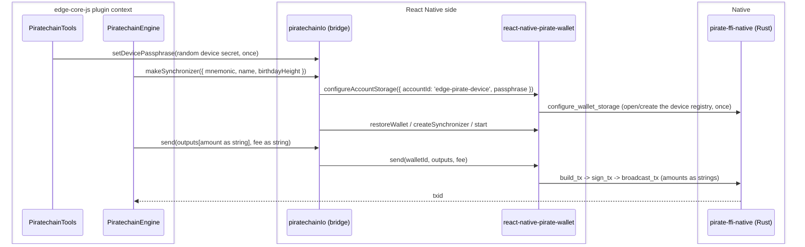

# Piratechain SDK reconciliation: replace the crashing wallet module with the released unified SDK

| | |
|---|---|
| Status | Implemented; sync and a funded end-to-end send both verified on the iOS sim, and the shippable build verified green on CI ([section 7](#7-testing)). Awaiting human review |
| Author | Jon Tzeng |
| Reviewer | peachbits |
| Last updated | 2026-08-19 |
| Repos | [edge-currency-accountbased](https://github.com/EdgeApp/edge-currency-accountbased), [edge-react-gui](https://github.com/EdgeApp/edge-react-gui), react-native-pirate-wallet (npm `0.3.0`, unified wallet v1.1.6) |
| Implementation | [edge-currency-accountbased#1055](https://github.com/EdgeApp/edge-currency-accountbased/pull/1055), [edge-react-gui#6021](https://github.com/EdgeApp/edge-react-gui/pull/6021) |
| Supersedes | - |
| Related | [PirateNetwork/Pirate-Unified-Light-Wallet#19](https://github.com/PirateNetwork/Pirate-Unified-Light-Wallet/pull/19), Asana 1216926437132721 |

Branch references point at `agent/1214721783909451` in both Edge repos. Direction came from Asana task 1216926437132721 (reconcile the open rewrite PRs with the released v1.1.5 and confirm it removes the piratechain crash workaround) and the recorded review thread with the Pirate Chain team.

## Contents
1. [Problem](#1-problem)
2. [Prior art](#2-prior-art)
3. [Goals and non-goals](#3-goals-and-non-goals)
4. [Design overview](#4-design-overview)
5. [Detailed design: edge-currency-accountbased](#5-detailed-design-edge-currency-accountbased)
6. [Detailed design: edge-react-gui and the SDK dependency](#6-detailed-design-edge-react-gui-and-the-sdk-dependency)
7. [Testing](#7-testing)
8. [Phase history](#8-phase-history)
9. [Decisions](#9-decisions)
10. [Glossary](#10-glossary)
11. [References](#11-references)
12. [Post-implementation retrospective](#12-post-implementation-retrospective)

## 1. Problem

The shipped `react-native-piratechain` module is a fork of ZcashLightClientKit. Its Swift and Rust layers each open the wallet's SQLite database, and when Swift reads while Rust writes the process crashes. The crash is frequent enough that the sim-testing playbook prescribes a local workaround for every unrelated agent run: set `piratechain: false` in `src/util/corePlugins.ts` so the module never loads. That workaround is the "orch workaround" this task exists to retire.

The Pirate Chain team replaced that module with a unified SDK whose React Native binding is `react-native-pirate-wallet`, where all database access goes through Rust (Swift and Kotlin only pass JSON). An in-flight rewrite reimplemented the Edge plugin over that binding (see [section 8](#8-phase-history)), but it was built against an unreleased fork (v1.1.4 plus local patches) and left three reviewer concerns open. The team has since shipped **v1.1.5**, which merges the Edge-authored fixes and changes the wire format, and then **v1.1.6** (npm `0.3.0`), which sets the [Ironwood](#ironwood) activation height and ships their [Supernova](#supernova) sync engine. This work reconciles the plugin with those releases and pins v1.1.6.

## 2. Prior art

- Old `react-native-piratechain`: the crash source ([section 1](#1-problem)); not fixable without abandoning the double-open architecture, which the unified SDK does.
- Vendored fork v1.1.4 plus patches: made sync and send work by patching a per-call tokio runtime that killed the sync worker and a payload-camelization bug in the [RN](#rn) wrapper. Those patches went upstream as [PR #19](https://github.com/PirateNetwork/Pirate-Unified-Light-Wallet/pull/19) and merged, so carrying a fork is no longer the answer; v1.1.5 is installable directly.

## 3. Goals and non-goals

Goals:
- Depend on the published `react-native-pirate-wallet`, native binaries included. The plugin started on a vendored v1.1.4 fork, moved to the v1.1.5 release ([RN](#rn) binding 0.1.1 to 0.2.0), and now pins the v1.1.6 release (`0.3.0`), which is the version that carries the [Ironwood](#ironwood) activation height ([section 6](#ironwood-activation)).
- Reconcile the plugin to the v1.1.5 wire format: amounts as decimal strings in both directions, sends through the SDK `send()` method, and the `orchard` to `ironwood` key rename in the type surface.
- Resolve the three open review threads: string amounts (precision), registry passphrase secrecy (security), and honest native-error typing.
- Hold every [ARRR](#arrr) wallet in one device-scoped registry so multiple wallets sync at once over a shared block cache ([decision 1](#decision-1-one-device-scoped-registry-namespace)).
- Keep `piratechain: true` in the GUI and confirm on device that the crash is gone, removing the need for the corePlugins workaround.

Non-goals:
- Isolating registries per Edge account. The SDK's registry selection is device-global, so an account-scoped registry would reintroduce the switching that breaks concurrent sync ([decision 1](#decision-1-one-device-scoped-registry-namespace)).
- Publishing `react-native-pirate-wallet` itself. The Pirate team published it on 2026-08-06, and [phase 5](#phase-5-npm-dependency-and-the-lightwalletd-endpoint) consumes that release; Edge does not own the package.
- Resolving the arm64 Debug link ceiling. Debug simulator builds do not link with all four large Rust/C++ native libraries present ([section 6](#the-arm64-debug-link-ceiling)). Release builds do, so this costs local iteration rather than shipping, and the real fix belongs upstream.

## 4. Design overview

| Repo | Deliverable | Scope |
|---|---|---|
| edge-currency-accountbased | [#1055](https://github.com/EdgeApp/edge-currency-accountbased/pull/1055) | Bridge and engine reconciliation ([section 5](#5-detailed-design-edge-currency-accountbased)) |
| edge-react-gui | [#6021](https://github.com/EdgeApp/edge-react-gui/pull/6021) | Depend on the published SDK, keep plugin enabled ([section 6](#6-detailed-design-edge-react-gui-and-the-sdk-dependency)) |
| react-native-pirate-wallet | npm `0.3.0` | Unified wallet v1.1.6, published by the Pirate team ([section 6](#6-detailed-design-edge-react-gui-and-the-sdk-dependency)) |

The plugin's native [IO bridge](#io-bridge) (`piratechainIo.ts`) runs on the React Native side and talks to the SDK, which forwards JSON to the Rust core. The engine (`PiratechainEngine.ts`) runs inside the edge-core-js plugin context and reaches the bridge over the [yaob](#yaob) object bridge.



## 5. Detailed design: edge-currency-accountbased

The plugin's public shape and the engine's transaction mapping are unchanged.

### Registry storage

v1.1.5 removes the global `set_app_passphrase` / `unlock_app` flow entirely; the only storage entry point is `configureAccountStorage`, which selects a registry directory and creates or unlocks it with a passphrase. That selection is **device-global**: one registry is active at a time, and switching cancels any running sync and clears the registry and block caches. So the bridge configures exactly one device-scoped registry, `DEVICE_ACCOUNT_ID = 'edge-pirate-device'`, and every [ARRR](#arrr) wallet lives inside it keyed by its alias `name` (the `base16(walletId)` the tools layer already passes). Wallet-free reads (`isValidAddress`, the chain-tip probe in `getLatestNetworkHeight`) use that same registry, so no throwaway namespace exists.

`ensureDeviceStorage()` performs the configuration at most once, memoized on a promise so concurrent wallet starts share one setup. It configures storage and then sets the transport (`set_tunnel` Direct, because the SDK's default Tor tunnel does not reliably bootstrap inside Edge); a failure clears the memo so the next call retries the whole setup rather than proceeding on an unconfigured registry. Registry mutations (restore, and the probe wallet's create/delete) run under a `registryLock` serialization. Syncing does not: each wallet gets its own `PirateWalletSynchronizer`, and with no namespace switching left they run concurrently over a shared block cache.

The passphrase is a random 32-byte secret minted per device on first use and persisted in the plugin's local storage. It is generated on the **core side**, in `piratechainDeviceStorage.ts`: the bridge cannot do it because Metro resolves neither Node's `crypto` (the bridge redboxes `Unable to resolve module crypto`) nor a [disklet](#disklet). The core hands it to the bridge through `setDevicePassphrase` before any wallet call:

[`src/piratechain/piratechainDeviceStorage.ts`](https://github.com/EdgeApp/edge-currency-accountbased/blob/494248a7ee0095b50fdc45c6f2fd6a3e408385e5/src/piratechain/piratechainDeviceStorage.ts)
```ts
const DEVICE_PASSPHRASE_FILE = 'piratechain/devicePassphrase.json'

const loadOrCreateDevicePassphrase = async (io: EdgeIo): Promise<string> => {
  const { disklet } = io

  // Check existence before reading, so a transient read failure surfaces as an
  // error instead of silently minting a new secret and orphaning the registry
  // (which would force every wallet to re-scan from its birthday):
  const listing = await disklet.list(DEVICE_PASSPHRASE_FILE)
  if (listing[DEVICE_PASSPHRASE_FILE] === 'file') {
    const text = await disklet.getText(DEVICE_PASSPHRASE_FILE)
    try {
      return asDevicePassphraseFile(text).passphrase
    } catch (error: unknown) {
      // Unreadable contents: fall through and re-mint. The wallets in the
      // abandoned registry restore themselves from their seeds.
    }
  }

  const passphrase = base16.stringify(io.random(32))
  await disklet.setText(DEVICE_PASSPHRASE_FILE, JSON.stringify({ passphrase }))
  return passphrase
}
```

`PiratechainTools.ensureDevicePassphrase()` performs the handoff once, memoized on a promise, and every path that reaches the SDK's storage awaits it first: the tools' own `isValidAddress`, `getNewWalletBirthdayBlockheight` and `derivePublicKey`, plus the engine's `syncNetwork` before it builds a synchronizer. It is deliberately lazy rather than part of `makeCurrencyTools`, so constructing tools never depends on the native module being linked (the plugin's unit tests build tools against a stub bridge).

### Chain tip without mutating the registry

`getLatestNetworkHeight` cannot ask the SDK for a chain tip directly, and the obvious workaround (create a throwaway wallet with no birthday, read the height it resolves, delete it) mutates the shared registry. Doing that while other wallets' synchronizers are running **aborts the app**: the native service panics inside `pirate_wallet_service_invoke_json`, and because the panic crosses the [FFI](#ffi) boundary Rust turns it into `SIGABRT` rather than a catchable error. Under the phase-2 per-wallet model this never surfaced, since the probe had its own throwaway namespace and touched nothing live.

So the height comes from three sources, cheapest and safest first:

1. A wallet that is already registered: `getSyncStatus(walletId).targetHeight`, which reads state instead of changing it.
2. `test_node` against the plugin's configured `lightwalletdUrl`. It reports `latest_block_height` without registering anything, so it is safe while synchronizers run, and it reads Edge's node rather than the SDK's default. That matters twice over: the default is unreachable, and a tip taken from an unaudited node could be inflated, which would set a new wallet's birthday above notes it then never scans.
3. The create-and-delete probe, gated on the registry being **empty**. Its `create_wallet` with no birthday falls back to the SDK's static checkpoint, which sits below the true tip and is therefore conservative.

The gate on step 3 is what keeps the probe away from a live registry. An earlier cut ran the probe whenever the step-1 loop fell through, which is not the same as an empty registry: wallets can be registered and syncing while none has resolved a tip yet (the first seconds after launch report `targetHeight: 0`), and that is exactly the state where the probe aborts the app. With wallets present and no reachable node, `getLatestNetworkHeight` now throws instead, failing wallet creation visibly rather than killing the process.

### Synchronizer status backstop

The engine subscribes to the synchronizer after `start()`, so a `statusChanged` that fires in between is lost and the engine stays at `STOPPED`, which blocks every spend. `PiratechainSynchronizer.getStatus()` exposes the SDK synchronizer's current `status`, and `initSubscriptions` reads it once after subscribing, adopting it only when no event has arrived yet (`synchronizerStatus === 'STOPPED'`) so a live event is never clobbered.

### Synchronizer lifecycle

`makeSynchronizer` returns its handle only after `start()` resolves, and that handle is the only way to stop the native poller. So a `start()` that throws closes the synchronizer before rethrowing: without that, the caller holds nothing to stop, and its retry stacks a second poller on the same registry wallet.

### Amounts as strings

`rnPirateWallet.d.ts` retypes `PirateBalance`, `PirateTransaction`, and `PirateTransactionOutput` amount fields from `number` to `string`, matching v1.1.5's `AmountString`. The engine drops `safeParseInt` on the send path and passes `spendAmount` and `networkFee` as strings straight through; the read path already wrapped values in `String(...)` and biggystring, so it needed only the sign check at `processTransaction` switched from a numeric comparison to `gte(netNativeAmount, '0')`.

### Sends

`makeSynchronizer(...).send` previously ran `build_tx` / `sign_tx` / `broadcast_tx` over the raw `invoke` bridge to dodge a camelization bug. v1.1.5's `send()` keeps the opaque pending and signed payloads verbatim (via `_callRaw`) and normalizes amounts to strings, so the bridge now calls `walletSdk.send(walletId, outputs, fee)` directly.

### Native error typing

`SynchronizerCallbacks.onError` is retyped `(error: unknown)` because bridge errors arrive as serialized objects or strings, not real `Error` instances; the existing `error instanceof Error ? error.message : String(error)` guard already assumes this.

## 6. Detailed design: edge-react-gui and the SDK dependency

`react-native-pirate-wallet@0.3.0` comes from npm, replacing the `file:../react-native-pirate-wallet` sibling. The wrapper tarball carries only JS and the ObjC/Swift/Kotlin bridge; the native artifacts ship as four `optionalDependencies` pinned to the exact wrapper version (`-android`, `-android-x86_64`, `-ios-device`, `-ios-simulator`), and `scripts/assemble-ios-framework.js` hard-links the two iOS slices into the `PirateWalletNative.xcframework` the podspec vendors. The iOS pair is marked `os: ["darwin"]`, so Linux CI skips 560MB it cannot use.

Nothing in the package runs that assembly on install. `0.2.1` invoked it from a `postinstall`, which `edge-react-gui` could never fire because `.npmrc` sets `ignore-scripts=true`; `0.3.0` dropped the hook entirely and left only a manual `prepare:native` script. Either way the assembly has to be driven by the consumer, so it runs from `scripts/prepare.sh`, where the repo already keeps `patch-package`, `jetify` and the native-header copy, and which runs before `pod install`. The script no-ops off macOS. `0.3.0`'s podspec also runs the same assembly itself during `pod install` and raises if the framework is still missing, which is a belt-and-braces second path rather than a replacement: the script is idempotent, and `prepare.sh` is what makes a plain `npm ci && npm run prepare` produce a complete tree.

`src/util/corePlugins.ts` keeps `piratechain: true`. The only other GUI change is four `testID`s on the send scene's address-tile actions (Enter, Myself, Scan, Paste in `AddressTile2`): they render as icon buttons whose labels are collapsed into an aggregated parent `accessibilityText`, so an automated send drive cannot select them by text and falls back to coordinate taps. The seam back to the plugin is the bridge in [section 5](#5-detailed-design-edge-currency-accountbased) and its diagram.

### The lightwalletd endpoint

The SDK bakes in a default [lightwalletd](#lightwalletd) node and never reads the plugin's `networkInfo`, so a wallet left alone scans against that default rather than Edge's. When that node degrades the failure is silent and total: `test_node` still succeeds, the chain tip still resolves, and `sync_status` still reports `SYNCING`, but the scan sits in the `Headers` stage at zero blocks/sec forever, which the app renders as "Sync in Progress, 0% Complete" with no error anywhere in the stack. `PiratechainEngine` therefore passes its configured node down as `lightwalletdUrl`, and `makeSynchronizer` applies it with `set_lightd_endpoint` before the synchronizer starts. The configured port is the node's plain gRPC port, not 443: `test_node` fails against `https://lightd1.pirate.black:443` and succeeds against `http://lightd1.pirate.black:9067`.

That default node has since gone away entirely. On 2026-08-17 `64.23.167.130:9067`, the address `get_lightd_endpoint` returns on a wallet nobody configured, refused TCP connections altogether, while `lightd1.pirate.black:9067` answered a `GetLightdInfo` and rejected a malformed `SendTransaction` in about a second. So `set_lightd_endpoint` is no longer an optimization over a degraded default; without it an [ARRR](#arrr) wallet has no reachable node at all.

### Ironwood activation

Pirate Chain's [Ironwood](#ironwood) [shielded pool](#shielded-pool) is the successor to [Sapling](#sapling), and unified wallet v1.1.6 is the release that sets its activation height. Nothing in the plugin has to change for it, because every call the plugin makes is pool-agnostic by construction: `get_balance` covers both pools plus internal change, `current_receive_address` returns Sapling before activation and Ironwood after it, and `send` sources notes from whatever pool holds them. The plugin never names a pool.

What activation does change is which SDK versions can spend at all. Consensus branch ids are opaque and go into a transaction's signature, so an SDK that does not carry the post-activation branch id builds transactions the network rejects. The SDK exposes this directly: `validate_consensus_branch` compares its own `sdk_branch_id` against the server's and answers `is_valid`. On 2026-08-17 both read `76b809bb` with `is_valid: true`, both wallets held their whole balance in `sapling` with `ironwood` at zero, and both receive addresses were `zs1...` Sapling addresses, which is the pre-activation state. When the network crosses the activation height, an app still shipping the old `react-native-piratechain` module (or a pre-v1.1.6 unified SDK) will see `is_valid` go false and will not be able to spend, while a v1.1.6 build follows the new rules. That is what makes shipping this pair of PRs time-sensitive rather than merely desirable.

The plugin's `deriveViewingKey` deliberately keeps calling `export_sapling_viewing_key` even though `export_ironwood_viewing_key` exists. That key is not used for scanning (the SDK scans from its own registry using the spending key); it only populates the wallet's `EdgePublicKey`, which Edge persists as wallet identity. Switching it post-activation would change a stored identity for no functional gain.

### The arm64 Debug link ceiling

**Debug** iOS builds do not link with all four large Rust/C++ native libraries present. Release builds do, so this costs local iteration and never reached shipping. The distinction was established on 2026-08-17 and is easy to get wrong, so both measurements are recorded here:

| configuration | SDK | `__TEXT` | `__text` | result |
|---|---|---|---|---|
| Debug | iphonesimulator | 187.3MB | 97.6MB | fails to link |
| Release | iphoneos | 140.7MB | 67.4MB | links, 189.7MB arm64 binary |
| Release | iphonesimulator | | | links (Jenkins `Build Maestro ios`) |

The Debug failure is `ld: fixup error (kind=arm64_b26) ... B/BL out of range (displacement=175114548, max is +/-128MB)`, from `libmonero-module.a`'s `boost::chrono` reaching `_mdb_mutex_failed`. The two ends are both monero calling itself, and they end up 167MB apart because the target lives in `__TEXT,text_env`, a 12KB section the same link warns about: *"symbols in `__TEXT,text_env` have unwind information, but it's not a code section (missing `regular,pure_instructions` section flag)"*. Not being flagged as code, `text_env` is placed at the very end of `__TEXT` (`0x0AB71B38`, 171.5MB in) rather than near its callers at 4.5MB, and the linker will not route a [branch island](#branch-island) into it. Release codegen shrinks `__text` by 31% and the distance falls back inside the ±128MB range.

Static-library contributions at Debug are roughly: pirate-wallet 369MB, zcash 106MB, monero 51MB, zano 29MB. This is not specific to this branch (the same libraries linked on 2026-08-04), and it reproduces unchanged on `0.3.0`, whose simulator slice grew by about 1MB over `0.2.1`. Local Debug testing gets past it by excluding `react-native-zcash`, `react-native-monero` and `react-native-zano` from iOS autolinking, which is a test-only measure and is never committed.

The durable fix belongs in `react-native-monero`: flag `text_env` as `regular,pure_instructions`, or fold those symbols into `__text`, so the linker can place them near their callers. Shrinking the Rust staticlibs (`opt-level=z`, `panic=abort`, link-time optimization) would also buy headroom, but it treats the symptom.

## 7. Testing

1. Static: in edge-currency-accountbased, `tsc --noEmit` exits 0 and `npm test` (`nyc mocha`) reports 490 passing / 0 failing, re-run after every code change through the `0.3.0` round. No piratechain unit tests exist, so the suite covers the repo's other plugins and the shared engine; eslint runs on every touched file through `lint-commit.sh`.
2. Crash retirement (VERIFIED, iOS sim): the GUI was built for the iOS simulator with `piratechain: true` (no corePlugins disable) against the v1.1.5 native binaries. Old `react-native-piratechain` is absent from the build (zero Podfile.lock references, not autolinked). [ARRR](#arrr) wallets ran the shielded sync with the app stable throughout, the exact background sync that crash-looped the old module. Per-account storage created isolated registries under `Library/Application Support/PirateWallet/accounts/<sanitized-id>/`, which [phase 4](#phase-4-one-device-scoped-registry) replaced with the single `edge-pirate-device` directory.
3. Send (VERIFIED, iOS sim, real broadcast): a self-account ARRR send was driven to the transaction-success scene. Source `My Pirate 2` (14.731 ARRR spendable), destination `My Pirate` (picked via the send scene's "Myself" wallet picker, which derived the recipient shielded z-address `zs1e5v84m2mnhwcxd0h4nx85jz97gd9shcphgx84fhh8v7vw9eztz72scekz8c6pxjrl0a2yurjuyj`), amount 4.754 ARRR, fee 0.0001 ARRR. The app reported "Transaction Success" and the transaction record shows txid `34ba68b0fee76668790ef7dae32f374c7f378da589022a1034f1112e234e49cd`. This confirms the string-amount send path and the SDK `send()` call end to end, and exercises the `txid` transaction-processing fix (see [phase 3](#phase-3-e2e-send-verification)) without the `toLowerCase` crash.

4. Endpoint fix (VERIFIED, iOS sim, 2026-08-11): with `set_lightd_endpoint` applied, `My Pirate 2` and `My Pirate` scanned from their birthdays to `SYNCED` at roughly 1,800 blocks/sec, `localHeight == targetHeight == 4085959`, wallet DBs growing 1.5MB to 233MB, and the wallet-detail sync banner cleared. Without it both wallets sat at `stage: "Headers"`, `blocksPerSecond: 0`, `localHeight` frozen, for 45 minutes across two full builds. Re-verified on a build carrying the committed fix rather than the diagnostic patch.
5. Broadcast (failed on `0.2.1`, 2026-08-11; SUPERSEDED by item 6): three funded attempts from the synced, spendable `My Pirate 2` (2.19 ARRR to `My Pirate`, fee 0.0001, confirm slider active) each failed inside the SDK with `Broadcast failed: Status error: status: Cancelled, message: "Timeout expired"`. Reproduced against two different [lightwalletd](#lightwalletd) nodes, so it was not endpoint-specific. No principal moved. The transaction built and signed in roughly 5 minutes on the sim and the failure was at the gRPC broadcast.
6. Broadcast on `0.3.0` (VERIFIED, iOS sim, 2026-08-17): the same send, driven the same way (`My Pirate 2` to `My Pirate` via the "Myself" picker, 1.088 ARRR, fee 0.0001), broadcast successfully. Build, sign and broadcast together took **2.083 seconds**, against the roughly 5 minutes that ended in a timeout on `0.2.1`. txid `8d2e25d0e624cf714057b65311347a8a5d21cafbbae8f579e714fb979e94a579`; the app showed "Transaction Success" and `My Pirate 2` reconciled from 9.9769 to 8.8888 ARRR while `My Pirate` rose to 257.13. The item-5 wall does not reproduce. Two host-side probes were run anyway to characterize the endpoint: a malformed `SendTransaction` over `grpcurl` against `lightd1.pirate.black:9067` is rejected in about a second with `errorCode -22 "TX decode failed"`, and the wrapper does expose `build_tx` / `sign_tx` / `broadcast_tx` separately, so the broadcast could have been timed in isolation had it still hung.
7. Sync throughput on `0.3.0` (VERIFIED, iOS sim, 2026-08-17): a wallet-menu resync of `My Pirate 2` rewound to height 3,175,610 and returned to the tip at 4,093,957 in 19.25 seconds of wall clock, or **about 47,700 blocks/sec** (about 67,000 blocks/sec across the sampled scanning phase alone). The 2026-08-11 baseline on `0.2.1` was roughly 1,800 blocks/sec, so the [Supernova](#supernova) engine is roughly 27x faster on the same simulator against the same node.
8. Packaging on `0.3.0` (VERIFIED, 2026-08-17): a fresh clone of each branch plus `npm ci` and `npm run prepare` exits 0. In the GUI clone that reproduces `PirateWalletNative.xcframework` with both slices, `ios-arm64` 181.8MB non-fat arm64 and `ios-arm64_x86_64-simulator` 360.3MB fat, with no install hook anywhere in the package, confirming `scripts/prepare.sh` is carrying the assembly on its own.
9. Shippable build (VERIFIED, 2026-08-17): the question of whether the Debug link failure blocks shipping is settled, and the answer is no. A local `xcodebuild -sdk iphoneos -configuration Release` of the untrimmed branch, with all four native libraries autolinked, reports `BUILD SUCCEEDED` and produces a 189.7MB non-fat arm64 binary (`__TEXT` 140.7MB, `__text` 67.4MB) with no link-range error anywhere in the log. Independently, a cheese build of the branch (Jenkins `test-gouda` #18, `4.50.2-gouda (26081701)`, 9m42s) passed all four stages: `Build ios` (the signed device archive), `Build Maestro ios` (Release simulator), and both Android stages. Only the Debug simulator configuration fails ([section 6](#the-arm64-debug-link-ceiling)).
10. Landing-order coupling (OBSERVED, 2026-08-17): the first Release device attempt linked cleanly and then failed at the `Bundle React Native code and images` phase with `Unable to resolve module react-native-piratechain from node_modules/edge-currency-accountbased/lib/piratechain/piratechainIo.js`. That is the published `edge-currency-accountbased@4.87.0` importing a module this branch removes. It is not a defect in either PR, it is the reason the two have to land in order; linking the plugin branch in (which is exactly what the cheese build's tarball pin does for CI) makes the same build succeed.

11. New-wallet creation on `0.3.0` (VERIFIED, iOS sim, 2026-08-17): `My Pirate 3` was created through the app with no native abort, then archived. Two wallets were already registered and syncing at the time, so the birthday resolved from source 1 of [the chain tip](#chain-tip-without-mutating-the-registry) and that drive did not exercise the `test_node` branch. `test_node` was instead verified directly at runtime, returning `latest_block_height: 4093998` against the configured node. The empty-registry probe path (source 3) is covered by neither.

Sync note (superseded): the earlier claim that a clean baked build syncs in roughly 90 seconds at 8000 blocks/sec, and that "sync stuck at 0%" was only a broken-build artifact, was wrong. Item 4 above identifies the real cause: the SDK scans against its own default node unless the plugin sets one, and that default stopped serving blocks.

## 8. Phase history

### Phase 1: rewrite over the vendored fork (v1.1.4)
- **Sketched:** reimplement the plugin over `react-native-pirate-wallet`, restoring wallets into the SDK registry under the Edge walletId alias, mapping sync progress from the polling synchronizer, and sending through the registry wallet.
- **Shipped:** as sketched, against a vendored fork of v1.1.4 with two local upstream patches (persistent tokio runtime, no-camelize tx payload) plus a JSON-number amount format.
- **Diverged:** the fork carried a shared registry unlocked by a hardcoded app passphrase and amounts as JS numbers. Both drew reviewer objections, held open pending the upstream release.

### Phase 2: reconcile to released v1.1.5
| Diverged in phase 1 | Shipped in phase 2 |
|---|---|
| Hardcoded shared app passphrase | Per-wallet `configureAccountStorage` namespace, passphrase = [HMAC](#hmac) of the wallet seed |
| Amounts as JS numbers (precision loss above 2^53-1) | Decimal strings both directions |
| Manual raw build/sign/broadcast | SDK `send()` (opaque payloads preserved upstream) |
| `onError: (error: Error)` | `onError: (error: unknown)` |
| Vendored fork v1.1.4 | Released v1.1.5, binding 0.2.0 |

- **Deferred:** a single per-Edge-account registry (rather than per wallet) would let one account's wallets share sync state without re-selecting namespaces; it needed an account-derived secret plumbed to the native IO and was out of scope. Phase 4 settles this differently, at device scope ([decision 1](#decision-1-one-device-scoped-registry-namespace)).

### Phase 3: e2e send verification
Verifying on device landed the following:
- **Fixed:** v1.1.5's `TransactionInfo.txid` is lowercase, but the engine read `tx.txId`, so `edgeTransaction.txid` was `undefined` and `CurrencyEngine.normalizeAddress(undefined)` threw `undefined is not an object (evaluating 'address.toLowerCase')` in `queryTransactions` on every [ARRR](#arrr) sync poll, before `updateTransactionRatio(1)`. Changed `txId` to `txid` in `PiratechainEngine` and `rnPirateWallet.d.ts`. Watch for other camelCase-vs-lowercase mismatches: the SDK's `camelize` only converts snake_case, so `txid` and `arrrtoshis` (no underscore) stay lowercase.
- **Verified:** a real ARRR send broadcast to another wallet in the account ([section 7](#7-testing)), retiring the crash workaround end to end.
- **Fixed (Bugbot review):** `selectNamespace` marked the namespace active before `set_tunnel` succeeded, so a failed Direct-tunnel call could not be retried (the early return left the namespace on the default Tor transport). Phase 4 removed `selectNamespace` entirely.

- **Observed (fixed in phase 4):** with more than one ARRR wallet, the SDK's single active namespace meant only the last-selected wallet synced and stayed spendable; the others' background pollers read the wrong namespace. The single-wallet send path was unaffected (the send succeeded), but concurrent multi-wallet sync was broken.

### Phase 4: one device-scoped registry

The Pirate team confirmed the intended storage model, which is not the one phase 2 built: `configure_wallet_storage` is global, only one namespace is active at a time, and switching cancels active sync and clears the registry and caches. One namespace per **device**, holding many wallets that share the block cache, is the design; concurrency comes from wallet-scoped synchronizers.

| Diverged in phase 2 | Shipped in phase 4 |
|---|---|
| One namespace per wallet, switched on every wallet-scoped call | One namespace per device, configured once at first use |
| Passphrase = HMAC of the wallet seed (`piratechainCrypto.ts`) | Random 32-byte per-device secret in local storage (`piratechainDeviceStorage.ts`) |
| Fixed throwaway probe namespace for wallet-free reads | The device registry serves them |
| Only the last-selected wallet synced; others polled the wrong namespace | Every wallet's synchronizer runs concurrently over a shared block cache |
| Initial `SYNCED` could be missed, stranding the engine at `STOPPED` | `getStatus()` backstop read once after subscribing |
| Chain tip probed by creating and deleting a throwaway wallet | Read from a registered wallet's `getSyncStatus().targetHeight`; the probe is the empty-registry fallback only |

Old per-wallet registries are abandoned rather than migrated: wallets re-restore from their seeds into the device registry on first run, and the stale directories hold no unrecoverable state.

- **Found while testing:** creating a new ARRR wallet crashed the app to springboard, because the chain-tip probe mutated the now-shared registry while three synchronizers were running against it. The crash report pinned it to a Rust panic in `pirate_wallet_service_invoke_json` reaching `abort` through `panic_cannot_unwind`. The fix is [the chain-tip change above](#chain-tip-without-mutating-the-registry); wallet creation then succeeded with all four wallets coexisting in the one registry.

### Phase 5: npm dependency and the lightwalletd endpoint
- **Sketched:** swap the GUI off the vendored `file:` sibling onto the published `react-native-pirate-wallet@0.2.1`, merge up with `develop`, and close the e2e send that the phase-4 storage re-key blocked.
- **Shipped:** the npm swap, with the [XCFramework](#xcframework) assembly moved into `scripts/prepare.sh` because the repo disables install scripts ([section 6](#6-detailed-design-edge-react-gui-and-the-sdk-dependency)); and the `set_lightd_endpoint` fix, which is what actually made ARRR sync ([section 6](#the-lightwalletd-endpoint)). A clean clone reproduces every native artifact.
- **Diverged:**
  - The e2e send still does not broadcast. It now fails at the SDK's gRPC broadcast rather than at spendability, a later failure than phase 4's.
  - On current `develop` the iOS binary no longer links. `__TEXT` reaches 184MB against the arm64 +/-128MB branch range, so `ld` cannot place a [branch island](#branch-island). The Pirate static library is the largest contributor at roughly 187MB of arm64 code, but not the only one: the build linked on 2026-08-04 with the same library, and dropping `zcash`, `monero` and `zano` links it again. Dead-stripping, link reordering and `-ld_classic` were each tried and each failed identically.

### Phase 6: unified wallet v1.1.6 (npm `0.3.0`)
- **Sketched:** move both repos to `react-native-pirate-wallet@0.3.0`, reconcile the plugin against whatever the release changed, re-drive the funded send to find out whether the phase-5 broadcast timeout survives the new [Supernova](#supernova) sync engine, and diagnose the GUI PR's red Travis.
- **Shipped:** a peer-range bump in the plugin, an exact-pin bump plus regenerated lockfiles in the GUI, and nothing else.
  - Diffing the `0.3.0` tarball against `0.2.1` showed `src/index.js`, `src/index.d.ts` and both native bridge sources byte-identical, so the entire release is native and there was no API or wire surface to reconcile.
  - The broadcast timeout is gone: the same send completes in 2.08s ([section 7](#7-testing) item 6), and sync is roughly 27x faster (item 7).
  - Travis was red for an unrelated reason. A rebase had dropped the component change that rendered a `createWalletRow.<pluginId>` testID while leaving four snapshot lines expecting it; removing those four lines restores parity with `develop`.
- **Diverged:**
  - The release notes suggested a larger simulator sidecar and therefore a worse link ceiling. It grew by about 1MB, and the Debug failure reproduces unchanged.
  - The link ceiling is a Debug-configuration problem rather than a shipping blocker, which settles a question two earlier rounds left open. A Release device build links, and CI builds the branch green end to end ([section 6](#the-arm64-debug-link-ceiling)).
  - The SDK's own default [lightwalletd](#lightwalletd) node stopped accepting connections entirely, independently of this release.
  - `0.3.0` removed the wrapper's `postinstall`, so `scripts/prepare.sh` is now the only assembly path a plain install exercises.
  - The dead default node turned two dormant review findings into real defects, both fixed here: the chain-tip probe could still run while synchronizers were live, and it resolved the tip against the SDK's default rather than the configured node ([section 5](#chain-tip-without-mutating-the-registry)).
  - A synchronizer that failed to `start()` was left running with no handle to stop it, so a retry could stack a second poller on the same registry wallet. `makeSynchronizer` now closes it before rethrowing.

## 9. Decisions

### Decision 1: one device-scoped registry namespace
- **Chosen:** a single `configureAccountStorage` namespace per device (`edge-pirate-device`), holding every [ARRR](#arrr) wallet keyed by alias, with one synchronizer per wallet.
- **Evidence:** the Pirate team confirmed `configure_wallet_storage` is global state, that switching cancels active sync and clears the registry and caches, and that one namespace per device sharing a block cache is the intended model. Phase 2's per-wallet namespaces produced exactly the predicted failure on device: with two ARRR wallets, only the last-selected one synced and stayed spendable while the others' pollers read the wrong namespace.
- **Rejected:** per-wallet namespaces (phase 2), which cannot support concurrent sync because every wallet-scoped call would have to re-select and thereby cancel another wallet's sync.
- **Rejected:** per-Edge-account namespaces, which have the same defect one level up (switching accounts still clears the shared block cache) and also need an account secret the bridge does not hold.
- **Rejected:** one SDK context per wallet, which the [RN](#rn) binding does not expose (`createPirateWalletSdk` wraps a single native module instance).
- **Reopen if:** the SDK gains per-wallet or per-context storage selection, making isolation possible without cancelling sync.

### Decision 2: send through the SDK, not raw invoke
- **Chosen:** `walletSdk.send(walletId, outputs, fee)`.
- **Evidence:** v1.1.5 fixed the camelization bug (merged from [PR #19](https://github.com/PirateNetwork/Pirate-Unified-Light-Wallet/pull/19)) that forced the raw path, and its `send()` both preserves the opaque intermediate payloads and normalizes amounts to strings.
- **Rejected:** keeping the manual `build_tx` / `sign_tx` / `broadcast_tx` over raw `invoke`, which now duplicates SDK logic and, because raw `invoke` skips the SDK's amount normalization, would send unnormalized numeric amounts.
- **Reopen if:** a future SDK release changes `send()` semantics or reintroduces the payload rewrite.

### Decision 3: a random per-device passphrase in the plugin's local storage
- **Chosen:** `base16.stringify(io.random(32))`, minted on first use and persisted to `piratechain/devicePassphrase.json` on the core `EdgeIo` [disklet](#disklet), handed to the bridge via `setDevicePassphrase`.
- **Evidence:** the storage contract published with v1.1.5 requires a unique, high-entropy, secret-derived passphrase and forbids hardcoded or public values; a device-random secret satisfies all three and, unlike a seed-derived one, does not tie a device-scoped registry to any single wallet's key material. `io.random` is the core's [CSPRNG](#csprng) and `io.disklet` is device-local storage that never syncs, so the secret stays on the device. Generation cannot live in the bridge: Metro resolves neither `crypto` nor a disklet.
- **Rejected:** [HMAC](#hmac) of a wallet seed (phase 2's answer), which cannot key a registry holding many wallets without arbitrarily privileging one wallet's seed, and which leaks a deterministic function of spending material into a storage key.
- **Rejected:** a hardcoded constant, the exact pattern the security review flagged.
- **Rejected:** the OS keychain, which would add a native dependency for a secret that guards device-local data the OS already sandboxes; the disklet is the plugin's existing storage seam.
- **Reopen if:** the secret needs to survive an app reinstall or migrate between devices, which local storage does not do (today the cost is a re-scan from birthday, not a loss of funds).
- **Accepted risk, raised by the automated security review:** the passphrase sits in plaintext JSON on the plugin disklet, and it unwraps a registry that holds every ARRR wallet's spending keys. Anyone who can read the app sandbox can therefore spend ARRR without knowing the Edge password, which is a weaker bar than the rest of the app, where the mnemonic is protected by account encryption. There is no better place for it inside the constraints: the SDK selects storage device-globally ([decision 1](#decision-1-one-device-scoped-registry-namespace)), so the secret cannot be keyed to an Edge account, and it must be readable before any account is unlocked for wallets to resume. The residual is bounded by the OS sandbox, and destroying the file costs a re-scan rather than funds.
  - **Reopen if:** the SDK gains per-account or per-call storage credentials, or exposes a way to hold the passphrase only in memory across a session.

## 10. Glossary

### ARRR
The currency code for Pirate Chain, the coin this plugin holds and spends. Every balance and amount in this doc is quoted in ARRR. See [pirate.black](https://pirate.black).

### Birthday height
The block height a wallet starts scanning from, recorded when the wallet is created. A birthday above the true tip leaves earlier notes unscanned, which is what makes the source of [the chain tip](#chain-tip-without-mutating-the-registry) matter. See the [SDK repo](https://github.com/PirateNetwork/Pirate-Unified-Light-Wallet).

### Branch island
A stub the linker inserts when a call's target sits further away than the branch instruction can encode. arm64 `B`/`BL` reach +/-128MB, and the Debug link failure in [section 6](#the-arm64-debug-link-ceiling) happens because `ld` will not route an island into a section it does not treat as code. See [ld64](https://github.com/apple-oss-distributions/ld64).

### Consensus branch id
An identifier for the network's active consensus rules, mixed into a transaction's signature so a transaction built under one rule set is invalid under another. Ironwood activation changes it, which is what stops an older SDK from spending. See [ZIP 200](https://zips.z.cash/zip-0200).

### CSPRNG
Cryptographically secure pseudo-random number generator. `io.random` is edge-core-js's, and the device registry passphrase is 32 bytes from it ([decision 3](#decision-3-a-random-per-device-passphrase-in-the-plugins-local-storage)). See [NIST SP 800-90A](https://csrc.nist.gov/pubs/sp/800/90/a/r1/final).

### Disklet
Edge's file-storage interface. `io.disklet` is device-local and never syncs to the Edge account, which is where the registry passphrase file lives. See [disklet](https://github.com/EdgeApp/disklet).

### FFI
Foreign function interface, the boundary where the SDK's Swift and Kotlin layers call into its Rust core. A Rust panic cannot unwind across it, so it aborts the process instead of raising a catchable error, which is how the chain-tip probe crash presented. See the [Rust FFI docs](https://doc.rust-lang.org/nomicon/ffi.html).

### HMAC
Hash-based message authentication code, a keyed hash. Phase 2 derived the registry passphrase as an HMAC of the wallet seed; [decision 3](#decision-3-a-random-per-device-passphrase-in-the-plugins-local-storage) replaced it with a device-random secret. See [RFC 2104](https://www.rfc-editor.org/rfc/rfc2104).

### Ironwood
Pirate Chain's successor to the Sapling shielded pool, and the reason this work pins v1.1.6: that release carries the activation height and the post-activation consensus branch id. See the [SDK repo](https://github.com/PirateNetwork/Pirate-Unified-Light-Wallet).

### IO bridge
The `nativeIo` object an edge-core-js plugin uses to reach React Native APIs from inside the plugin context. `piratechainIo.ts` is this plugin's, and it is the only file that calls the SDK. See [edge-core-js](https://github.com/EdgeApp/edge-core-js).

### lightwalletd
The light-client server a shielded wallet fetches compact blocks from and broadcasts transactions through. Edge points every ARRR wallet at its own node rather than the SDK's default ([the lightwalletd endpoint](#the-lightwalletd-endpoint)). See [lightwalletd](https://github.com/zcash/lightwalletd).

### RN
React Native. The RN binding in this doc is `react-native-pirate-wallet`, the JS and ObjC/Kotlin layer the Pirate team publishes over their Rust core. See [native modules](https://reactnative.dev/docs/native-modules-intro).

### Sapling
The Zcash shielded pool Pirate Chain inherited, whose addresses start `zs1`. Balances and receive addresses stay Sapling until Ironwood activates. See [ZIP 205](https://zips.z.cash/zip-0205).

### Shielded pool
A pool of notes whose amounts and addresses are encrypted on chain, spent by proving knowledge of a note rather than by revealing it. The plugin never names a pool: `get_balance` covers both and `send` sources notes from whichever holds them. See the [Zcash protocol spec](https://zips.z.cash/protocol/protocol.pdf).

### Supernova
The Pirate team's rewritten sync engine, shipped in unified wallet v1.1.6. Measured here at about 47,700 blocks/sec against roughly 1,800 on the previous engine ([section 7](#7-testing) item 7). See the [SDK repo](https://github.com/PirateNetwork/Pirate-Unified-Light-Wallet).

### Wallet registry
The SDK's own encrypted store of wallets and their spending keys. `configure_wallet_storage` selects exactly one registry per device, and every ARRR wallet lives inside it keyed by alias ([registry storage](#registry-storage)). See the [SDK repo](https://github.com/PirateNetwork/Pirate-Unified-Light-Wallet).

### xcframework
Apple's container format holding one binary per platform and architecture slice. `PirateWalletNative.xcframework` is assembled from two npm sidecar packages, one per slice, because the wrapper tarball ships no binaries. See [Apple's docs](https://developer.apple.com/documentation/xcode/creating-a-multi-platform-binary-framework-bundle).

### yaob
The asynchronous object bridge edge-core-js uses between the plugin context and the React Native side. The engine reaches the [IO bridge](#io-bridge) over it, so every bridge method is a promise and every callback is an event. See [yaob](https://github.com/swansontec/yaob).

## 11. References
- Asana task 1216926437132721 and its recorded Pirate Chain team thread.
- [PirateNetwork/Pirate-Unified-Light-Wallet#19](https://github.com/PirateNetwork/Pirate-Unified-Light-Wallet/pull/19) (merged): the upstream runtime and payload fixes now in v1.1.5.
- v1.1.5 release artifact `pirate-unified-wallet-react-native-plugin-artifacts-v1.1.5.zip` and its bundled documentation (account-scoped storage contract).
- `react-native-pirate-wallet@0.3.0` on npm (unified wallet v1.1.6): the [Ironwood](#ironwood) activation height, the [Supernova](#supernova) sync engine, and the four `0.3.0` native sidecar packages. It documents the pre- and post-activation address selection rules and the `validate_consensus_branch` compatibility check.

## 12. Post-implementation retrospective

Written from the two branches as they stand, before merge.

### Estimate vs. actuals

| Item | Expected | Actual |
|---|---|---|
| The v1.1.5 reconcile | A wire-format pass over a finished rewrite | Three further phases before a funded send worked ([phase history](#8-phase-history)) |
| Registry model | The per-wallet namespaces phase 2 shipped | Namespace selection is device-global, so it was rebuilt at device scope ([decision 1](#decision-1-one-device-scoped-registry-namespace)) |
| The `0.3.0` bump | An API reconcile on the scale of v1.1.5 | A peer-range bump and lockfiles; the release is entirely native |
| The broadcast timeout | An SDK defect needing a second upstream PR | Gone in v1.1.6, with no Edge change: five minutes to a timeout became 2.083s to a txid |
| The arm64 link failure | A shipping blocker wanting a dynamic framework | Debug-only. Release links locally and on CI ([section 6](#the-arm64-debug-link-ceiling)) |

### Where this document was wrong or silent

1. [Registry storage](#registry-storage) described one namespace per wallet through phase 3. That model cannot hold more than one ARRR wallet, because `configure_wallet_storage` selects device-globally and switching cancels the other wallets' sync. Rewritten in phase 4.
2. [Testing](#7-testing) carried a sync note claiming a clean build syncs in about 90 seconds and that a stuck sync was a broken-build artifact. Both were wrong; the scan was running against the SDK's own default node (item 4).
3. The doc was silent on what the chain-tip probe does to a shared registry until it aborted the app on device. [Chain tip without mutating the registry](#chain-tip-without-mutating-the-registry) exists because of that crash.
4. [The arm64 Debug link ceiling](#the-arm64-debug-link-ceiling) was written as an open shipping question for two rounds before anyone linked a Release build, which takes one command and settles it.

### What held

- The plugin's public shape and the engine's transaction mapping are the same as before the rewrite. Every SDK change landed inside `piratechainIo.ts` behind the [IO bridge](#io-bridge), which is why the GUI carries a dependency swap and four `testID`s.
- Amounts as decimal strings, adopted in phase 2, survived every later phase and made the `0.3.0` bump a no-op on the wire.
- The fixes Edge wrote against the vendored fork went upstream in [PR #19](https://github.com/PirateNetwork/Pirate-Unified-Light-Wallet/pull/19) and shipped in v1.1.5, so no fork is carried today.

### Verification highlights

- Funded send on `0.3.0`, txid [`8d2e25d0e624cf714057b65311347a8a5d21cafbbae8f579e714fb979e94a579`](https://explorer.pirate.black/tx/8d2e25d0e624cf714057b65311347a8a5d21cafbbae8f579e714fb979e94a579), build through broadcast in 2.083s ([section 7](#7-testing) item 6).
- Resync of 918,347 blocks in 19.25s, about 47,700 blocks/sec against roughly 1,800 on `0.2.1` (item 7).
- `xcodebuild -sdk iphoneos -configuration Release` reports `BUILD SUCCEEDED` with all four native libraries autolinked, and Jenkins `test-gouda` #18 passed all four stages in 9m42s (item 9).
- A fresh clone of each branch plus `npm ci` and `npm run prepare` exits 0, and the GUI clone reproduces the [xcframework](#xcframework) with both slices (item 8).
