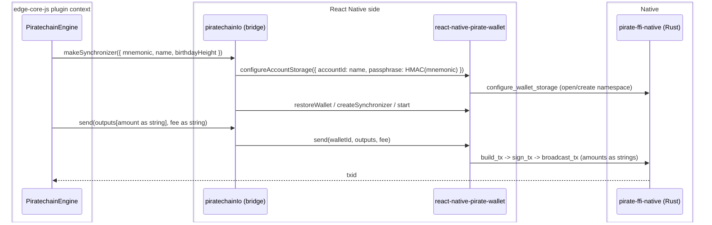

# Piratechain SDK v1.1.5 reconciliation: replace the crashing wallet module with the released unified SDK

| | |
|---|---|
| Status | Implemented (pending sim verification) |
| Author | Jon Tzeng |
| Reviewer | peachbits |
| Last updated | 2026-07-28 |
| Repos | [edge-currency-accountbased](https://github.com/EdgeApp/edge-currency-accountbased), [edge-react-gui](https://github.com/EdgeApp/edge-react-gui), react-native-pirate-wallet (vendored) |
| Implementation | [edge-currency-accountbased#1055](https://github.com/EdgeApp/edge-currency-accountbased/pull/1055), [edge-react-gui#6021](https://github.com/EdgeApp/edge-react-gui/pull/6021) |
| Supersedes | - |
| Related | [PirateNetwork/Pirate-Unified-Light-Wallet#19](https://github.com/PirateNetwork/Pirate-Unified-Light-Wallet/pull/19), Asana 1216926437132721 |

Branch references point at `agent/1214721783909451` in both Edge repos. Direction came from Asana task 1216926437132721 (reconcile the open rewrite PRs with the released v1.1.5 and confirm it removes the piratechain crash workaround) and the recorded review thread with the Pirate Chain team.

## Contents
1. [Problem](#1-problem)
2. [Prior art](#2-prior-art)
3. [Goals and non-goals](#3-goals-and-non-goals)
4. [Design overview](#4-design-overview)
5. [Detailed design: edge-currency-accountbased](#5-detailed-design-edge-currency-accountbased)
6. [Detailed design: edge-react-gui and the vendored SDK](#6-detailed-design-edge-react-gui-and-the-vendored-sdk)
7. [Testing](#7-testing)
8. [Phase history](#8-phase-history)
9. [Decisions](#9-decisions)
10. [References](#10-references)

## 1. Problem

The shipped `react-native-piratechain` module is a fork of ZcashLightClientKit. Its Swift and Rust layers each open the wallet's SQLite database, and when Swift reads while Rust writes the process crashes. The crash is frequent enough that the sim-testing playbook prescribes a local workaround for every unrelated agent run: set `piratechain: false` in `src/util/corePlugins.ts` so the module never loads. That workaround is the "orch workaround" this task exists to retire.

The Pirate Chain team replaced that module with a unified SDK whose React Native binding is `react-native-pirate-wallet`, where all database access goes through Rust (Swift and Kotlin only pass JSON). An in-flight rewrite reimplemented the Edge plugin over that binding (see [section 8](#8-phase-history)), but it was built against an unreleased fork (v1.1.4 plus local patches) and left three reviewer concerns open. The team has since shipped **v1.1.5**, which merges the Edge-authored fixes and changes the wire format. This work reconciles the plugin with that release.

## 2. Prior art

- Old `react-native-piratechain`: the crash source ([section 1](#1-problem)); not fixable without abandoning the double-open architecture, which the unified SDK does.
- Vendored fork v1.1.4 plus patches: made sync and send work by patching a per-call tokio runtime that killed the sync worker and a payload-camelization bug in the RN wrapper. Those patches went upstream as [PR #19](https://github.com/PirateNetwork/Pirate-Unified-Light-Wallet/pull/19) and merged, so carrying a fork is no longer the answer; v1.1.5 is installable directly.

## 3. Goals and non-goals

Goals:
- Re-vendor `react-native-pirate-wallet` from the v1.1.5 release (RN binding 0.1.1 to 0.2.0), native binaries included.
- Reconcile the plugin to the v1.1.5 wire format: amounts as decimal strings in both directions, sends through the SDK `send()` method, and the `orchard` to `ironwood` key rename in the type surface.
- Resolve the three open review threads: string amounts (precision), per-wallet registry passphrase (security), and honest native-error typing.
- Keep `piratechain: true` in the GUI and confirm on device that the crash is gone, removing the need for the corePlugins workaround.

Non-goals:
- Plumbing an Edge-account-derived secret into the plugin's native IO for a single per-Edge-account registry. The bridge only receives per-wallet secret material, so this design scopes the registry per wallet instead ([decision 1](#decision-1-per-wallet-registry-namespaces)).
- Publishing `react-native-pirate-wallet` to npm. It stays a vendored `file:` dependency, unchanged from the prior phase.

## 4. Design overview

| Repo | Deliverable | Scope |
|---|---|---|
| edge-currency-accountbased | [#1055](https://github.com/EdgeApp/edge-currency-accountbased/pull/1055) | Bridge and engine reconciliation ([section 5](#5-detailed-design-edge-currency-accountbased)) |
| edge-react-gui | [#6021](https://github.com/EdgeApp/edge-react-gui/pull/6021) | Dependency version bump, keep plugin enabled ([section 6](#6-detailed-design-edge-react-gui-and-the-vendored-sdk)) |
| react-native-pirate-wallet | vendored `file:` sibling | Re-vendored to v1.1.5 0.2.0 ([section 6](#6-detailed-design-edge-react-gui-and-the-vendored-sdk)) |

The plugin's native IO bridge (`piratechainIo.ts`) runs on the React Native side and talks to the SDK, which forwards JSON to the Rust core. The engine (`PiratechainEngine.ts`) runs inside the edge-core-js plugin context and reaches the bridge over the yaob object bridge.



## 5. Detailed design: edge-currency-accountbased

Three files change; the plugin's public shape and the engine's transaction mapping are unchanged.

### Registry storage and namespaces

v1.1.5 removes the global `set_app_passphrase` / `unlock_app` flow entirely; the only storage entry point is `configureAccountStorage`, which selects an account-scoped registry directory, creates or unlocks it with the passphrase, and clears active wallet and sync caches before switching namespaces. The bridge configures one namespace per Edge wallet, keyed by the wallet's alias `name` (already the `base16(walletId)` the tools layer passes), with a passphrase derived from that wallet's seed:

```ts
// as landed, piratechainIo.ts
const PASSPHRASE_DOMAIN = 'edge-pirate-wallet-registry-v1'
const deriveNamespacePassphrase = (mnemonic: string): string =>
  createHmac('sha256', mnemonic).update(PASSPHRASE_DOMAIN).digest('hex')
```

`selectNamespace(accountId, passphrase)` no-ops when the requested namespace is already active, so a syncing wallet's caches are not cleared by unrelated reads. Wallet-free reads (`isValidAddress`, the chain-tip probe in `getLatestNetworkHeight`) reuse the active namespace when one exists and otherwise fall back to a fixed throwaway probe namespace that never holds funds. All namespace switches and registry mutations run under the existing `ensureWalletLock` serialization.

### Amounts as strings

`rnPirateWallet.d.ts` retypes `PirateBalance`, `PirateTransaction`, and `PirateTransactionOutput` amount fields from `number` to `string`, matching v1.1.5's `AmountString`. The engine drops `safeParseInt` on the send path and passes `spendAmount` and `networkFee` as strings straight through; the read path already wrapped values in `String(...)` and biggystring, so it needed only the sign check at `processTransaction` switched from a numeric comparison to `gte(netNativeAmount, '0')`.

### Sends

`makeSynchronizer(...).send` previously ran `build_tx` / `sign_tx` / `broadcast_tx` over the raw `invoke` bridge to dodge a camelization bug. v1.1.5's `send()` keeps the opaque pending and signed payloads verbatim (via `_callRaw`) and normalizes amounts to strings, so the bridge now calls `walletSdk.send(walletId, outputs, fee)` directly.

### Native error typing

`SynchronizerCallbacks.onError` is retyped `(error: unknown)` because bridge errors arrive as serialized objects or strings, not real `Error` instances; the existing `error instanceof Error ? error.message : String(error)` guard already assumes this.

## 6. Detailed design: edge-react-gui and the vendored SDK

The vendored `react-native-pirate-wallet` sibling is re-extracted from the v1.1.5 release artifact (`pirate-unified-wallet-react-native-plugin-artifacts-v1.1.5.zip`), taking the 0.2.0 binding source plus the iOS xcframework (device and simulator slices) and Android jniLibs. The GUI dependency reference stays `file:../react-native-pirate-wallet`; only the resolved version in `yarn.lock` and `ios/Podfile.lock` moves from 0.1.1 to 0.2.0. `src/util/corePlugins.ts` keeps `piratechain: true`; no code change is needed there because the fix is native. The seam back to the plugin is the bridge in [section 5](#5-detailed-design-edge-currency-accountbased) and its diagram.

## 7. Testing

1. Static: `tsc --noEmit` and `verify-repo.sh` (eslint plus jest) pass in edge-currency-accountbased. No piratechain unit tests exist.
2. Crash retirement: build the GUI for the iOS simulator with `piratechain: true` (no corePlugins disable) against the v1.1.5 native binaries, open an ARRR wallet, and confirm the app does not crash while the wallet syncs. This is the primary acceptance signal.
3. Send: from a funded ARRR wallet, send a small amount to a second address and reach the transaction-success scene, confirming the string-amount send path and the SDK `send()` call end to end.

## 8. Phase history

### Phase 1: rewrite over the vendored fork (v1.1.4)
Sketched: reimplement the plugin over `react-native-pirate-wallet`, restoring wallets into the SDK registry under the Edge walletId alias, mapping sync progress from the polling synchronizer, and sending through the registry wallet.
Shipped: as sketched, against a vendored fork of v1.1.4 with two local upstream patches (persistent tokio runtime, no-camelize tx payload) plus a JSON-number amount format.
Diverged: the fork carried a shared registry unlocked by a hardcoded app passphrase and amounts as JS numbers. Both drew reviewer objections, held open pending the upstream release.

### Phase 2: reconcile to released v1.1.5 (this work)
| Diverged in phase 1 | Shipped in phase 2 |
|---|---|
| Hardcoded shared app passphrase | Per-wallet `configureAccountStorage` namespace, passphrase = HMAC of the wallet seed |
| Amounts as JS numbers (precision loss above 2^53-1) | Decimal strings both directions |
| Manual raw build/sign/broadcast | SDK `send()` (opaque payloads preserved upstream) |
| `onError: (error: Error)` | `onError: (error: unknown)` |
| Vendored fork v1.1.4 | Released v1.1.5, binding 0.2.0 |

Deferred: a single per-Edge-account registry (rather than per wallet) would let one account's wallets share sync state without re-selecting namespaces; it needs an account-derived secret plumbed to the native IO and is out of scope here ([decision 1](#decision-1-per-wallet-registry-namespaces)).

## 9. Decisions

### Decision 1: per-wallet registry namespaces
Chosen: one `configureAccountStorage` namespace per Edge wallet, keyed by the wallet alias, passphrase derived from that wallet's seed.
Evidence: the native IO bridge is a single shared instance that receives only per-wallet config (`{ mnemonic, name, birthdayHeight }`); it has no Edge-account handle. v1.1.5's README requires a unique, high-entropy, secret-derived passphrase per local account and forbids hardcoded or public values. The wallet seed is the only secret material the bridge holds.
Rejected: a single shared namespace with one passphrase, which cannot be both unique-per-account and derived-from-secret without plumbing an account secret the bridge does not have, and which is exactly the hardcoded-passphrase pattern the reviewer flagged. Rejected: per-Edge-account namespaces, which would require changing how the plugin's native IO is instantiated to carry account secret material; deferred as a non-goal.
Reopen if: the plugin gains access to an Edge-account-derived secret, or concurrent multi-wallet sync (which forces namespace re-selection and cache clears on switch) becomes a measured problem.

### Decision 2: send through the SDK, not raw invoke
Chosen: `walletSdk.send(walletId, outputs, fee)`.
Evidence: v1.1.5 fixed the camelization bug (merged from [PR #19](https://github.com/PirateNetwork/Pirate-Unified-Light-Wallet/pull/19)) that forced the raw path, and its `send()` both preserves the opaque intermediate payloads and normalizes amounts to strings.
Rejected: keeping the manual `build_tx` / `sign_tx` / `broadcast_tx` over raw `invoke`, which now duplicates SDK logic and, because raw `invoke` skips the SDK's amount normalization, would send unnormalized numeric amounts.
Reopen if: a future SDK release changes `send()` semantics or reintroduces the payload rewrite.

### Decision 3: derive the passphrase with an HMAC over the seed
Chosen: `createHmac('sha256', mnemonic).update(domain).digest('hex')` from Node `crypto` (shimmed by the `crypto-browserify` dependency in the RN bundle).
Evidence: `crypto-browserify` is a direct dependency and `@types/node` types the import, so it type-checks and bundles. HMAC over the seed yields a stable, high-entropy, per-wallet value without ever using the raw mnemonic as the passphrase.
Rejected: `create-hmac` directly (present transitively but untyped, would introduce `any`); using the raw mnemonic (exposes spending material as the storage key).
Reopen if: the RN bundle stops shimming `crypto`, in which case switch to a typed hashing dependency.

## 10. References
- Asana task 1216926437132721 and its recorded Pirate Chain team thread.
- [PirateNetwork/Pirate-Unified-Light-Wallet#19](https://github.com/PirateNetwork/Pirate-Unified-Light-Wallet/pull/19) (merged): the upstream runtime and payload fixes now in v1.1.5.
- v1.1.5 release artifact `pirate-unified-wallet-react-native-plugin-artifacts-v1.1.5.zip` and its README (account-scoped storage contract).
