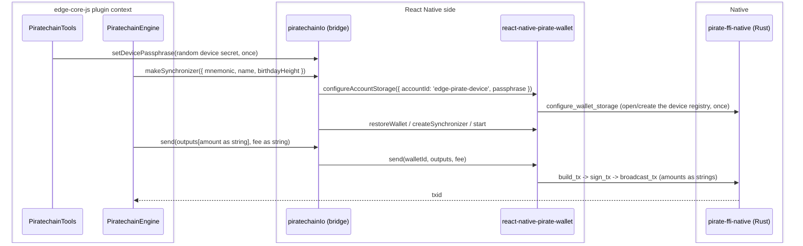

# Piratechain SDK v1.1.5 reconciliation: replace the crashing wallet module with the released unified SDK

| | |
|---|---|
| Status | Implemented; sync verified on the iOS sim, broadcast blocked upstream ([section 7](#7-testing)) |
| Author | Jon Tzeng |
| Reviewer | peachbits |
| Last updated | 2026-08-11 |
| Repos | [edge-currency-accountbased](https://github.com/EdgeApp/edge-currency-accountbased), [edge-react-gui](https://github.com/EdgeApp/edge-react-gui), react-native-pirate-wallet (npm `0.2.1`) |
| Implementation | [edge-currency-accountbased#1055](https://github.com/EdgeApp/edge-currency-accountbased/pull/1055), [edge-react-gui#6021](https://github.com/EdgeApp/edge-react-gui/pull/6021) |
| Supersedes | - |
| Related | [PirateNetwork/Pirate-Unified-Light-Wallet#19](https://github.com/PirateNetwork/Pirate-Unified-Light-Wallet/pull/19), Asana 1216926437132721 |

Branch references point at `agent/1214721783909451` in both Edge repos. Direction came from Asana task 1216926437132721 (reconcile the open rewrite PRs with the released v1.1.5 and confirm it removes the piratechain crash workaround) and the recorded review thread with the Pirate Chain team.

## Contents
1. [Problem](#1-problem)
2. [Prior art](#2-prior-art)
3. [Goals and non-goals](#3-goals-and-non-goals)
4. [Design overview](#4-design-overview)
5. [Detailed design: edge-currency-accountbased](#5-detailed-design-edge-currency-accountbased)
6. [Detailed design: edge-react-gui and the SDK dependency](#6-detailed-design-edge-react-gui-and-the-sdk-dependency)
7. [Testing](#7-testing)
8. [Phase history](#8-phase-history)
9. [Decisions](#9-decisions)
10. [References](#10-references)

## 1. Problem

The shipped `react-native-piratechain` module is a fork of ZcashLightClientKit. Its Swift and Rust layers each open the wallet's SQLite database, and when Swift reads while Rust writes the process crashes. The crash is frequent enough that the sim-testing playbook prescribes a local workaround for every unrelated agent run: set `piratechain: false` in `src/util/corePlugins.ts` so the module never loads. That workaround is the "orch workaround" this task exists to retire.

The Pirate Chain team replaced that module with a unified SDK whose React Native binding is `react-native-pirate-wallet`, where all database access goes through Rust (Swift and Kotlin only pass JSON). An in-flight rewrite reimplemented the Edge plugin over that binding (see [section 8](#8-phase-history)), but it was built against an unreleased fork (v1.1.4 plus local patches) and left three reviewer concerns open. The team has since shipped **v1.1.5**, which merges the Edge-authored fixes and changes the wire format. This work reconciles the plugin with that release.

## 2. Prior art

- Old `react-native-piratechain`: the crash source ([section 1](#1-problem)); not fixable without abandoning the double-open architecture, which the unified SDK does.
- Vendored fork v1.1.4 plus patches: made sync and send work by patching a per-call tokio runtime that killed the sync worker and a payload-camelization bug in the RN wrapper. Those patches went upstream as [PR #19](https://github.com/PirateNetwork/Pirate-Unified-Light-Wallet/pull/19) and merged, so carrying a fork is no longer the answer; v1.1.5 is installable directly.

## 3. Goals and non-goals

Goals:
- Re-vendor `react-native-pirate-wallet` from the v1.1.5 release (RN binding 0.1.1 to 0.2.0), native binaries included.
- Reconcile the plugin to the v1.1.5 wire format: amounts as decimal strings in both directions, sends through the SDK `send()` method, and the `orchard` to `ironwood` key rename in the type surface.
- Resolve the three open review threads: string amounts (precision), registry passphrase secrecy (security), and honest native-error typing.
- Hold every ARRR wallet in one device-scoped registry so multiple wallets sync at once over a shared block cache ([decision 1](#decision-1-one-device-scoped-registry-namespace)).
- Keep `piratechain: true` in the GUI and confirm on device that the crash is gone, removing the need for the corePlugins workaround.

Non-goals:
- Isolating registries per Edge account. The SDK's registry selection is device-global, so an account-scoped registry would reintroduce the switching that breaks concurrent sync ([decision 1](#decision-1-one-device-scoped-registry-namespace)).
- Publishing `react-native-pirate-wallet` itself. The Pirate team published it on 2026-08-06, and [phase 5](#phase-5-npm-dependency-and-the-lightwalletd-endpoint) consumes that release; Edge does not own the package.
- Bumping to v1.1.6. That release is v1.1.5 plus the Ironwood mainnet activation height, which the Pirate team sets only once partners confirm readiness. A v1.1.5 build does not survive that activation, so one more bump is owed before it happens.

## 4. Design overview

| Repo | Deliverable | Scope |
|---|---|---|
| edge-currency-accountbased | [#1055](https://github.com/EdgeApp/edge-currency-accountbased/pull/1055) | Bridge and engine reconciliation ([section 5](#5-detailed-design-edge-currency-accountbased)) |
| edge-react-gui | [#6021](https://github.com/EdgeApp/edge-react-gui/pull/6021) | Depend on the published SDK, keep plugin enabled ([section 6](#6-detailed-design-edge-react-gui-and-the-sdk-dependency)) |
| react-native-pirate-wallet | npm `0.2.1` | Published by the Pirate team 2026-08-06 ([section 6](#6-detailed-design-edge-react-gui-and-the-sdk-dependency)) |

The plugin's native IO bridge (`piratechainIo.ts`) runs on the React Native side and talks to the SDK, which forwards JSON to the Rust core. The engine (`PiratechainEngine.ts`) runs inside the edge-core-js plugin context and reaches the bridge over the yaob object bridge.



## 5. Detailed design: edge-currency-accountbased

The plugin's public shape and the engine's transaction mapping are unchanged.

### Registry storage

v1.1.5 removes the global `set_app_passphrase` / `unlock_app` flow entirely; the only storage entry point is `configureAccountStorage`, which selects a registry directory and creates or unlocks it with a passphrase. That selection is **device-global**: one registry is active at a time, and switching cancels any running sync and clears the registry and block caches. So the bridge configures exactly one device-scoped registry, `DEVICE_ACCOUNT_ID = 'edge-pirate-device'`, and every ARRR wallet lives inside it keyed by its alias `name` (the `base16(walletId)` the tools layer already passes). Wallet-free reads (`isValidAddress`, the chain-tip probe in `getLatestNetworkHeight`) use that same registry, so no throwaway namespace exists.

`ensureDeviceStorage()` performs the configuration at most once, memoized on a promise so concurrent wallet starts share one setup. It configures storage and then sets the transport (`set_tunnel` Direct, because the SDK's default Tor tunnel does not reliably bootstrap inside Edge); a failure clears the memo so the next call retries the whole setup rather than proceeding on an unconfigured registry. Registry mutations (restore, and the probe wallet's create/delete) run under a `registryLock` serialization. Syncing does not: each wallet gets its own `PirateWalletSynchronizer`, and with no namespace switching left they run concurrently over a shared block cache.

The passphrase is a random 32-byte secret minted per device on first use and persisted in the plugin's local storage. It is generated on the **core side**, in `piratechainDeviceStorage.ts`: the bridge cannot do it because Metro resolves neither Node's `crypto` (the bridge redboxes `Unable to resolve module crypto`) nor a disklet. The core hands it to the bridge through `setDevicePassphrase` before any wallet call:

```ts
// as landed, piratechainDeviceStorage.ts (core side)
const DEVICE_PASSPHRASE_FILE = 'piratechain/devicePassphrase.json'

const loadOrCreateDevicePassphrase = async (io: EdgeIo): Promise<string> => {
  const { disklet } = io
  const listing = await disklet.list(DEVICE_PASSPHRASE_FILE)
  if (listing[DEVICE_PASSPHRASE_FILE] === 'file') {
    const text = await disklet.getText(DEVICE_PASSPHRASE_FILE)
    try {
      return asDevicePassphraseFile(text).passphrase
    } catch (error: unknown) {
      // Unreadable contents: fall through and re-mint.
    }
  }
  const passphrase = base16.stringify(io.random(32))
  await disklet.setText(DEVICE_PASSPHRASE_FILE, JSON.stringify({ passphrase }))
  return passphrase
}
```

Existence is checked before reading so a transient read failure surfaces as an error rather than silently minting a new secret and orphaning the registry, which would force every wallet to re-scan from its birthday.

`PiratechainTools.ensureDevicePassphrase()` performs the handoff once, memoized on a promise, and every path that reaches the SDK's storage awaits it first: the tools' own `isValidAddress`, `getNewWalletBirthdayBlockheight` and `derivePublicKey`, plus the engine's `syncNetwork` before it builds a synchronizer. It is deliberately lazy rather than part of `makeCurrencyTools`, so constructing tools never depends on the native module being linked (the plugin's unit tests build tools against a stub bridge).

### Chain tip without mutating the registry

`getLatestNetworkHeight` cannot ask the SDK for a chain tip directly, and the obvious workaround (create a throwaway wallet with no birthday, read the height it resolves, delete it) mutates the shared registry. Doing that while other wallets' synchronizers are running **aborts the app**: the native service panics inside `pirate_wallet_service_invoke_json`, and because the panic crosses the FFI boundary Rust turns it into `SIGABRT` rather than a catchable error. Under the phase-2 per-wallet model this never surfaced, since the probe had its own throwaway namespace and touched nothing live.

So the height comes from a wallet that is already registered: `getSyncStatus(walletId).targetHeight`, which reads state instead of changing it. The create-and-delete probe survives only as the empty-registry fallback, where no wallet exists to ask and therefore no synchronizer can be running.

### Synchronizer status backstop

The engine subscribes to the synchronizer after `start()`, so a `statusChanged` that fires in between is lost and the engine stays at `STOPPED`, which blocks every spend. `PiratechainSynchronizer.getStatus()` exposes the SDK synchronizer's current `status`, and `initSubscriptions` reads it once after subscribing, adopting it only when no event has arrived yet (`synchronizerStatus === 'STOPPED'`) so a live event is never clobbered.

### Amounts as strings

`rnPirateWallet.d.ts` retypes `PirateBalance`, `PirateTransaction`, and `PirateTransactionOutput` amount fields from `number` to `string`, matching v1.1.5's `AmountString`. The engine drops `safeParseInt` on the send path and passes `spendAmount` and `networkFee` as strings straight through; the read path already wrapped values in `String(...)` and biggystring, so it needed only the sign check at `processTransaction` switched from a numeric comparison to `gte(netNativeAmount, '0')`.

### Sends

`makeSynchronizer(...).send` previously ran `build_tx` / `sign_tx` / `broadcast_tx` over the raw `invoke` bridge to dodge a camelization bug. v1.1.5's `send()` keeps the opaque pending and signed payloads verbatim (via `_callRaw`) and normalizes amounts to strings, so the bridge now calls `walletSdk.send(walletId, outputs, fee)` directly.

### Native error typing

`SynchronizerCallbacks.onError` is retyped `(error: unknown)` because bridge errors arrive as serialized objects or strings, not real `Error` instances; the existing `error instanceof Error ? error.message : String(error)` guard already assumes this.

## 6. Detailed design: edge-react-gui and the SDK dependency

`react-native-pirate-wallet@0.2.1` comes from npm, replacing the `file:../react-native-pirate-wallet` sibling. The wrapper tarball carries only JS and the ObjC/Swift/Kotlin bridge; the native artifacts ship as four `optionalDependencies` pinned to the exact wrapper version (`-android`, `-android-x86_64`, `-ios-device`, `-ios-simulator`), and a `postinstall` hard-links the two iOS slices into the `PirateWalletNative.xcframework` the podspec vendors. The iOS pair is marked `os: ["darwin"]`, so Linux CI skips 560MB it cannot use.

`edge-react-gui` sets `ignore-scripts=true` in `.npmrc`, so that `postinstall` can never fire and the podspec would vendor a framework that does not exist. The assembly therefore runs from `scripts/prepare.sh`, which is where the repo already keeps `patch-package`, `jetify` and the native-header copy, and which must run before `pod install`. The script no-ops off macOS.

`src/util/corePlugins.ts` keeps `piratechain: true`; nothing else on the GUI side changes. The seam back to the plugin is the bridge in [section 5](#5-detailed-design-edge-currency-accountbased) and its diagram.

### The lightwalletd endpoint

The SDK bakes in a default lightwalletd node and never reads the plugin's `networkInfo`, so a wallet left alone scans against that default rather than Edge's. When that node degrades the failure is silent and total: `test_node` still succeeds, the chain tip still resolves, and `sync_status` still reports `SYNCING` — but the scan sits in the `Headers` stage at zero blocks/sec forever, which the app renders as "Sync in Progress, 0% Complete" with no error anywhere in the stack. `PiratechainEngine` therefore passes its configured node down as `lightwalletdUrl`, and `makeSynchronizer` applies it with `set_lightd_endpoint` before the synchronizer starts. The configured port is the node's plain gRPC port, not 443: `test_node` fails against `https://lightd1.pirate.black:443` and succeeds against `http://lightd1.pirate.black:9067`.

## 7. Testing

1. Static: `tsc --noEmit` and `verify-repo.sh` (eslint plus jest) pass in edge-currency-accountbased. No piratechain unit tests exist.
2. Crash retirement (VERIFIED, iOS sim): the GUI was built for the iOS simulator with `piratechain: true` (no corePlugins disable) against the v1.1.5 native binaries. Old `react-native-piratechain` is absent from the build (zero Podfile.lock references, not autolinked). ARRR wallets ran the shielded sync with the app stable throughout, the exact background sync that crash-looped the old module. Per-account storage created isolated registries under `Library/Application Support/PirateWallet/accounts/<sanitized-id>/`.
3. Send (VERIFIED, iOS sim, real broadcast): a self-account ARRR send was driven to the transaction-success scene. Source `My Pirate 2` (14.731 ARRR spendable), destination `My Pirate` (picked via the send scene's "Myself" wallet picker, which derived the recipient shielded z-address `zs1e5v84m2mnhwcxd0h4nx85jz97gd9shcphgx84fhh8v7vw9eztz72scekz8c6pxjrl0a2yurjuyj`), amount 4.754 ARRR, fee 0.0001 ARRR. The app reported "Transaction Success" and the transaction record shows txid `34ba68b0fee76668790ef7dae32f374c7f378da589022a1034f1112e234e49cd`. This confirms the string-amount send path and the SDK `send()` call end to end, and exercises the `txid` transaction-processing fix (see [phase 3](#phase-3-e2e-send-verification)) without the `toLowerCase` crash.

4. Endpoint fix (VERIFIED, iOS sim, 2026-08-11): with `set_lightd_endpoint` applied, `My Pirate 2` and `My Pirate` scanned from their birthdays to `SYNCED` at roughly 1,800 blocks/sec, `localHeight == targetHeight == 4085959`, wallet DBs growing 1.5MB to 233MB, and the wallet-detail sync banner cleared. Without it both wallets sat at `stage: "Headers"`, `blocksPerSecond: 0`, `localHeight` frozen, for 45 minutes across two full builds. Re-verified on a build carrying the committed fix rather than the diagnostic patch.
5. Broadcast (NOT VERIFIED, 2026-08-11): three funded attempts from the SYNCED, spendable `My Pirate 2` — 2.19 ARRR to `My Pirate`, fee 0.0001, confirm slider active — each failed inside the SDK with `Broadcast failed: Status error: status: Cancelled, message: "Timeout expired"`. Reproduced against two different lightwalletd nodes, so it is not endpoint-specific. No principal moved. The transaction builds and signs (roughly 5 minutes on the sim) and the failure is at the gRPC broadcast. This is the one remaining gap before the app is ready for activation, and it is upstream of Edge's code.

Sync note (superseded): the earlier claim that a clean baked build syncs in roughly 90 seconds at 8000 blocks/sec, and that "sync stuck at 0%" was only a broken-build artifact, was wrong. Item 4 above identifies the real cause: the SDK scans against its own default node unless the plugin sets one, and that default stopped serving blocks.

## 8. Phase history

### Phase 1: rewrite over the vendored fork (v1.1.4)
Sketched: reimplement the plugin over `react-native-pirate-wallet`, restoring wallets into the SDK registry under the Edge walletId alias, mapping sync progress from the polling synchronizer, and sending through the registry wallet.
Shipped: as sketched, against a vendored fork of v1.1.4 with two local upstream patches (persistent tokio runtime, no-camelize tx payload) plus a JSON-number amount format.
Diverged: the fork carried a shared registry unlocked by a hardcoded app passphrase and amounts as JS numbers. Both drew reviewer objections, held open pending the upstream release.

### Phase 2: reconcile to released v1.1.5 (this work)
| Diverged in phase 1 | Shipped in phase 2 |
|---|---|
| Hardcoded shared app passphrase | Per-wallet `configureAccountStorage` namespace, passphrase = HMAC of the wallet seed |
| Amounts as JS numbers (precision loss above 2^53-1) | Decimal strings both directions |
| Manual raw build/sign/broadcast | SDK `send()` (opaque payloads preserved upstream) |
| `onError: (error: Error)` | `onError: (error: unknown)` |
| Vendored fork v1.1.4 | Released v1.1.5, binding 0.2.0 |

Deferred: a single per-Edge-account registry (rather than per wallet) would let one account's wallets share sync state without re-selecting namespaces; it needed an account-derived secret plumbed to the native IO and was out of scope. Phase 4 settles this differently, at device scope ([decision 1](#decision-1-one-device-scoped-registry-namespace)).

### Phase 3: e2e send verification
Verifying on device landed the following:
- Fixed: v1.1.5's `TransactionInfo.txid` is lowercase, but the engine read `tx.txId`, so `edgeTransaction.txid` was `undefined` and `CurrencyEngine.normalizeAddress(undefined)` threw `undefined is not an object (evaluating 'address.toLowerCase')` in `queryTransactions` on every ARRR sync poll, before `updateTransactionRatio(1)`. Changed `txId` to `txid` in `PiratechainEngine` and `rnPirateWallet.d.ts`. Watch for other camelCase-vs-lowercase mismatches: the SDK's `camelize` only converts snake_case, so `txid` and `arrrtoshis` (no underscore) stay lowercase.
- Verified: a real ARRR send broadcast to another wallet in the account ([section 7](#7-testing)), retiring the crash workaround end to end.
- Fixed (Bugbot review): `selectNamespace` marked the namespace active before `set_tunnel` succeeded, so a failed Direct-tunnel call could not be retried (the early return left the namespace on the default Tor transport). Phase 4 removed `selectNamespace` entirely.

Observed (fixed in phase 4): with more than one ARRR wallet, the SDK's single active namespace meant only the last-selected wallet synced and stayed spendable; the others' background pollers read the wrong namespace. The single-wallet send path was unaffected (the send succeeded), but concurrent multi-wallet sync was broken.

### Phase 4: one device-scoped registry

The Pirate team confirmed the intended storage model, which is not the one phase 2 built: `configure_wallet_storage` is global, only one namespace is active at a time, and switching cancels active sync and clears the registry and caches. One namespace per **device**, holding many wallets that share the block cache, is the design; concurrency comes from wallet-scoped synchronizers.

| Diverged in phase 2 | Shipped in phase 4 |
|---|---|
| One namespace per wallet, switched on every wallet-scoped call | One namespace per device, configured once at first use |
| Passphrase = HMAC of the wallet seed (`piratechainCrypto.ts`) | Random 32-byte per-device secret in local storage (`piratechainDeviceStorage.ts`) |
| Fixed throwaway probe namespace for wallet-free reads | The device registry serves them |
| Only the last-selected wallet synced; others polled the wrong namespace | Every wallet's synchronizer runs concurrently over a shared block cache |
| Initial `SYNCED` could be missed, stranding the engine at `STOPPED` | `getStatus()` backstop read once after subscribing |
| Chain tip probed by creating and deleting a throwaway wallet | Read from a registered wallet's `getSyncStatus().targetHeight`; the probe is the empty-registry fallback only |

Old per-wallet registries are abandoned rather than migrated: wallets re-restore from their seeds into the device registry on first run, and the stale directories hold no unrecoverable state.

Found while testing this phase: creating a new ARRR wallet crashed the app to springboard, because the chain-tip probe mutated the now-shared registry while three synchronizers were running against it. The crash report pinned it to a Rust panic in `pirate_wallet_service_invoke_json` reaching `abort` through `panic_cannot_unwind`. The fix is [the chain-tip change above](#chain-tip-without-mutating-the-registry); wallet creation then succeeded with all four wallets coexisting in the one registry.

### Phase 5: npm dependency and the lightwalletd endpoint
Sketched: swap the GUI off the vendored `file:` sibling onto the published `react-native-pirate-wallet@0.2.1`, merge up with `develop`, and close the e2e send that the phase-4 storage re-key blocked.
Shipped: the npm swap, with the XCFramework assembly moved into `scripts/prepare.sh` because the repo disables install scripts ([section 6](#6-detailed-design-edge-react-gui-and-the-sdk-dependency)); and the `set_lightd_endpoint` fix, which is what actually made ARRR sync ([section 6](#the-lightwalletd-endpoint)). A clean clone reproduces every native artifact.
Diverged: two walls the phase did not anticipate. The e2e send still does not broadcast — it now fails at the SDK's gRPC broadcast rather than at spendability, which is a different and later failure than phase 4's. And on current `develop` the iOS binary no longer links: `__TEXT` reaches 184MB against the arm64 ±128MB branch range, so `ld` cannot place a branch island. The Pirate static library is the largest contributor at roughly 187MB of arm64 code, but it is not solely responsible; the build linked on 2026-08-04 with the same library, and dropping the three other large Rust/C++ libraries (`zcash`, `monero`, `zano`) links it again. Dead-stripping, link reordering and `-ld_classic` were each tried and each failed identically.

## 9. Decisions

### Decision 1: one device-scoped registry namespace
Chosen: a single `configureAccountStorage` namespace per device (`edge-pirate-device`), holding every ARRR wallet keyed by alias, with one synchronizer per wallet.
Evidence: the Pirate team confirmed `configure_wallet_storage` is global state, that switching cancels active sync and clears the registry and caches, and that one namespace per device sharing a block cache is the intended model. Phase 2's per-wallet namespaces produced exactly the predicted failure on device: with two ARRR wallets, only the last-selected one synced and stayed spendable while the others' pollers read the wrong namespace.
Rejected: per-wallet namespaces (phase 2), which cannot support concurrent sync because every wallet-scoped call would have to re-select and thereby cancel another wallet's sync. Rejected: per-Edge-account namespaces, which have the same defect one level up (switching accounts still clears the shared block cache) and also need an account secret the bridge does not hold. Rejected: one SDK context per wallet, which the RN binding does not expose (`createPirateWalletSdk` wraps a single native module instance).
Reopen if: the SDK gains per-wallet or per-context storage selection, making isolation possible without cancelling sync.

### Decision 2: send through the SDK, not raw invoke
Chosen: `walletSdk.send(walletId, outputs, fee)`.
Evidence: v1.1.5 fixed the camelization bug (merged from [PR #19](https://github.com/PirateNetwork/Pirate-Unified-Light-Wallet/pull/19)) that forced the raw path, and its `send()` both preserves the opaque intermediate payloads and normalizes amounts to strings.
Rejected: keeping the manual `build_tx` / `sign_tx` / `broadcast_tx` over raw `invoke`, which now duplicates SDK logic and, because raw `invoke` skips the SDK's amount normalization, would send unnormalized numeric amounts.
Reopen if: a future SDK release changes `send()` semantics or reintroduces the payload rewrite.

### Decision 3: a random per-device passphrase in the plugin's local storage
Chosen: `base16.stringify(io.random(32))`, minted on first use and persisted to `piratechain/devicePassphrase.json` on the core `EdgeIo` disklet, handed to the bridge via `setDevicePassphrase`.
Evidence: v1.1.5's README requires a unique, high-entropy, secret-derived passphrase and forbids hardcoded or public values; a device-random secret satisfies all three and, unlike a seed-derived one, does not tie a device-scoped registry to any single wallet's key material. `io.random` is the core's CSPRNG and `io.disklet` is device-local storage that never syncs, so the secret stays on the device. Generation cannot live in the bridge: Metro resolves neither `crypto` nor a disklet.
Rejected: HMAC of a wallet seed (phase 2's answer), which cannot key a registry holding many wallets without arbitrarily privileging one wallet's seed, and which leaks a deterministic function of spending material into a storage key. Rejected: a hardcoded constant, the exact pattern the security review flagged. Rejected: the OS keychain, which would add a native dependency for a secret that guards device-local data the OS already sandboxes; the disklet is the plugin's existing storage seam.
Reopen if: the secret needs to survive an app reinstall or migrate between devices, which local storage does not do (today the cost is a re-scan from birthday, not a loss of funds).

## 10. References
- Asana task 1216926437132721 and its recorded Pirate Chain team thread.
- [PirateNetwork/Pirate-Unified-Light-Wallet#19](https://github.com/PirateNetwork/Pirate-Unified-Light-Wallet/pull/19) (merged): the upstream runtime and payload fixes now in v1.1.5.
- v1.1.5 release artifact `pirate-unified-wallet-react-native-plugin-artifacts-v1.1.5.zip` and its README (account-scoped storage contract).
