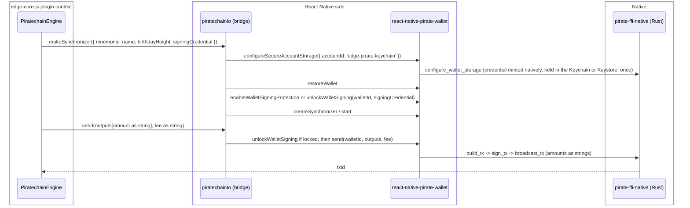

# Pirate Chain on the unified wallet SDK: replace the crashing wallet module with react-native-pirate-wallet

| | |
|---|---|
| Status | Implemented; a funded end-to-end send verified on the iOS sim on `0.3.4` through the [keychain](#keychain) registry and a signing session, and the shippable build verified green on CI ([section 7](#7-testing)). Awaiting human review |
| Author | Jon Tzeng |
| Reviewer | peachbits |
| Last updated | 2026-09-05 |
| Repos | [edge-currency-accountbased](https://github.com/EdgeApp/edge-currency-accountbased), [edge-react-gui](https://github.com/EdgeApp/edge-react-gui), react-native-pirate-wallet (npm `0.3.4`) |
| Implementation | [edge-currency-accountbased#1055](https://github.com/EdgeApp/edge-currency-accountbased/pull/1055), [edge-react-gui#6021](https://github.com/EdgeApp/edge-react-gui/pull/6021) |
| Supersedes | - |
| Related | [PirateNetwork/Pirate-Unified-Light-Wallet#19](https://github.com/PirateNetwork/Pirate-Unified-Light-Wallet/pull/19), Asana 1216926437132721 |

<!-- tdd-code-fingerprint: f0f574113cd64293510a093e4fd8fc60f643fec9 -->

Branch references point at `agent/1214721783909451` in both Edge repos. Direction came from Asana task 1216926437132721 (reconcile the open rewrite PRs with the released v1.1.5 and confirm it removes the piratechain crash workaround) and the recorded review thread with the Pirate Chain team.

## Contents
1. [Problem](#1-problem)
2. [Prior art](#2-prior-art)
3. [Goals and non-goals](#3-goals-and-non-goals)
4. [Design overview](#4-design-overview)
5. [Detailed design: edge-currency-accountbased](#5-detailed-design-edge-currency-accountbased)
6. [Detailed design: edge-react-gui and the SDK dependency](#6-detailed-design-edge-react-gui-and-the-sdk-dependency)
7. [Testing](#7-testing)
8. [Phase history](#8-phase-history)
9. [Decisions](#9-decisions)
10. [Glossary](#10-glossary)
11. [References](#11-references)
12. [Post-implementation retrospective](#12-post-implementation-retrospective)

## 1. Problem

The shipped `react-native-piratechain` module is a fork of ZcashLightClientKit. Its Swift and Rust layers each open the wallet's SQLite database, and when Swift reads while Rust writes the process crashes. The crash is frequent enough that the sim-testing playbook prescribes a local workaround for every unrelated agent run: set `piratechain: false` in `src/util/corePlugins.ts` so the module never loads. That workaround is the "orch workaround" this task exists to retire.

The Pirate Chain team replaced that module with a unified SDK whose React Native binding is `react-native-pirate-wallet`, where all database access goes through Rust (Swift and Kotlin only pass JSON). An in-flight rewrite reimplemented the Edge plugin over that binding (see [section 8](#8-phase-history)), but it was built against an unreleased fork (v1.1.4 plus local patches) and left three reviewer concerns open. The team has since shipped **v1.1.5**, which merges the Edge-authored fixes and changes the wire format, and then **v1.1.6** (npm `0.3.0`), which sets the [Ironwood](#ironwood) activation height and ships their [Supernova](#supernova) sync engine. This work reconciles the plugin with those releases and pins v1.1.6.

## 2. Prior art

- Old `react-native-piratechain`: the crash source ([section 1](#1-problem)); not fixable without abandoning the double-open architecture, which the unified SDK does.
- Vendored fork v1.1.4 plus patches: made sync and send work by patching a per-call tokio runtime that killed the sync worker and a payload-camelization bug in the [RN](#rn) wrapper. Those patches went upstream as [PR #19](https://github.com/PirateNetwork/Pirate-Unified-Light-Wallet/pull/19) and merged, so carrying a fork is no longer the answer; v1.1.5 is installable directly.

## 3. Goals and non-goals

Goals:
- Depend on the published `react-native-pirate-wallet`, native binaries included. The plugin started on a vendored v1.1.4 fork, moved to the v1.1.5 release ([RN](#rn) binding 0.1.1 to 0.2.0), and now pins `0.3.2`, on top of the v1.1.6 release (`0.3.0`) that carries the [Ironwood](#ironwood) activation height ([section 6](#ironwood-activation)).
- Reconcile the plugin to the v1.1.5 wire format: amounts as decimal strings in both directions, sends through the SDK `send()` method, and the `orchard` to `ironwood` key rename in the type surface.
- Resolve the three open review threads: string amounts (precision), registry passphrase secrecy (security), and honest native-error typing.
- Hold every [ARRR](#arrr) wallet in one device-scoped registry so multiple wallets sync at once over a shared block cache ([decision 1](#decision-1-one-device-scoped-registry-namespace)).
- Keep `piratechain: true` in the GUI and confirm on device that the crash is gone, removing the need for the corePlugins workaround.

Non-goals:
- Isolating registries per Edge account. The SDK's registry selection is device-global, so an account-scoped registry would reintroduce the switching that breaks concurrent sync ([decision 1](#decision-1-one-device-scoped-registry-namespace)).
- Publishing `react-native-pirate-wallet` itself. The Pirate team published it on 2026-08-06, and [phase 5](#phase-5-npm-dependency-and-the-lightwalletd-endpoint) consumes that release; Edge does not own the package.
- Resolving the arm64 Debug link ceiling. Debug simulator builds do not link with all four large Rust/C++ native libraries present ([section 6](#the-arm64-debug-link-ceiling)). Release builds do, so this costs local iteration rather than shipping, and the real fix belongs upstream.
- Closing the spendability window the SDK leaves after `SYNCED`. The plugin surfaces the SDK's `ERR_SYNC_FINALIZING` the same way it surfaces any other native error, which the app renders as a generic failure ([the spendability window after `SYNCED`](#the-spendability-window-after-synced)). Mapping it to retryable copy is a GUI change on top of a plugin signal that does not exist yet, so it is tracked rather than done here.
- Stopping the synchronizers that archived wallets start at login ([section 7](#7-testing) item 21). Engines are started by the core before the account's archived state loads, so the fix is above the plugin and would be an unrelated change to core's wallet lifecycle.

## 4. Design overview

| Repo | Deliverable | Scope |
|---|---|---|
| edge-currency-accountbased | [#1055](https://github.com/EdgeApp/edge-currency-accountbased/pull/1055) | Bridge and engine reconciliation ([section 5](#5-detailed-design-edge-currency-accountbased)) |
| edge-react-gui | [#6021](https://github.com/EdgeApp/edge-react-gui/pull/6021) | Depend on the published SDK, keep plugin enabled ([section 6](#6-detailed-design-edge-react-gui-and-the-sdk-dependency)) |
| react-native-pirate-wallet | npm `0.3.4` | Unified wallet SDK, published by the Pirate team ([section 6](#6-detailed-design-edge-react-gui-and-the-sdk-dependency)) |

The plugin's native [IO bridge](#io-bridge) (`piratechainIo.ts`) runs on the React Native side and talks to the SDK, which forwards JSON to the Rust core. The engine (`PiratechainEngine.ts`) runs inside the edge-core-js plugin context and reaches the bridge over the [yaob](#yaob) object bridge.



## 5. Detailed design: edge-currency-accountbased

The plugin's public shape and the engine's transaction mapping are unchanged.

### Registry storage

The SDK's storage entry points select a registry directory and create or unlock it with a passphrase, and that selection is **device-global**: one registry is active at a time, and switching cancels any running sync and clears the registry and block caches. So the bridge configures exactly one device-scoped registry, `DEVICE_ACCOUNT_ID = 'edge-pirate-keychain'`, and every [ARRR](#arrr) wallet lives inside it keyed by its alias `name` (the `base16(walletId)` the tools layer already passes). Wallet-free reads (`isValidAddress`, the chain-tip probe in `getLatestNetworkHeight`) use that same registry, so no throwaway namespace exists.

`ensureDeviceStorage()` performs the configuration at most once, memoized on a promise so concurrent wallet starts share one setup. It configures storage and then sets the transport (`set_tunnel` Direct, because the SDK's default Tor tunnel does not reliably bootstrap inside Edge); a failure clears the memo so the next call retries the whole setup rather than proceeding on an unconfigured registry. Registry mutations (restore, and the probe wallet's create/delete) run under a `registryLock` serialization. Syncing does not: each wallet gets its own `PirateWalletSynchronizer`, and with no namespace switching left they run concurrently over a shared block cache.

The registry passphrase never exists in JavaScript. `configureSecureAccountStorage({ accountId })`, added in SDK 0.3.4, has the native module mint a random credential on first use and keep it in the iOS [Keychain](#keychain) or the Android [Keystore](#keystore): the Kotlin bridge wraps it with [AES-GCM](#aes-gcm) under an `AndroidKeyStore` key and stores the ciphertext in private shared preferences, and the iOS bridge stores a Keychain item. Every later launch reads it back natively and passes it to `configure_wallet_storage` without returning it across the bridge. The registry directory is derived from `accountId` alone on both platforms, so the secure registry takes a fresh id rather than pointing a Keychain credential at a directory whose registry was encrypted under the earlier JS-minted passphrase. Nothing shipped with that passphrase, so the only registries it orphans are on development devices, and their wallets re-restore from seed into the new registry on first run.

[`src/piratechain/piratechainIo.ts`](https://github.com/EdgeApp/edge-currency-accountbased/blob/01fad4038a80cd870951925b704a43ae4f6cc938/src/piratechain/piratechainIo.ts)
```ts
const DEVICE_ACCOUNT_ID = 'edge-pirate-keychain'

  const configureDeviceStorage = async (): Promise<void> => {
    await getSdk().configureSecureAccountStorage({
      accountId: DEVICE_ACCOUNT_ID
    })
    // The default transport tunnels through Tor, which doesn't reliably
    // bootstrap inside Edge, and configuring storage clears transport state.
    // Reconnect directly, like every other plugin:
    await invokeCall('set_tunnel', { mode: 'Direct' })
  }
```

Every path that reaches the SDK's storage awaits `ensureDeviceStorage()` first: the tools' `isValidAddress`, `getNewWalletBirthdayBlockheight` and `derivePublicKey`, and the engine's `syncNetwork` before it builds a synchronizer. Nothing runs at construction, so building tools never depends on the native module being linked (the plugin's unit tests build tools against a stub bridge).

### Wallet signing sessions

The registry credential unlocks viewing data and the block cache, which concurrent sync needs before any Edge account is open, so it cannot also be what guards signing. SDK 0.3.4 separates the two. `enable_wallet_signing_protection` rewraps a wallet's seed and spending keys under a second key derived from a credential the host supplies, holds that key in memory only, and fails `sign_tx` with `ERR_SIGNING_SESSION_LOCKED` until `unlock_wallet_signing` installs it again. Viewing keys and compact blocks stay readable while locked, so a locked wallet still syncs.

Edge has no account-session secret to hand a currency plugin; engines receive wallet keys, not account keys. The mnemonic is the closest thing: account-encrypted material that `syncNetwork` receives exactly while the account is unlocked and that leaves the engine when it is killed. So the credential is an [HMAC](#hmac) over the mnemonic, keyed by a fixed domain string and built on [SHA-256](#sha-256), hex encoded, computed in the engine and passed to the bridge inside the synchronizer config, and never written anywhere on either side:

[`src/piratechain/PiratechainEngine.ts`](https://github.com/EdgeApp/edge-currency-accountbased/blob/01fad4038a80cd870951925b704a43ae4f6cc938/src/piratechain/PiratechainEngine.ts)
```ts
function deriveSigningCredential(mnemonic: string): string {
  return base16.stringify(
    createHmac('sha256', SIGNING_CREDENTIAL_DOMAIN).update(mnemonic).digest()
  )
}
const SIGNING_CREDENTIAL_DOMAIN = 'edge-currency-accountbased/piratechain/signing-session/v1'
```

The bridge reads `get_wallet_signing_status` after the wallet is restored, enables protection the first time a wallet is seen on this device, and unlocks it on every later start. It runs the same check again immediately before `send`, because another wallet's `lock_wallet_signing` or a `lock_all_wallet_signing` can have cleared this wallet's key since start, and it locks the wallet when the synchronizer stops, which is when the engine is killed on account lock or logout. Sync never depends on any of this: a signing call that fails logs and the synchronizer starts anyway, and the eventual send then reports the SDK's own reason rather than a softened one.

[`src/piratechain/piratechainIo.ts`](https://github.com/EdgeApp/edge-currency-accountbased/blob/01fad4038a80cd870951925b704a43ae4f6cc938/src/piratechain/piratechainIo.ts)
```ts
      const { signingCredential } = config
      const ensureSigningUnlocked = async (): Promise<void> => {
        const status = await walletSdk.getWalletSigningStatus(walletId)
        if (!status.protectionEnabled) {
          await walletSdk.enableWalletSigningProtection(
            walletId,
            signingCredential
          )
        } else if (!status.unlocked) {
          await walletSdk.unlockWalletSigning(walletId, signingCredential)
        }
      }
```

### Endpoint pool diagnostics

`get_lightd_endpoint_pool_diagnostics`, also new in 0.3.4, live-probes every configured endpoint over the wallet's transport and reports the configured primary, the endpoint the SDK would select (`activeEndpoint`, null when none passes connectivity, compact-cache readiness and canonical-chain validation), whether automatic failover is on, and each endpoint's health, tip height, latency and rejection reason. The engine logs it once after each synchronizer start, off the sync path, because a wallet that never syncs otherwise looks the same whether every node is down or the pool was refused. It is the observation surface the degraded-endpoint test in [section 7](#7-testing) item 19 lacked.

### Chain tip without mutating the registry

`getLatestNetworkHeight` cannot ask the SDK for a chain tip directly, and the obvious workaround (create a throwaway wallet with no birthday, read the height it resolves, delete it) mutates the shared registry. Doing that while other wallets' synchronizers are running **aborts the app**: the native service panics inside `pirate_wallet_service_invoke_json`, and because the panic crosses the [FFI](#ffi) boundary Rust turns it into `SIGABRT` rather than a catchable error. Under the phase-2 per-wallet model this never surfaced, since the probe had its own throwaway namespace and touched nothing live.

So the height comes from three sources, cheapest and safest first:

1. A wallet that is already registered: `getSyncStatus(walletId).targetHeight`, which reads state instead of changing it.
2. `test_node` against the plugin's configured `lightwalletdUrl`. It reports `latest_block_height` without registering anything, so it is safe while synchronizers run, and it reads Edge's node rather than the SDK's default. That matters twice over: the default is unreachable, and a tip taken from an unaudited node could be inflated, which would set a new wallet's birthday above notes it then never scans.
3. The create-and-delete probe, gated on the registry being **empty**. Its `create_wallet` with no birthday falls back to the SDK's static checkpoint, which sits below the true tip and is therefore conservative.

The gate on step 3 is what keeps the probe away from a live registry. An earlier cut ran the probe whenever the step-1 loop fell through, which is not the same as an empty registry: wallets can be registered and syncing while none has resolved a tip yet (the first seconds after launch report `targetHeight: 0`), and that is exactly the state where the probe aborts the app. With wallets present and no reachable node, `getLatestNetworkHeight` now throws instead, failing wallet creation visibly rather than killing the process.

### Synchronizer status backstop

The engine subscribes to the synchronizer after `start()`, so a `statusChanged` that fires in between is lost and the engine stays at `STOPPED`, which blocks every spend. `PiratechainSynchronizer.getStatus()` exposes the SDK synchronizer's current `status`, and `initSubscriptions` reads it once after subscribing, adopting it only when no event has arrived yet (`synchronizerStatus === 'STOPPED'`) so a live event is never clobbered.

### Synchronizer lifecycle

`makeSynchronizer` returns its handle only after `start()` resolves, and that handle is the only way to stop the native poller. So a `start()` that throws closes the synchronizer before rethrowing: without that, the caller holds nothing to stop, and its retry stacks a second poller on the same registry wallet.

The plugin does not choose which wallets get a synchronizer; the core starts engines and the plugin serves them. That has an observable cost the plugin cannot fix: archived [ARRR](#arrr) wallets still start synchronizers at login and scan for tens of seconds before the account's archived state arrives and stops them ([section 7](#7-testing) item 21). On an account carrying several, that is several concurrent scans against one node on every launch.

### Amounts as strings

`rnPirateWallet.d.ts` retypes `PirateBalance`, `PirateTransaction`, and `PirateTransactionOutput` amount fields from `number` to `string`, matching v1.1.5's `AmountString`. The engine drops `safeParseInt` on the send path and passes `spendAmount` and `networkFee` as strings straight through; the read path already wrapped values in `String(...)` and biggystring, so it needed only the sign check at `processTransaction` switched from a numeric comparison to `gte(netNativeAmount, '0')`.

### Sends

`makeSynchronizer(...).send` previously ran `build_tx` / `sign_tx` / `broadcast_tx` over the raw `invoke` bridge to dodge a camelization bug. v1.1.5's `send()` keeps the opaque pending and signed payloads verbatim (via `_callRaw`) and normalizes amounts to strings, so the bridge calls `walletSdk.send(walletId, outputs, fee)` directly. SDK 0.3.4 made `broadcast_tx` wallet-scoped (`broadcastTransaction(walletId, signed)`; the one-argument form is gone) so endpoint selection and repair state belong to the wallet that built the transaction. `send()` routes through it, so the plugin's call is unchanged.

### The spendability window after `SYNCED`

A wallet reporting `SYNCED` at 100 percent is not necessarily able to spend. The SDK builds its spend anchor after the scan finishes, and a send attempted in that interval is refused with `ERR_SYNC_FINALIZING: Wallet spend anchor is not available yet. Let sync complete and retry.` The window was ninety seconds on one measured cold sync ([section 7](#7-testing) item 20) and closed on its own.

`sync_status` cannot see that window: it reports `SYNCED`, `percent` reads 100, and the app clears its sync banner. `get_spendability_status` can, and the Pirate team pointed at it on 2026-08-27 after this doc reported the gap. It returns `spendable` plus the reason it is false, as `rescanRequired`, `repairQueued`, a `reasonCode`, and the anchor heights the SDK is validating against. Since 0.3.4 `reasonCode` is a closed set, `OK`, `ERR_SYNC_FINALIZING`, `ERR_WITNESS_REPAIR_QUEUED` and `ERR_RESCAN_REQUIRED`, and `spendabilityMessage` picks the copy from it, with the two booleans as the fallback for a status that arrives without one.

So `makeSpend` gates on it. `checkSpendable` keeps the existing `SYNCED` check, then reads the status and throws `PendingFundsError` naming which wait the wallet is in. Refusing at `makeSpend` rather than at broadcast is what makes this a disabled send instead of a failed one: the send scene keeps its confirm slider disabled while it holds no transaction, so the user never confirms a spend the SDK is going to reject. The GUI turns that error into localized retry copy ([section 6](#6-detailed-design-edge-react-gui-and-the-sdk-dependency)) in place of the generic "check your network connection" card.

A status the plugin cannot read is not a reason to block a spend: `SYNCED` alone was the whole gate before this [RPC](#rpc) existed, so a failed or unrecognized `get_spendability_status` logs and falls through to the old behavior. Only `spendable: false`, read successfully, stops the send.

On `0.3.2` the status was necessary and not sufficient, which testing established rather than assumed ([section 7](#7-testing) item 22): a wallet reading `spendable: true, repairQueued: false, reasonCode: OK`, with `anchorHeight` equal to `validatedAnchorHeight`, still had two broadcasts rejected by the node with `ERR_WITNESS_REPAIR_QUEUED: Node rejected transaction with unknown anchor. Witness repair was queued; let sync complete and retry.`, and the status did not change after either failure. SDK 0.3.4 answers that directly: repair state is durable until witness reconstruction and anchor validation both finish, `repairQueued` stays true while a repair is queued or running, and the status cannot return `OK` early. `broadcastTx` keeps restating `ERR_WITNESS_REPAIR_QUEUED` and `ERR_SYNC_FINALIZING` as `PendingFundsError` anyway: the backstop costs nothing, and a status that was wrong once earns a second route. Any other native error keeps its own text, because an error the plugin cannot classify must not be softened into a wait.

### Native error typing

`SynchronizerCallbacks.onError` is retyped `(error: unknown)` because bridge errors arrive as serialized objects or strings, not real `Error` instances; the existing `error instanceof Error ? error.message : String(error)` guard already assumes this.

## 6. Detailed design: edge-react-gui and the SDK dependency

`react-native-pirate-wallet@0.3.4` comes from npm, replacing the `file:../react-native-pirate-wallet` sibling. Its podspec links the `Security` framework for the [Keychain](#keychain)-backed registry credential ([registry storage](#registry-storage)). The wrapper tarball carries only JS and the ObjC/Swift/Kotlin bridge; the native artifacts ship as five `optionalDependencies` pinned to the exact wrapper version (`-android`, `-android-x86_64`, `-ios-device`, `-ios-simulator-arm64`, `-ios-simulator-x86_64`), and `scripts/assemble-ios-framework.js` assembles them into the `PirateWalletNative.xcframework` the podspec vendors. The three iOS packages are marked `os: ["darwin"]`, so Linux CI skips the hundreds of megabytes it cannot use.

The simulator slice arrives as two thin archives, one per architecture, which 0.3.2 split apart so a developer pulls only what their machine runs. The assembly script hard-links the device slice, then fuses the two thin simulator archives into the universal `ios-arm64_x86_64-simulator` slice with `xcrun lipo`, checking each input's architectures with `lipo -archs` first. That adds a host requirement the earlier versions did not have: `scripts/prepare.sh` now needs Xcode's command line tools on the machine running it, not just Node.

Nothing in the package runs that assembly on install. `0.2.1` invoked it from a `postinstall`, which `edge-react-gui` could never fire because `.npmrc` sets `ignore-scripts=true`; `0.3.0` dropped the hook entirely and left only a manual `prepare:native` script, which 0.3.2 keeps. Either way the assembly has to be driven by the consumer, so it runs from `scripts/prepare.sh`, where the repo already keeps `patch-package`, `jetify` and the native-header copy, and which runs before `pod install`. The script no-ops off macOS. The podspec also runs the same assembly itself during `pod install` and raises if the framework is still missing, which is a belt-and-braces second path rather than a replacement: the script is idempotent, and `prepare.sh` is what makes a plain `npm ci && npm run prepare` produce a complete tree.

`src/util/corePlugins.ts` keeps `piratechain: true`. The only other GUI change is four `testID`s on the send scene's address-tile actions (Enter, Myself, Scan, Paste in `AddressTile2`): they render as icon buttons whose labels are collapsed into an aggregated parent `accessibilityText`, so an automated send drive cannot select them by text and falls back to coordinate taps. The seam back to the plugin is the bridge in [section 5](#5-detailed-design-edge-currency-accountbased) and its diagram.

### The not-yet-spendable send error

`ErrorCard`, which the send scene renders when `makeSpend` throws, shows a specific message only for an `I18nError` and falls back to "An unexpected error occurred. Please check your network connection and try again later." for everything else. That fallback is wrong in both diagnosis and advice for a wallet whose funds are merely not spendable yet, which is what the plugin now reports through `PendingFundsError` ([section 5](#5-detailed-design-edge-currency-accountbased)).

So `SendScene2` translates that one error, in the same `makeSpend` catch block that already translates `InsufficientFundsError`, into an `I18nError` carrying `send_funds_not_spendable_error_message`: the funds are not spendable yet, wait for the wallet to finish syncing and try again. The wording covers both producers of this error, since monero throws it for unconfirmed funds and piratechain for the anchor window, and both resolve by waiting.

Ethereum throws the same error type with the sentinel message `Unexpected pending transactions`, which the scene already handles with its own warning card and suppressed error state. That path is matched first and left alone.

### The lightwalletd endpoint

The SDK bakes in a default [lightwalletd](#lightwalletd) node and never reads the plugin's `networkInfo`, so a wallet left alone scans against that default rather than Edge's. When that node degrades the failure is silent and total: `test_node` still succeeds, the chain tip still resolves, and `sync_status` still reports `SYNCING`, but the scan sits in the `Headers` stage at zero blocks/sec forever, which the app renders as "Sync in Progress, 0% Complete" with no error anywhere in the stack. `PiratechainEngine` therefore passes its configured node down as `lightwalletdUrl`, and `makeSynchronizer` applies it with `set_lightd_endpoint` before the synchronizer starts. The configured port is the node's plain gRPC port, not 443: `test_node` fails against `https://lightd1.pirate.black:443` and succeeds against `http://lightd1.pirate.black:9067`.

That default node has since gone away entirely. `64.23.167.130:9067`, the address `get_lightd_endpoint` returns on a wallet nobody configured, does not answer: an in-app `test_node` gives back `deadline has elapsed` after eight seconds, and a host-side TCP connect times out rather than being refused, so the packets are dropped. The Pirate team confirmed the retirement directly on this PR on 2026-08-17 and named the replacements: `lightd1.pirate.black`, `lightwalletd1.cryptoforge.cc` and `lightwalletd2.cryptoforge.cc`. So `set_lightd_endpoint` is no longer an optimization over a degraded default; without it an [ARRR](#arrr) wallet has no reachable node at all.

The configured endpoint is now `https://lightwalletd2.cryptoforge.cc:443`, and the reasons are transport and throughput together. Both cryptoforge hosts terminate TLS on 443 with a Let's Encrypt certificate whose subject alternative names cover the lightwalletd name, and the SDK reports a `tls_pin` for each, so the plaintext exposure this section used to accept is gone: sync and broadcast no longer travel in the clear where an observer can read which block ranges a device fetches, or an active attacker can serve a forked view.

The throughput half is the larger surprise, and it is the reason this is a change rather than a nicety. Under `0.3.2` a cold scan of a wallet 1.06 million blocks behind runs at roughly 500 blocks/sec against `lightd1.pirate.black:9067`, projecting past half an hour, and reaches the tip in 95 seconds against `lightwalletd2.cryptoforge.cc:443` ([section 7](#7-testing) items 15 to 17). The same wallet on `0.3.0` reached the tip against `lightd1.pirate.black` in 72 seconds, so the naive reading is an SDK regression; the cryptoforge measurement rules that out and leaves an interaction between `0.3.2`'s fetch pattern and that one node. `test_node` puts `lightd1.pirate.black` at a 2,434 ms round trip against `lightwalletd2`'s 537 ms, which is the shape a more round-trip-bound fetch loop would amplify, but the plugin has no visibility into the engine's request pattern and this is where the evidence stops.

### The lightwalletd failover pool

SDK 0.3.2 adds a multi-server mode: instead of one endpoint per wallet, the sync engine takes a pool and spreads block fetches across the servers in it, moving off one that stalls. It is off by default upstream, and the wrapper exposes no typed API for it, so the plugin reaches it the same way it reaches the endpoint and the transport, through the raw `invoke` surface. The [RPC](#rpc) is `set_lightd_endpoint_pool`, taking the wallet id, the primary URL, the alternates, and an `automatic_failover` flag.

The plugin opts in whenever its config names alternates, and it now ships one: `networkInfo.lightwalletdFailoverUrls` carries `https://lightwalletd1.cryptoforge.cc:443` beside the `lightwalletd2` primary. That reverses the earlier default. The pool shipped empty while Edge knew of exactly one reachable clearnet node, which made a "pool" of one both useless and misleading; the Pirate team's answer on this PR supplied the second and third, and an empty list is no longer the honest setting. The info-server payload can still replace the list without an app release, and an empty list still means the bridge makes the ordinary `set_lightd_endpoint` call.

The SDK validates a pool before accepting it, and two of its rules bind Edge's configuration directly. Both were observed as literal errors on device rather than read from documentation, since none exists:

- `Automatic failover requires a recognized Pirate network` rejects a host the SDK does not know as a Pirate node. This is why the pool cannot be exercised against a local proxy: an arbitrary `http://127.0.0.1:9068` primary never reaches the transport at all.
- `Automatic failover endpoint <url> changes the connection security mode` rejects a pool whose members disagree on transport. A TLS primary may not list a plaintext alternate, which is the reason `lightd1.pirate.black:9067` stays out of the shipped list, rather than anything about its reachability.

Two further rules are visible in the SDK's symbol table but were not triggered here: a cap on the number of alternates, and a refusal to combine automatic failover with a pinned primary.

A rejected pool falls back rather than failing the wallet, and that path is not hypothetical: both rejections above logged, fell back to `set_lightd_endpoint`, and the wallet still reached `SYNCED` ([section 7](#7-testing) item 18). Since the list arrives from the info server, a payload that trips any of these rules would otherwise leave the wallet with no endpoint at all, so `makeSynchronizer` catches the rejection, logs it, and configures the single endpoint instead.

### Ironwood activation

Pirate Chain's [Ironwood](#ironwood) [shielded pool](#shielded-pool) is the successor to [Sapling](#sapling), and unified wallet v1.1.6 is the release that sets its activation height. Nothing in the plugin has to change for it, because every call the plugin makes is pool-agnostic by construction: `get_balance` covers both pools plus internal change, `current_receive_address` returns Sapling before activation and Ironwood after it, and `send` sources notes from whatever pool holds them. The plugin never names a pool.

What activation does change is which SDK versions can spend at all. Consensus branch ids are opaque and go into a transaction's signature, so an SDK that does not carry the post-activation branch id builds transactions the network rejects. The SDK exposes this directly: `validate_consensus_branch` compares its own `sdk_branch_id` against the server's and answers `is_valid`. On 2026-08-17 both read `76b809bb` with `is_valid: true`, both wallets held their whole balance in `sapling` with `ironwood` at zero, and both receive addresses were `zs1...` Sapling addresses, which is the pre-activation state. When the network crosses the activation height, an app still shipping the old `react-native-piratechain` module (or a pre-v1.1.6 unified SDK) will see `is_valid` go false and will not be able to spend, while a v1.1.6 build follows the new rules. That is what makes shipping this pair of PRs time-sensitive rather than merely desirable.

The plugin's `deriveViewingKey` deliberately keeps calling `export_sapling_viewing_key` even though `export_ironwood_viewing_key` exists. That key is not used for scanning (the SDK scans from its own registry using the spending key); it only populates the wallet's `EdgePublicKey`, which Edge persists as wallet identity. Switching it post-activation would change a stored identity for no functional gain.

### The arm64 Debug link ceiling

**Debug** iOS builds do not link with all four large Rust/C++ native libraries present. Release builds do, so this costs local iteration and never reached shipping. The distinction was established on 2026-08-17 and is easy to get wrong, so both measurements are recorded here:

| configuration | SDK | `__TEXT` | `__text` | result |
|---|---|---|---|---|
| Debug | iphonesimulator | 187.3MB | 97.6MB | fails to link |
| Release | iphoneos | 140.7MB | 67.4MB | links, 189.7MB arm64 binary |
| Release | iphonesimulator | | | links (Jenkins `Build Maestro ios`) |

The Debug failure is `ld: fixup error (kind=arm64_b26) ... B/BL out of range (displacement=175114548, max is +/-128MB)`, from `libmonero-module.a`'s `boost::chrono` reaching `_mdb_mutex_failed`. The two ends are both monero calling itself, and they end up 167MB apart because the target lives in `__TEXT,text_env`, a 12KB section the same link warns about: *"symbols in `__TEXT,text_env` have unwind information, but it's not a code section (missing `regular,pure_instructions` section flag)"*. Not being flagged as code, `text_env` is placed at the very end of `__TEXT` (`0x0AB71B38`, 171.5MB in) rather than near its callers at 4.5MB, and the linker will not route a [branch island](#branch-island) into it. Release codegen shrinks `__text` by 31% and the distance falls back inside the ±128MB range.

Static-library contributions at Debug are roughly: pirate-wallet 369MB, zcash 106MB, monero 51MB, zano 29MB. This is not specific to this branch (the same libraries linked on 2026-08-04), and it reproduces unchanged on `0.3.0`, whose simulator slice grew by about 1MB over `0.2.1`. Local Debug testing gets past it by excluding `react-native-zcash`, `react-native-monero` and `react-native-zano` from iOS autolinking, which is a test-only measure and is never committed.

The durable fix belongs in `react-native-monero`: flag `text_env` as `regular,pure_instructions`, or fold those symbols into `__text`, so the linker can place them near their callers. Shrinking the Rust staticlibs (`opt-level=z`, `panic=abort`, link-time optimization) would also buy headroom, but it treats the symptom.

## 7. Testing

1. Static: in edge-currency-accountbased, `tsc --noEmit` exits 0 and `npm test` (`nyc mocha`) reports 490 passing / 0 failing, re-run after every code change through the `0.3.0` round. No piratechain unit tests exist, so the suite covers the repo's other plugins and the shared engine; eslint runs on every touched file through `lint-commit.sh`.
2. Crash retirement (VERIFIED, iOS sim): the GUI was built for the iOS simulator with `piratechain: true` (no corePlugins disable) against the v1.1.5 native binaries. Old `react-native-piratechain` is absent from the build (zero Podfile.lock references, not autolinked). [ARRR](#arrr) wallets ran the shielded sync with the app stable throughout, the exact background sync that crash-looped the old module. Per-account storage created isolated registries under `Library/Application Support/PirateWallet/accounts/<sanitized-id>/`, which [phase 4](#phase-4-one-device-scoped-registry) replaced with the single `edge-pirate-device` directory.
3. Send (VERIFIED, iOS sim, real broadcast): a self-account ARRR send was driven to the transaction-success scene. Source `My Pirate 2` (14.731 ARRR spendable), destination `My Pirate` (picked via the send scene's "Myself" wallet picker, which derived the recipient shielded z-address `zs1e5v84m2mnhwcxd0h4nx85jz97gd9shcphgx84fhh8v7vw9eztz72scekz8c6pxjrl0a2yurjuyj`), amount 4.754 ARRR, fee 0.0001 ARRR. The app reported "Transaction Success" and the transaction record shows txid `34ba68b0fee76668790ef7dae32f374c7f378da589022a1034f1112e234e49cd`. This confirms the string-amount send path and the SDK `send()` call end to end, and exercises the `txid` transaction-processing fix (see [phase 3](#phase-3-e2e-send-verification)) without the `toLowerCase` crash.

4. Endpoint fix (VERIFIED, iOS sim, 2026-08-11): with `set_lightd_endpoint` applied, `My Pirate 2` and `My Pirate` scanned from their birthdays to `SYNCED` at roughly 1,800 blocks/sec, `localHeight == targetHeight == 4085959`, wallet DBs growing 1.5MB to 233MB, and the wallet-detail sync banner cleared. Without it both wallets sat at `stage: "Headers"`, `blocksPerSecond: 0`, `localHeight` frozen, for 45 minutes across two full builds. Re-verified on a build carrying the committed fix rather than the diagnostic patch.
5. Broadcast (failed on `0.2.1`, 2026-08-11; SUPERSEDED by item 6): three funded attempts from the synced, spendable `My Pirate 2` (2.19 ARRR to `My Pirate`, fee 0.0001, confirm slider active) each failed inside the SDK with `Broadcast failed: Status error: status: Cancelled, message: "Timeout expired"`. Reproduced against two different [lightwalletd](#lightwalletd) nodes, so it was not endpoint-specific. No principal moved. The transaction built and signed in roughly 5 minutes on the sim and the failure was at the gRPC broadcast.
6. Broadcast on `0.3.0` (VERIFIED, iOS sim, 2026-08-17): the same send, driven the same way (`My Pirate 2` to `My Pirate` via the "Myself" picker, 1.088 ARRR, fee 0.0001), broadcast successfully. Build, sign and broadcast together took **2.083 seconds**, against the roughly 5 minutes that ended in a timeout on `0.2.1`. txid `8d2e25d0e624cf714057b65311347a8a5d21cafbbae8f579e714fb979e94a579`; the app showed "Transaction Success" and `My Pirate 2` reconciled from 9.9769 to 8.8888 ARRR while `My Pirate` rose to 257.13. The item-5 wall does not reproduce. Two host-side probes were run anyway to characterize the endpoint: a malformed `SendTransaction` over `grpcurl` against `lightd1.pirate.black:9067` is rejected in about a second with `errorCode -22 "TX decode failed"`, and the wrapper does expose `build_tx` / `sign_tx` / `broadcast_tx` separately, so the broadcast could have been timed in isolation had it still hung.
7. Sync throughput on `0.3.0` (VERIFIED, iOS sim, 2026-08-17): a wallet-menu resync of `My Pirate 2` rewound to height 3,175,610 and returned to the tip at 4,093,957 in 19.25 seconds of wall clock, or **about 47,700 blocks/sec** (about 67,000 blocks/sec across the sampled scanning phase alone). The 2026-08-11 baseline on `0.2.1` was roughly 1,800 blocks/sec, so the [Supernova](#supernova) engine is roughly 27x faster on the same simulator against the same node.
8. Packaging on `0.3.0` (VERIFIED, 2026-08-17): a fresh clone of each branch plus `npm ci` and `npm run prepare` exits 0. In the GUI clone that reproduces `PirateWalletNative.xcframework` with both slices, `ios-arm64` 181.8MB non-fat arm64 and `ios-arm64_x86_64-simulator` 360.3MB fat, with no install hook anywhere in the package, confirming `scripts/prepare.sh` is carrying the assembly on its own.
9. Shippable build (VERIFIED, 2026-08-17): the question of whether the Debug link failure blocks shipping is settled, and the answer is no. A local `xcodebuild -sdk iphoneos -configuration Release` of the untrimmed branch, with all four native libraries autolinked, reports `BUILD SUCCEEDED` and produces a 189.7MB non-fat arm64 binary (`__TEXT` 140.7MB, `__text` 67.4MB) with no link-range error anywhere in the log. Independently, a cheese build of the branch (Jenkins `test-gouda` #18, `4.50.2-gouda (26081701)`, 9m42s) passed all four stages: `Build ios` (the signed device archive), `Build Maestro ios` (Release simulator), and both Android stages. Only the Debug simulator configuration fails ([section 6](#the-arm64-debug-link-ceiling)).
10. Landing-order coupling (OBSERVED, 2026-08-17): the first Release device attempt linked cleanly and then failed at the `Bundle React Native code and images` phase with `Unable to resolve module react-native-piratechain from node_modules/edge-currency-accountbased/lib/piratechain/piratechainIo.js`. That is the published `edge-currency-accountbased@4.87.0` importing a module this branch removes. It is not a defect in either PR, it is the reason the two have to land in order; linking the plugin branch in (which is exactly what the cheese build's tarball pin does for CI) makes the same build succeed.

11. New-wallet creation on `0.3.0` (VERIFIED, iOS sim, 2026-08-17): `My Pirate 3` was created through the app with no native abort, then archived. Two wallets were already registered and syncing at the time, so the birthday resolved from source 1 of [the chain tip](#chain-tip-without-mutating-the-registry) and that drive did not exercise the `test_node` branch. `test_node` was instead verified directly at runtime, returning `latest_block_height: 4093998` against the configured node. The empty-registry probe path (source 3) is covered by neither.

12. Multi-server pool on `0.3.2` (VERIFIED, iOS sim, 2026-08-25): the `set_lightd_endpoint_pool` request shape was inferred from the SDK's symbol table, then confirmed on device. With a failover list configured, the bridge logged `pool:ok` and `get_lightd_endpoint_config` read back `{"automatic_failover":true,"failover_endpoints":["http://lightd1.pirate.black:9067"],"host":"64.23.167.130","is_configured":true,"label":null,"port":9067,"tls_pin":null,"use_tls":false}`, so the SDK accepted and stored every field the plugin sends. With the list empty, the default, the bridge logged `pool:skipped-single-endpoint` and made the ordinary `set_lightd_endpoint` call.
13. Automatic failover (NOT DEMONSTRATED, iOS sim, 2026-08-25): configured with the SDK's own dead default node (`64.23.167.130:9067`, which refuses TCP) as the primary and the live `lightd1.pirate.black:9067` as the only alternate, no wallet made scan progress in five minutes: header height crept about 20 blocks/sec and the wallet that reports 100% on a live primary sat at `local: 0`. `get_lightd_endpoint` kept returning the dead primary. Restoring the live primary produced a wallet at `local: 4094008`, `pct: 100` within a minute. Whether the pool needs longer to trip, or needs a primary that fails differently from a refused connection, is not established.
14. Funded send (BLOCKED, iOS sim, 2026-08-25): the send scene derived the destination z-address cross-wallet through the "Myself" picker, then the plugin refused the spend with `Cannot spend until wallet is synced`. The wallet holds 256.0399 ARRR and was 509,535 blocks behind, scanning at a few blocks per second with brief bursts above 20,000, so it reached 0.66 percent in fourteen minutes. Archiving the two empty ARRR wallets that prior rounds left on the account (playbook account hygiene) raised the burst rate but not the sustained one. The send path itself is unchanged by this round's diff and was driven to the transaction-success scene on `0.3.0` (item 6).

15. Cold-sync A/B, `0.3.0` against `0.3.2` (VERIFIED, iOS sim, 2026-08-25). One controlled experiment, because the numbers on record were not comparable: `0.2.1` at ~1,800 blocks/sec was a cold scan, `0.3.0` at ~47,700 blocks/sec (item 7) was a warm-cache resync, and the 2026-08-25 `0.3.2` figure of 3 to 5 blocks/sec came from a wallet whose birthday sat 64k blocks below the tip. Protocol: one active [ARRR](#arrr) wallet (`My Pirate`, birthday 3,048,549, 1,056,918 blocks behind), every other ARRR wallet archived, the same simulator and the same session, and the SDK version as the only variable. Each side was forced cold by deleting `Library/Application Support/PirateWallet` and `.../com.Pirate.PirateWallet` and asserting both read zero bytes before launch; each side's block cache then grew from zero, which is what distinguishes a cold scan from a rescan. Versions were swapped by replacing `libpirate_ffi_native.a` inside the assembled [xcframework](#xcframework) and relinking, since the wrapper's JS, ObjC/Swift bridge and podspec are the same bytes in both releases and the headers differ only in comments, so the static archive is genuinely the only variable. The linked binary was checked each time for the `set_lightd_endpoint_pool` symbol, which `0.3.2` carries and `0.3.0` does not.

| SDK | node | cold time to 100% | rate |
|---|---|---|---|
| `0.3.0` | `http://lightd1.pirate.black:9067` | 72 s | ~14,700 blocks/sec |
| `0.3.2` | `http://lightd1.pirate.black:9067` | ~30 min projected (15.86% in 5.6 min) | 499 blocks/sec |
| `0.3.2` | `https://lightwalletd2.cryptoforge.cc:443` | 95 s | ~11,100 blocks/sec |

16. Verdict (2026-08-25): ship `0.3.2`, and move the endpoint. The middle row read alone says `0.3.2` regressed 20 to 40x, and that was the working hypothesis until the third row was measured. `0.3.2` reaches the tip in 95 seconds against a different node, so the SDK is not slow; the pair of `0.3.2` and `lightd1.pirate.black` is. Block-cache growth measures the same gap in bytes: about 95 KB/s in the middle row against about 3.5 MB/s in the other two, from the same simulator. CPU contention was ruled out by a rehearsal run under a concurrent `xcodebuild` that measured 355 to 412 blocks/sec, inside the same range as the clean 499.

17. Node survey by in-app `test_node` (VERIFIED, 2026-08-25). All reachable hosts reported the same tip, 4,105,481:

| url | result | round trip |
|---|---|---|
| `http://lightd1.pirate.black:9067` | ok, `chain_name: main`, `v1.0.0.0` | 2,434 ms |
| `https://lightwalletd2.cryptoforge.cc:443` | ok, `chain_name: main`, `v1.0.0.0` | 537 ms |
| `https://lightwalletd1.cryptoforge.cc:443` | ok | 3,442 ms |
| `http://lightwalletd1.cryptoforge.cc:9067` | connection refused | |
| `http://64.23.167.130:9067` | `deadline has elapsed` | 8,002 ms |

18. Failover pool with real nodes (VERIFIED, iOS sim, 2026-08-25). Configured with `https://lightwalletd2.cryptoforge.cc:443` primary and `https://lightwalletd1.cryptoforge.cc:443` alternate, `set_lightd_endpoint_pool` returned ok and `get_lightd_endpoint_config` read back `{"automatic_failover":true,"failover_endpoints":["https://lightwalletd1.cryptoforge.cc:443"],"host":"lightwalletd2.cryptoforge.cc","is_configured":true,"port":443,"use_tls":true}`, with `get_lightd_endpoint` naming the primary. That wallet cold-synced to 100% in 87 seconds. Two rejections were produced deliberately along the way and each fell back to the single endpoint and still reached `SYNCED`, which exercises the degrade path for real: a `http://127.0.0.1:9068` primary gave `Automatic failover requires a recognized Pirate network`, and a TLS primary with an `http://lightd1.pirate.black:9067` alternate gave `Automatic failover endpoint ... changes the connection security mode`.

19. Automatic failover under a stalling primary (NOT TESTED, 2026-08-25). The prescribed harness is a local TCP proxy that completes the handshake and then stops serving, which is a different failure mode from the refused or dropped connections that did not trip failover in item 13. It cannot be built here: the SDK rejects an unrecognized host outright (item 18), so the proxy can never be the primary, and pointing a recognized hostname at it needs `/etc/hosts` or a loopback alias, neither of which this host grants without an interactive password. Whether automatic failover actually moves a stalled scan therefore remains unestablished, and the feature ships on the strength of the pool being configured correctly rather than on a demonstrated recovery.

20. Funded sends (VERIFIED, iOS sim, real broadcast, 2026-08-25). Two, one per configuration, both from the fully-synced `My Pirate` to its own shielded address and both reaching the transaction-success scene:
    - `0.3.0` against `lightd1.pirate.black`: 0.495 [ARRR](#arrr) plus a 0.0001 fee, txid `d4bc2294a427e9c0f197c5ccc21d4ac2687d28fc5f4f3a718f77c757bc130585`.
    - `0.3.2` against `lightwalletd2.cryptoforge.cc`, the shipping configuration: 0.498 ARRR plus a 0.0001 fee, txid `239ab8743afbed4f8047ed4e0b05d2aa3e39ebfa7ab9824ddfa52c72c47c4205`.

    This retires item 14's block. It also surfaced a spendability window the plugin does not model: the first slide on the `0.3.0` send failed with `ERR_SYNC_FINALIZING: Wallet spend anchor is not available yet. Let sync complete and retry.` while the wallet already reported `SYNCED` at 100% and the app showed no sync banner. The retry ninety seconds later succeeded, and the `0.3.2` send succeeded on its first slide. So `SYNCED` precedes spendability by an interval the SDK does not expose, and a user who taps send in that window sees Edge's generic "Unexpected Error" card.

21. Archived wallets still start synchronizers (OBSERVED, iOS sim, 2026-08-25). On an account whose ARRR wallets were all archived, four `makeSynchronizer` calls fired at login, scanned for about 38 seconds, and then went `STOPPED` once the account's archived state loaded. The work is wasted rather than harmful, but it is four concurrent scans against one node on every launch, and it is the mechanism behind the playbook's account-hygiene rule.

22. The spendability gate, and what it does not cover (VERIFIED, iOS sim, 2026-08-31). `My Pirate`, restored from the account archive at 257.12770237 ARRR, on the `0.3.2` build with the gate compiled in. The gate reads real data and passes a spendable wallet: instrumenting the shipped bundle's `checkSpendable` logged `{"spendable":true,"rescanRequired":false,"repairQueued":false,"reasonCode":"OK","anchorHeight":4113936,"validatedAnchorHeight":4113936}` on every `makeSpend`, the transaction built, and the confirm slider armed. `reasonCode: "OK"` is the first value of that field anyone has recorded.

    What the gate did NOT prevent: two broadcasts of a 2.6 ARRR self-send were rejected by the node with `ERR_WITNESS_REPAIR_QUEUED: Node rejected transaction with unknown anchor. Witness repair was queued; let sync complete and retry.` No principal moved and no fee was spent. A `get_spendability_status` read taken after the second failure returned the same fields apart from the anchor advancing to 4,113,944, so the status does not reflect a repair the broadcast itself queues. This is what motivates the second route in [section 5](#5-detailed-design-edge-currency-accountbased): the retryable broadcast errors are restated as `PendingFundsError` too, so the wait-and-retry advice reaches the user on the path the status cannot see. That contradiction was raised with the Pirate team and answered in 0.3.4, which keeps the repair state visible until the anchor is accepted (phase 10 in [section 8](#8-phase-history)).

23. [Keychain](#keychain) registry on `0.3.4` (VERIFIED, iOS sim, 2026-09-02). A fresh Debug build of both branches on `react-native-pirate-wallet@0.3.4`, with the local three-library trim. `My Pirate` restored from the account archive; the app created `Library/Application Support/PirateWallet/accounts/edge-pirate-keychain/` with a `wallet_registry.db` and four wallet databases (the archived wallets start synchronizers too, item 21), 13MB within a minute, with no passphrase file anywhere on the plugin [disklet](#disklet). The wallet scanned 1,068,154 blocks from its 2024 birthday to `SYNCED` in about two minutes against `lightwalletd2.cryptoforge.cc` and reported 257.12770237 ARRR, the chain balance.

24. Funded send through a signing session on `0.3.4` (VERIFIED, iOS sim, real broadcast, 2026-09-02). Self-send of 0.538 ARRR plus the 0.0001 fee from `My Pirate` to its own shielded address `zs1e5v84m2mnhwcxd0h4nx85jz97gd9shcphgx84fhh8v7vw9eztz72scekz8c6pxjrl0a2yurjuyj`. `makeSpend` passed the spendability gate and armed the slider; the broadcast reached "Transaction Success" with txid `93f42a33af4161d697277f050da1c65c1dbf267c2aafdeaa1329ba063f64fbcb`. The bridge's `send` calls `ensureSigningUnlocked` with no guard, so a successful send is evidence that `get_wallet_signing_status`, `enable_wallet_signing_protection` and the unlock all succeeded against the SDK, and that the wallet-scoped `broadcast_tx` accepted the transaction on the first slide. No `ERR_WITNESS_REPAIR_QUEUED` on a wallet restored minutes earlier, which is the state that produced the item 22 rejections on `0.3.2`.

25. Endpoint pool diagnostic (NOT OBSERVED, 2026-09-02). `logEndpointDiagnostics` runs after every synchronizer start, but the app's persisted log files carried no plugin log lines at all during the drive (`logs_info.000.txt` stayed empty), so whether the probe returned a payload or a rejection is not established on device. The call is fire-and-forget and cannot affect sync or sends; the log level was raised to warn so a future export carries it.

Sync note (superseded): the earlier claim that a clean baked build syncs in roughly 90 seconds at 8000 blocks/sec, and that "sync stuck at 0%" was only a broken-build artifact, was wrong. Item 4 above identifies the real cause: the SDK scans against its own default node unless the plugin sets one, and that default stopped serving blocks.

## 8. Phase history

### Phase 1: rewrite over the vendored fork (v1.1.4)
- **Sketched:** reimplement the plugin over `react-native-pirate-wallet`, restoring wallets into the SDK registry under the Edge walletId alias, mapping sync progress from the polling synchronizer, and sending through the registry wallet.
- **Shipped:** as sketched, against a vendored fork of v1.1.4 with two local upstream patches (persistent tokio runtime, no-camelize tx payload) plus a JSON-number amount format.
- **Diverged:** the fork carried a shared registry unlocked by a hardcoded app passphrase and amounts as JS numbers. Both drew reviewer objections, held open pending the upstream release.

### Phase 2: reconcile to released v1.1.5
| Diverged in phase 1 | Shipped in phase 2 |
|---|---|
| Hardcoded shared app passphrase | Per-wallet `configureAccountStorage` namespace, passphrase = [HMAC](#hmac) of the wallet seed |
| Amounts as JS numbers (precision loss above 2^53-1) | Decimal strings both directions |
| Manual raw build/sign/broadcast | SDK `send()` (opaque payloads preserved upstream) |
| `onError: (error: Error)` | `onError: (error: unknown)` |
| Vendored fork v1.1.4 | Released v1.1.5, binding 0.2.0 |

- **Deferred:** a single per-Edge-account registry (rather than per wallet) would let one account's wallets share sync state without re-selecting namespaces; it needed an account-derived secret plumbed to the native IO and was out of scope. Phase 4 settles this differently, at device scope ([decision 1](#decision-1-one-device-scoped-registry-namespace)).

### Phase 3: e2e send verification
Verifying on device landed the following:
- **Fixed:** v1.1.5's `TransactionInfo.txid` is lowercase, but the engine read `tx.txId`, so `edgeTransaction.txid` was `undefined` and `CurrencyEngine.normalizeAddress(undefined)` threw `undefined is not an object (evaluating 'address.toLowerCase')` in `queryTransactions` on every [ARRR](#arrr) sync poll, before `updateTransactionRatio(1)`. Changed `txId` to `txid` in `PiratechainEngine` and `rnPirateWallet.d.ts`. Watch for other camelCase-vs-lowercase mismatches: the SDK's `camelize` only converts snake_case, so `txid` and `arrrtoshis` (no underscore) stay lowercase.
- **Verified:** a real ARRR send broadcast to another wallet in the account ([section 7](#7-testing)), retiring the crash workaround end to end.
- **Fixed (Bugbot review):** `selectNamespace` marked the namespace active before `set_tunnel` succeeded, so a failed Direct-tunnel call could not be retried (the early return left the namespace on the default Tor transport). Phase 4 removed `selectNamespace` entirely.

- **Observed (fixed in phase 4):** with more than one ARRR wallet, the SDK's single active namespace meant only the last-selected wallet synced and stayed spendable; the others' background pollers read the wrong namespace. The single-wallet send path was unaffected (the send succeeded), but concurrent multi-wallet sync was broken.

### Phase 4: one device-scoped registry

The Pirate team confirmed the intended storage model, which is not the one phase 2 built: `configure_wallet_storage` is global, only one namespace is active at a time, and switching cancels active sync and clears the registry and caches. One namespace per **device**, holding many wallets that share the block cache, is the design; concurrency comes from wallet-scoped synchronizers.

| Diverged in phase 2 | Shipped in phase 4 |
|---|---|
| One namespace per wallet, switched on every wallet-scoped call | One namespace per device, configured once at first use |
| Passphrase = HMAC of the wallet seed (`piratechainCrypto.ts`) | Random 32-byte per-device secret in local storage (`piratechainDeviceStorage.ts`) |
| Fixed throwaway probe namespace for wallet-free reads | The device registry serves them |
| Only the last-selected wallet synced; others polled the wrong namespace | Every wallet's synchronizer runs concurrently over a shared block cache |
| Initial `SYNCED` could be missed, stranding the engine at `STOPPED` | `getStatus()` backstop read once after subscribing |
| Chain tip probed by creating and deleting a throwaway wallet | Read from a registered wallet's `getSyncStatus().targetHeight`; the probe is the empty-registry fallback only |

Old per-wallet registries are abandoned rather than migrated: wallets re-restore from their seeds into the device registry on first run, and the stale directories hold no unrecoverable state.

- **Found while testing:** creating a new ARRR wallet crashed the app to springboard, because the chain-tip probe mutated the now-shared registry while three synchronizers were running against it. The crash report pinned it to a Rust panic in `pirate_wallet_service_invoke_json` reaching `abort` through `panic_cannot_unwind`. The fix is [the chain-tip change above](#chain-tip-without-mutating-the-registry); wallet creation then succeeded with all four wallets coexisting in the one registry.

### Phase 5: npm dependency and the lightwalletd endpoint
- **Sketched:** swap the GUI off the vendored `file:` sibling onto the published `react-native-pirate-wallet@0.2.1`, merge up with `develop`, and close the e2e send that the phase-4 storage re-key blocked.
- **Shipped:** the npm swap, with the [XCFramework](#xcframework) assembly moved into `scripts/prepare.sh` because the repo disables install scripts ([section 6](#6-detailed-design-edge-react-gui-and-the-sdk-dependency)); and the `set_lightd_endpoint` fix, which is what actually made ARRR sync ([section 6](#the-lightwalletd-endpoint)). A clean clone reproduces every native artifact.
- **Diverged:**
  - The e2e send still does not broadcast. It now fails at the SDK's gRPC broadcast rather than at spendability, a later failure than phase 4's.
  - On current `develop` the iOS binary no longer links. `__TEXT` reaches 184MB against the arm64 +/-128MB branch range, so `ld` cannot place a [branch island](#branch-island). The Pirate static library is the largest contributor at roughly 187MB of arm64 code, but not the only one: the build linked on 2026-08-04 with the same library, and dropping `zcash`, `monero` and `zano` links it again. Dead-stripping, link reordering and `-ld_classic` were each tried and each failed identically.

### Phase 6: unified wallet v1.1.6 (npm `0.3.0`)
- **Sketched:** move both repos to `react-native-pirate-wallet@0.3.0`, reconcile the plugin against whatever the release changed, re-drive the funded send to find out whether the phase-5 broadcast timeout survives the new [Supernova](#supernova) sync engine, and diagnose the GUI PR's red Travis.
- **Shipped:** a peer-range bump in the plugin, an exact-pin bump plus regenerated lockfiles in the GUI, and nothing else.
  - Diffing the `0.3.0` tarball against `0.2.1` showed `src/index.js`, `src/index.d.ts` and both native bridge sources unchanged down to the byte, so the entire release is native and there was no API or wire surface to reconcile.
  - The broadcast timeout is gone: the same send completes in 2.08s ([section 7](#7-testing) item 6), and sync is roughly 27x faster (item 7).
  - Travis was red for an unrelated reason. A rebase had dropped the component change that rendered a `createWalletRow.<pluginId>` testID while leaving four snapshot lines expecting it; removing those four lines restores parity with `develop`.
- **Diverged:**
  - The release notes suggested a larger simulator sidecar and therefore a worse link ceiling. It grew by about 1MB, and the Debug failure reproduces unchanged.
  - The link ceiling is a Debug-configuration problem rather than a shipping blocker, which settles a question two earlier rounds left open. A Release device build links, and CI builds the branch green end to end ([section 6](#the-arm64-debug-link-ceiling)).
  - The SDK's own default [lightwalletd](#lightwalletd) node stopped accepting connections entirely, independently of this release.
  - `0.3.0` removed the wrapper's `postinstall`, so `scripts/prepare.sh` is now the only assembly path a plain install exercises.
  - The dead default node turned two dormant review findings into real defects, both fixed here: the chain-tip probe could still run while synchronizers were live, and it resolved the tip against the SDK's default rather than the configured node ([section 5](#chain-tip-without-mutating-the-registry)).
  - A synchronizer that failed to `start()` was left running with no handle to stop it, so a retry could stack a second poller on the same registry wallet. `makeSynchronizer` now closes it before rethrowing.

### Phase 7: npm `0.3.2`, the split simulator packages and the failover pool
- **Sketched:** move both repos to `0.3.2` and incorporate its three release changes: the per-architecture iOS simulator packages, the sync recovery and stall fix, and the optional multi-server mode.
- **Shipped:**
  - The dependency move, with `package-lock.json` and `ios/Podfile.lock` regenerated. Diffing the `0.3.2` tarball against `0.3.0` showed only `package.json`, `README.md` and the two packaging scripts changed, so again there was no API or wire surface to reconcile.
  - The simulator split needs no consumer change beyond the version: the assembly script fuses the two thin archives itself. What it does add is a host requirement, since it fuses them with `xcrun lipo` ([section 6](#6-detailed-design-edge-react-gui-and-the-sdk-dependency)).
  - Multi-server as an opt-in `lightwalletdFailoverUrls` list, defaulting to empty ([the lightwalletd failover pool](#the-lightwalletd-failover-pool)).
- **Diverged:**
  - The wrapper documents no multi-server API, and its `README` [RPC](#rpc) list omits it. The surface was recovered by diffing the native symbol strings between the two sidecars, which produced `set_lightd_endpoint_pool` and a new `get_lightd_endpoint_config`, then confirmed on device rather than from documentation ([section 7](#7-testing) item 12).
  - Edge has nowhere to fail over to. `lightd1.piratechain.com`, the second clearnet host the SDK carries, no longer resolves, so the pool ships empty and the feature waits on the info server.
  - Automatic failover did not rescue a wallet whose primary was unreachable, at least not within the window measured ([section 7](#7-testing) item 13).
  - ARRR sync on this simulator is far slower than the `0.3.0` round measured, which blocked the funded send ([section 7](#7-testing) item 14).

### Phase 8: the endpoint, not the SDK

- **Sketched:** run a controlled cold-sync A/B between `0.3.0` and `0.3.2` to decide whether to ship the bump or hold, then finally drive the funded send that phase 7 could not reach, and test automatic failover against a primary that accepts connections and then stops serving.
- **Shipped:**
  - The A/B, and the verdict it produced: ship `0.3.2` and move the endpoint to `https://lightwalletd2.cryptoforge.cc:443` ([section 7](#7-testing) items 15 and 16).
  - The failover pool flipped on by default with a real second node, and the SDK's own validation rules documented from the errors it returns ([the lightwalletd failover pool](#the-lightwalletd-failover-pool)).
  - Both funded sends, on both configurations ([section 7](#7-testing) item 20).
- **Diverged:**
  - The premise the A/B was built on turned out to be wrong. Two rows of the matrix say `0.3.2` regressed 20 to 40x; the third says it reaches the tip in 95 seconds against a different node. The regression is an interaction with one endpoint, not the SDK, and the fix is a config change rather than holding the bump.
  - The Pirate team had already answered the second-node question, in a review comment on this PR on 2026-08-17, eight days before it was asked again. Reading the PR's own review threads would have supplied `lightwalletd1.cryptoforge.cc` and `lightwalletd2.cryptoforge.cc` at the start of this round instead of the end.
  - Automatic failover is still not demonstrated, and now provably cannot be with the prescribed harness: the SDK refuses an unrecognized host as a pool primary ([section 7](#7-testing) item 19).
  - Two things surfaced that neither the plugin nor Edge models: a spendability window after `SYNCED` (`ERR_SYNC_FINALIZING`), and synchronizers starting for archived wallets ([section 7](#7-testing) items 20 and 21).

### Phase 9: the team's answer, and a real spendability gate

- **Sketched:** integrate the Pirate team's 2026-08-27 reply to the report this doc then carried for them. It carried two items: ship `0.3.2` over `0.3.0`, and use `get_spendability_status` to disable spending rather than surfacing `ERR_SYNC_FINALIZING`.
- **Shipped:**
  - `checkSpendable` in the engine, `getSpendability` on the bridged synchronizer, and the RPC's result typed and cleaned at the boundary ([the spendability window after `SYNCED`](#the-spendability-window-after-synced)).
  - The GUI's translation of that error into localized retry copy, replacing the generic network-error card ([the not-yet-spendable send error](#the-not-yet-spendable-send-error)).
  - Both answered items folded into the report so it reads as a resolved thread rather than an open question.
- **Diverged:**
  - The status is not sufficient. A wallet reporting `spendable: true` with a validated anchor still had two broadcasts rejected on anchor grounds, and the status did not move afterwards ([section 7](#7-testing) item 22). The gate shipped as recommended, plus a second route on the broadcast error, plus a follow-on question back to the team.
  - The RPC was never missing. `get_spendability_status` shipped in `0.3.2` and is in the wrapper's README; the previous round read the SDK's symbol table for the pool RPCs and the README for the rest, and reported a gap that a fuller read of the same file would have closed. The team answered a question that Edge could have answered itself.

### Phase 10: npm `0.3.4`, the keychain registry and signing sessions

- **Sketched:** move both repos to `0.3.4` and take every change the release carries: the typed `reasonCode` set, the wallet-scoped broadcast, the endpoint pool diagnostic, and the opt-in secure storage with its wallet signing sessions.
- **Shipped:**

| Before | After |
|---|---|
| Registry passphrase minted in JS, plaintext on the plugin [disklet](#disklet) (`piratechainDeviceStorage.ts`), handed over through `setDevicePassphrase` | `configureSecureAccountStorage({ accountId: 'edge-pirate-keychain' })`; the native module mints and keeps the credential ([registry storage](#registry-storage)) |
| Signing keys unlocked whenever the registry is | Wrapped under an HMAC of the mnemonic, unlocked per synchronizer start and before each send, locked on stop ([wallet signing sessions](#wallet-signing-sessions)) |
| `reasonCode` an undocumented string; copy branched on the two booleans | Closed set typed and documented; copy branches on it, booleans as fallback |
| No view into which pool node the SDK uses | `get_lightd_endpoint_pool_diagnostics` logged once per start ([endpoint pool diagnostics](#endpoint-pool-diagnostics)) |
| `PiratechainWalletConfig` carried endpoint config and identity together | Split into the registry identity and `PiratechainSynchronizerConfig`, since `deriveViewingKey` needs only the former |

- **Diverged:**
  - The broadcast change needed no plugin code. `send(walletId, ...)` was already the plugin's call and the wrapper routes it through the new wallet-scoped `broadcastTransaction`.
  - The registry could not keep its account id. The directory derives from the id alone, so the same id under a new credential would have pointed the [Keychain](#keychain) passphrase at a registry encrypted under the old one; `edge-pirate-device` is abandoned rather than migrated, which costs development devices a rescan and costs users nothing, since nothing shipped with it.
  - The SDK's "Edge account session credential" does not exist on the plugin side, so the credential is derived from the mnemonic ([decision 6](#decision-6-the-signing-session-credential-is-an-hmac-of-the-mnemonic)).
  - The pool diagnostic's log line never reached the app's persisted logs during the drive ([section 7](#7-testing) item 25); the level moved to warn.
  - The typed endpoint setters (`setLightdEndpoint`, `setLightdEndpointPool`) are not adopted this round; the raw RPC the plugin sends still works and the change is deferred so the round stays on the four items the release announced.
- **Re-read, 2026-09-02:** the team's full note was checked again after the orchestration had served it truncated. Every item it names is in the branch, including the lifecycle it prescribes: protection enabled once, unlock on later account unlocks, lock on account lock or sign-out. The plugin enables protection at a wallet's first synchronizer start rather than immediately after create or restore, which is the one timing difference from their note. In Edge those are the same moment, because a new or restored wallet starts its engine at once, and the enable call needs the registry entry that `ensureWallet` creates on that same start. No code changed.
- **History fold, 2026-09-03:** the branch's 26 commits, which narrated the SDK journey (v1.1.5, then 0.3.0, then 0.3.4, seven revisions of this doc, a registry rewritten by a later keychain commit), are folded into six that each describe the end state. This doc rides in the first commit, and the file is renamed from `piratechain-sdk-v115-reconcile.md` because the reconciliation is no longer what it describes. The tree is unchanged apart from the rename and the doc's code stamp.
- **Trimmed, 2026-09-05:** the report section this doc carried for the Pirate team is removed. Four of its five items had been answered (the 0.3.2 sync spread, the typed endpoint surface, spendability after `SYNCED`, the status that read clean while the node rejected the anchor) and each answer already lives in the design sections above; the still-open asks are listed below. npm's latest plugin is still `0.3.4`, so no upgrade was owed.

### Open with the Pirate Chain team

- The SDK's baked-in default lightwalletd, `64.23.167.130:9067`, drops packets. An unconfigured wallet sits in `Headers` at zero blocks per second with no error: `test_node` against a named node still succeeds, the chain tip still resolves, and `sync_status` reports `SYNCING`. The ask is a default that answers, or an unreachable endpoint surfaced through the synchronizer's `onError` callback.
- `set_tunnel` is absent from the README's [RPC](#rpc) list, and the typed `setLightdEndpointPool` carries no `automatic_failover` flag; the plugin still sends the raw RPC with the flag, which `0.3.4` accepts.
- On `0.3.2` a cold resync of the same wallet took 72 seconds against `lightwalletd2.cryptoforge.cc` and a projected 30 minutes against `lightd1.pirate.black` ([section 7](#7-testing)). The team's answer was that the resync is network-bound; why one host produces a 400x spread on the same request pattern is unexplained.


## 9. Decisions

### Decision 1: one device-scoped registry namespace
- **Chosen:** a single registry namespace per device (`edge-pirate-keychain`, selected through `configureSecureAccountStorage`), holding every [ARRR](#arrr) wallet keyed by alias, with one synchronizer per wallet.
- **Evidence:** the Pirate team confirmed `configure_wallet_storage` is global state, that switching cancels active sync and clears the registry and caches, and that one namespace per device sharing a block cache is the intended model. Phase 2's per-wallet namespaces produced exactly the predicted failure on device: with two ARRR wallets, only the last-selected one synced and stayed spendable while the others' pollers read the wrong namespace.
- **Rejected:** per-wallet namespaces (phase 2), which cannot support concurrent sync because every wallet-scoped call would have to re-select and thereby cancel another wallet's sync.
- **Rejected:** per-Edge-account namespaces, which have the same defect one level up (switching accounts still clears the shared block cache) and also need an account secret the bridge does not hold.
- **Rejected:** one SDK context per wallet, which the [RN](#rn) binding does not expose (`createPirateWalletSdk` wraps a single native module instance).
- **Reopen if:** the SDK gains per-wallet or per-context storage selection, making isolation possible without cancelling sync.

### Decision 2: send through the SDK, not raw invoke
- **Chosen:** `walletSdk.send(walletId, outputs, fee)`.
- **Evidence:** v1.1.5 fixed the camelization bug (merged from [PR #19](https://github.com/PirateNetwork/Pirate-Unified-Light-Wallet/pull/19)) that forced the raw path, and its `send()` both preserves the opaque intermediate payloads and normalizes amounts to strings.
- **Rejected:** keeping the manual `build_tx` / `sign_tx` / `broadcast_tx` over raw `invoke`, which now duplicates SDK logic and, because raw `invoke` skips the SDK's amount normalization, would send unnormalized numeric amounts.
- **Reopen if:** a future SDK release changes `send()` semantics or reintroduces the payload rewrite.

### Decision 3: the registry credential lives in the OS keychain
- **Chosen:** `configureSecureAccountStorage({ accountId: 'edge-pirate-keychain' })`. The native module mints the passphrase, keeps it in the iOS [Keychain](#keychain) or Android [Keystore](#keystore), and never returns it to JavaScript.
- **Evidence:** the automated security review's finding against the previous design was that a plaintext passphrase on the plugin [disklet](#disklet) let anyone who can read the app sandbox spend ARRR without the Edge password, a weaker bar than the rest of the app, where the mnemonic is protected by account encryption. The 0.3.4 entry point removes the secret from JavaScript and from the sandbox's plain files: on Android it is [AES-GCM](#aes-gcm) ciphertext under an `AndroidKeyStore` key, on iOS a Keychain item. The registry directory derives from `accountId` alone on both platforms, which is why the id changed along with the credential.
- **Rejected:** the random per-device passphrase in the plugin's disklet, the design this replaces. It satisfied the SDK's storage contract and the doc carried it as an accepted risk for two rounds; it was the best available seam before the SDK offered a native one.
- **Rejected:** [HMAC](#hmac) of a wallet seed (phase 2), which cannot key a registry holding many wallets without privileging one wallet's seed.
- **Rejected:** a hardcoded constant, the pattern the security review flagged first.
- **Rejected:** reusing `edge-pirate-device` as the secure account id. Same directory, different credential: a device carrying the old registry would fail to open it rather than start fresh.
- **Reopen if:** the credential needs to survive an app reinstall or move between devices, which neither keychain does for this item (the cost is a rescan from birthday, not funds).

### Decision 4: a TLS endpoint and a real failover pool, rather than holding at `0.3.0`
- **Chosen:** ship `0.3.2`, move the primary to `https://lightwalletd2.cryptoforge.cc:443`, and enable the pool with `https://lightwalletd1.cryptoforge.cc:443` as its alternate.
- **Evidence:** the three-row matrix in [section 7](#7-testing) item 15. `0.3.2` against the old node projects past half an hour for a wallet 1.06M blocks behind; the same build reaches the tip in 95 seconds against the new one, and a funded send broadcast from that configuration ([item 20](#7-testing)). The pool was accepted and read back correctly with those two nodes ([item 18](#7-testing)).
- **Rejected:** holding at `0.3.0`, which was the working verdict until the third row was measured. It would have kept the plaintext transport, kept a node whose round trip is 4.5x the alternative's, and given up `0.3.2`'s pool support for a problem that is not `0.3.2`'s.
- **Rejected:** keeping `lightd1.pirate.black:9067` as a pool alternate. The SDK refuses a pool that mixes transports, so a TLS primary cannot list it; it stays available through the info server if the cryptoforge hosts ever go dark, at the cost of dropping back to plaintext.
- **Rejected:** shipping the pool empty and letting the info server populate it. That was the right call when Edge knew of one node; it is now just a slower path to the same list, and it leaves every existing install on a single endpoint until a payload lands.
- **Reopen if:** the cryptoforge hosts stop answering, or `lightd1.pirate.black` starts serving `0.3.2` at the rate it serves `0.3.0`, which would make the older node a viable third pool member again.
- **Confirmed 2026-08-27:** the Pirate team recommends `0.3.2` over `0.3.0` on its own merits, a resync correctness change and better handling of the heavy blocks near 2,400,000, and attributes the slow row to a one-time live-blocks resync bounded by network rather than by the engine. The decision stands on the measurement either way; this removes the residual worry that the bump carried an engine regression.

### Decision 5: gate the spend on `get_spendability_status`
- **Chosen:** `makeSpend` reads `get_spendability_status` after the `SYNCED` check and throws `PendingFundsError` when the wallet is not spendable, which the GUI renders as localized retry copy.
- **Evidence:** the anchor window is real and was measured at ninety seconds ([section 7](#7-testing) item 20). The Pirate team named the [RPC](#rpc) on 2026-08-27 in answer to this doc's report; the wrapper has carried it since `0.3.2` and this doc simply missed it.
- **Rejected:** mapping `ERR_SYNC_FINALIZING` to retryable copy in the GUI, which was the alternative this doc proposed before the RPC was known. It fires only after the user confirms a send, so the spend still fails rather than being unavailable, and it couples the GUI to one SDK's error string.
- **Rejected:** reporting zero spendable balance during the window so the existing insufficient-funds path handles it. The balance is real and the message would be false.
- **Also:** `broadcastTx` restates `ERR_SYNC_FINALIZING` and `ERR_WITNESS_REPAIR_QUEUED` as the same error. On `0.3.2` the status alone caught neither ([section 7](#7-testing) item 22); 0.3.4 keeps a queued repair visible until the node will accept the anchor, and the backstop stays because it costs nothing. Every other native error keeps its own text.
- **Rejected:** treating an unreadable status as not spendable. `SYNCED` alone was the whole gate before this RPC existed, so a native surface that drifts or fails would silently disable every ARRR send; the read falls through to the old behavior instead.
- **Reopen if:** the SDK adds a spendability signal to the synchronizer's update events, which would let the send scene disable its slider before the user reaches it rather than at `makeSpend`. The `reasonCode` values are documented as of 0.3.4 and the copy branches on them.

### Decision 6: the signing session credential is an HMAC of the mnemonic
- **Chosen:** `deriveSigningCredential(mnemonic)`, an [HMAC](#hmac) keyed by a fixed domain string over [SHA-256](#sha-256), computed in the engine on every synchronizer start and held only in the config object handed to the bridge ([wallet signing sessions](#wallet-signing-sessions)).
- **Evidence:** the SDK asks for "the Edge account session credential", and edge-core-js exposes no such thing to a currency plugin: engines receive wallet keys through `syncNetwork`'s `privateKeys`, nothing account-scoped. The mnemonic has the lifecycle the SDK wants, present exactly while the account is unlocked and gone when the engine is killed, and it is already the secret the wallet's spending keys derive from, so a one-way function of it adds no new secret to protect. `create-hmac` is a direct dependency of the repo.
- **Rejected:** leaving signing protection off. Then the Keychain credential alone unlocks signing, and anything that can call the native module while the device is unlocked can sign, which is the residual [decision 3](#decision-3-the-registry-credential-lives-in-the-os-keychain) leaves open.
- **Rejected:** a random per-wallet secret on the disklet, which reintroduces the plaintext-secret-in-the-sandbox problem this round retires.
- **Rejected:** the raw mnemonic as the credential. The SDK receives it once at restore already, but a credential that is itself the seed would put the seed through every unlock call and into whatever the SDK does with credentials; the HMAC is one-way and domain-separated.
- **Reopen if:** edge-core-js gives plugins an account-scoped session secret, which would let the credential lock on account lock without the plugin holding wallet keys at all.

## 10. Glossary

### ARRR
The currency code for Pirate Chain, the coin this plugin holds and spends. Every balance and amount in this doc is quoted in ARRR. See [pirate.black](https://pirate.black).

### Birthday height
The block height a wallet starts scanning from, recorded when the wallet is created. A birthday above the true tip leaves earlier notes unscanned, which is what makes the source of [the chain tip](#chain-tip-without-mutating-the-registry) matter. See the [SDK repo](https://github.com/PirateNetwork/Pirate-Unified-Light-Wallet).

### Branch island
A stub the linker inserts when a call's target sits further away than the branch instruction can encode. arm64 `B`/`BL` reach +/-128MB, and the Debug link failure in [section 6](#the-arm64-debug-link-ceiling) happens because `ld` will not route an island into a section it does not treat as code. See [ld64](https://github.com/apple-oss-distributions/ld64).

### Consensus branch id
An identifier for the network's active consensus rules, mixed into a transaction's signature so a transaction built under one rule set is invalid under another. Ironwood activation changes it, which is what stops an older SDK from spending. See [ZIP 200](https://zips.z.cash/zip-0200).

### AES-GCM
Authenticated symmetric encryption, AES in Galois/Counter Mode. The Android bridge wraps the registry credential with it under a Keystore key before storing the ciphertext in shared preferences ([decision 3](#decision-3-the-registry-credential-lives-in-the-os-keychain)). See [NIST SP 800-38D](https://csrc.nist.gov/pubs/sp/800/38/d/final).

### CSPRNG
Cryptographically secure pseudo-random number generator. `io.random` is edge-core-js's, and the tools mint new wallet entropy from it; the registry credential is minted natively instead ([decision 3](#decision-3-the-registry-credential-lives-in-the-os-keychain)). See [NIST SP 800-90A](https://csrc.nist.gov/pubs/sp/800/90/a/r1/final).

### Disklet
Edge's file-storage interface. `io.disklet` is device-local and never syncs to the Edge account; it held the registry passphrase file until [decision 3](#decision-3-the-registry-credential-lives-in-the-os-keychain) moved the credential into the OS keychain. See [disklet](https://github.com/EdgeApp/disklet).

### FFI
Foreign function interface, the boundary where the SDK's Swift and Kotlin layers call into its Rust core. A Rust panic cannot unwind across it, so it aborts the process instead of raising a catchable error, which is how the chain-tip probe crash presented. See the [Rust FFI docs](https://doc.rust-lang.org/nomicon/ffi.html).

### HMAC
Hash-based message authentication code, a keyed hash. Phase 2 derived the registry passphrase as an HMAC of the wallet seed, which phase 4 dropped; [decision 6](#decision-6-the-signing-session-credential-is-an-hmac-of-the-mnemonic) uses one, under a fixed domain, as the wallet signing session credential. See [RFC 2104](https://www.rfc-editor.org/rfc/rfc2104).

### Ironwood
Pirate Chain's successor to the Sapling shielded pool, and the reason this work pins v1.1.6: that release carries the activation height and the post-activation consensus branch id. See the [SDK repo](https://github.com/PirateNetwork/Pirate-Unified-Light-Wallet).

### IO bridge
The `nativeIo` object an edge-core-js plugin uses to reach React Native APIs from inside the plugin context. `piratechainIo.ts` is this plugin's, and it is the only file that calls the SDK. See [edge-core-js](https://github.com/EdgeApp/edge-core-js).

### Keychain
Apple's per-app encrypted credential store, backed by the Secure Enclave on device. The iOS bridge keeps the registry credential in it, so `configureSecureAccountStorage` unlocks the registry without the credential ever reaching JavaScript. See [Apple's Keychain services](https://developer.apple.com/documentation/security/keychain-services).

### Keystore
The Android system credential store (`AndroidKeyStore`), which holds keys that cannot be exported to the app process. The Android bridge wraps the registry credential with a Keystore key and stores the ciphertext in private shared preferences. See [Android Keystore](https://developer.android.com/privacy-and-security/keystore).

### lightwalletd
The light-client server a shielded wallet fetches compact blocks from and broadcasts transactions through. Edge points every ARRR wallet at its own node rather than the SDK's default ([the lightwalletd endpoint](#the-lightwalletd-endpoint)). See [lightwalletd](https://github.com/zcash/lightwalletd).

### RN
React Native. The RN binding in this doc is `react-native-pirate-wallet`, the JS and ObjC/Kotlin layer the Pirate team publishes over their Rust core. See [native modules](https://reactnative.dev/docs/native-modules-intro).

### RPC
Remote procedure call. Every request the plugin makes of the SDK's Rust core is one JSON envelope naming a method, so this doc names each one by its method string (`get_balance`, `set_lightd_endpoint_pool`). See the [SDK repo](https://github.com/PirateNetwork/Pirate-Unified-Light-Wallet).

### Sapling
The Zcash shielded pool Pirate Chain inherited, whose addresses start `zs1`. Balances and receive addresses stay Sapling until Ironwood activates. See [ZIP 205](https://zips.z.cash/zip-0205).

### SHA-256
The 256-bit member of the SHA-2 hash family. It is the hash inside the HMAC that derives the wallet signing session credential from the mnemonic ([decision 6](#decision-6-the-signing-session-credential-is-an-hmac-of-the-mnemonic)). See [FIPS 180-4](https://csrc.nist.gov/pubs/fips/180-4/upd1/final).

### Shielded pool
A pool of notes whose amounts and addresses are encrypted on chain, spent by proving knowledge of a note rather than by revealing it. The plugin never names a pool: `get_balance` covers both and `send` sources notes from whichever holds them. See the [Zcash protocol spec](https://zips.z.cash/protocol/protocol.pdf).

### Supernova
The Pirate team's rewritten sync engine, shipped in unified wallet v1.1.6. Measured here at about 47,700 blocks/sec against roughly 1,800 on the previous engine ([section 7](#7-testing) item 7). See the [SDK repo](https://github.com/PirateNetwork/Pirate-Unified-Light-Wallet).

### Wallet registry
The SDK's own encrypted store of wallets and their spending keys. `configure_wallet_storage` selects exactly one registry per device, and every ARRR wallet lives inside it keyed by alias ([registry storage](#registry-storage)). See the [SDK repo](https://github.com/PirateNetwork/Pirate-Unified-Light-Wallet).

### xcframework
Apple's container format holding one binary per platform and architecture slice. `PirateWalletNative.xcframework` is assembled from two npm sidecar packages, one per slice, because the wrapper tarball ships no binaries. See [Apple's docs](https://developer.apple.com/documentation/xcode/creating-a-multi-platform-binary-framework-bundle).

### yaob
The asynchronous object bridge edge-core-js uses between the plugin context and the React Native side. The engine reaches the [IO bridge](#io-bridge) over it, so every bridge method is a promise and every callback is an event. See [yaob](https://github.com/swansontec/yaob).

## 11. References
- Asana task 1216926437132721 and its recorded Pirate Chain team thread.
- [PirateNetwork/Pirate-Unified-Light-Wallet#19](https://github.com/PirateNetwork/Pirate-Unified-Light-Wallet/pull/19) (merged): the upstream runtime and payload fixes now in v1.1.5.
- v1.1.5 release artifact `pirate-unified-wallet-react-native-plugin-artifacts-v1.1.5.zip` and its bundled documentation (account-scoped storage contract).
- `react-native-pirate-wallet@0.3.4` on npm: `configureSecureAccountStorage`, the wallet signing session RPCs, the typed `SpendabilityStatus` and endpoint API, `getLightdEndpointPoolDiagnostics`, and the wallet-scoped `broadcastTransaction`.
- `react-native-pirate-wallet@0.3.0` on npm (unified wallet v1.1.6): the [Ironwood](#ironwood) activation height, the [Supernova](#supernova) sync engine, and the four `0.3.0` native sidecar packages. It documents the pre- and post-activation address selection rules and the `validate_consensus_branch` compatibility check.

## 12. Post-implementation retrospective

Written from the two branches as they stand, before merge.

### Estimate vs. actuals

| Item | Expected | Actual |
|---|---|---|
| The v1.1.5 reconcile | A wire-format pass over a finished rewrite | Three further phases before a funded send worked ([phase history](#8-phase-history)) |
| Registry model | The per-wallet namespaces phase 2 shipped | Namespace selection is device-global, so it was rebuilt at device scope ([decision 1](#decision-1-one-device-scoped-registry-namespace)) |
| The `0.3.0` bump | An API reconcile on the scale of v1.1.5 | A peer-range bump and lockfiles; the release is entirely native |
| The broadcast timeout | An SDK defect needing a second upstream PR | Gone in v1.1.6, with no Edge change: five minutes to a timeout became 2.083s to a txid |
| The arm64 link failure | A shipping blocker wanting a dynamic framework | Debug-only. Release links locally and on CI ([section 6](#the-arm64-debug-link-ceiling)) |
| The `0.3.4` bump | A version bump plus a broadcast-signature fix | The broadcast change cost nothing; the storage change retired an accepted security risk and rewrote [decision 3](#decision-3-the-registry-credential-lives-in-the-os-keychain) |

### Where this document was wrong or silent

1. [Registry storage](#registry-storage) described one namespace per wallet through phase 3. That model cannot hold more than one ARRR wallet, because `configure_wallet_storage` selects device-globally and switching cancels the other wallets' sync. Rewritten in phase 4.
2. [Testing](#7-testing) carried a sync note claiming a clean build syncs in about 90 seconds and that a stuck sync was a broken-build artifact. Both were wrong; the scan was running against the SDK's own default node (item 4).
3. The doc was silent on what the chain-tip probe does to a shared registry until it aborted the app on device. [Chain tip without mutating the registry](#chain-tip-without-mutating-the-registry) exists because of that crash.
4. [The arm64 Debug link ceiling](#the-arm64-debug-link-ceiling) was written as an open shipping question for two rounds before anyone linked a Release build, which takes one command and settles it.
5. Every round through phase 7 treated "one reachable clearnet node" as a fact about the world. It was a fact about what had been looked at: the Pirate team named two more in a review comment on the plugin PR on 2026-08-17, and phase 8 found it there eight days later. The doc's [failover pool](#the-lightwalletd-failover-pool) section argued for an empty default from that premise, and [section 7](#7-testing) item 14 blamed sync throughput on the SDK from the same blind spot.
6. Phase 7 recorded "3 to 5 blocks/sec on `0.3.2`" without recording what wallet produced it. The figure came from a wallet whose birthday sat 64k blocks below the tip, which is not comparable to a scan from a 2024 birthday, and it sent phase 8 looking for an SDK regression that turned out to be an endpoint problem. A rate without its block range is not a measurement.
7. [Decision 3](#decision-3-the-registry-credential-lives-in-the-os-keychain) rejected the OS keychain in its earlier form as "a native dependency for a secret that guards device-local data the OS already sandboxes". The security review's point was that the sandbox is exactly the boundary a plaintext file trusts too much, and the SDK's 0.3.4 entry point made the keychain free. The rejection was cost reasoning applied to a security question.

### What held

- The plugin's public shape and the engine's transaction mapping are the same as before the rewrite. Every SDK change landed inside `piratechainIo.ts` behind the [IO bridge](#io-bridge), which is why the GUI carries a dependency swap and four `testID`s.
- Amounts as decimal strings, adopted in phase 2, survived every later phase and made the `0.3.0` bump a no-op on the wire.
- The fixes Edge wrote against the vendored fork went upstream in [PR #19](https://github.com/PirateNetwork/Pirate-Unified-Light-Wallet/pull/19) and shipped in v1.1.5, so no fork is carried.

### Verification highlights

- Funded send on `0.3.4` through the [keychain](#keychain) registry and a signing session, txid [`93f42a33af4161d697277f050da1c65c1dbf267c2aafdeaa1329ba063f64fbcb`](https://explorer.pirate.black/tx/93f42a33af4161d697277f050da1c65c1dbf267c2aafdeaa1329ba063f64fbcb), first slide, on a wallet restored two minutes earlier ([section 7](#7-testing) item 24).

- Funded send on `0.3.0`, txid [`8d2e25d0e624cf714057b65311347a8a5d21cafbbae8f579e714fb979e94a579`](https://explorer.pirate.black/tx/8d2e25d0e624cf714057b65311347a8a5d21cafbbae8f579e714fb979e94a579), build through broadcast in 2.083s ([section 7](#7-testing) item 6).
- Resync of 918,347 blocks in 19.25s, about 47,700 blocks/sec against roughly 1,800 on `0.2.1` (item 7).
- `xcodebuild -sdk iphoneos -configuration Release` reports `BUILD SUCCEEDED` with all four native libraries autolinked, and Jenkins `test-gouda` #18 passed all four stages in 9m42s (item 9).
- A fresh clone of each branch plus `npm ci` and `npm run prepare` exits 0, and the GUI clone reproduces the [xcframework](#xcframework) with both slices (item 8).
