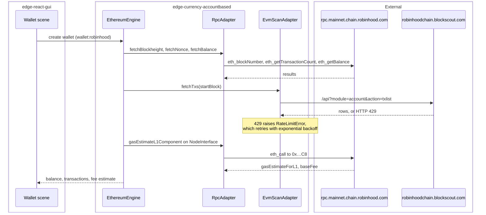

# Robinhood Chain: an Arbitrum Nitro L2 as an Edge EVM currency plugin

| | |
|---|---|
| Status | Implemented |
| Author | Jon Tzeng |
| Reviewer | - |
| Last updated | 2026-08-12 |
| Repos | [edge-currency-accountbased](https://github.com/EdgeApp/edge-currency-accountbased), [edge-react-gui](https://github.com/EdgeApp/edge-react-gui) |
| Implementation | see the repo table in [4. Design overview](#4-design-overview) |
| Supersedes | - |
| Related | [Asana 1217382370104887](https://app.asana.com/1/9976422036640/project/1213843652804305/task/1217382370104887) |

File and branch references point at the `jon/robinhood-chain` branch in both repos. The task description carried a single link, `https://docs.robinhood.com/chain/`, so every chain parameter below was read from Robinhood's published documentation and then confirmed against the live network.

## Contents

1. [Problem](#1-problem)
2. [Prior art](#2-prior-art)
3. [Goals and non-goals](#3-goals-and-non-goals)
4. [Design overview](#4-design-overview)
5. [Detailed design: edge-currency-accountbased](#5-detailed-design-edge-currency-accountbased)
6. [Detailed design: edge-react-gui](#6-detailed-design-edge-react-gui)
7. [Testing](#7-testing)
8. [Phase history](#8-phase-history)
9. [Decisions](#9-decisions)
10. [Glossary](#10-glossary)
11. [References](#11-references)
12. [Post-implementation retrospective](#12-post-implementation-retrospective)

## 1. Problem

Edge has no wallet for Robinhood Chain, an [EVM](#evm) Layer 2 that Robinhood runs on the [Arbitrum Nitro](#arbitrum-nitro) stack with ETH as its gas token. A user holding ETH or bridged stablecoins there cannot hold, receive, or spend them from Edge.

The chain differs from Edge's existing EVM plugins in two ways that decide the design. Its chain ID, 4663, is not one of the 64 chains Etherscan's V2 API serves, so the usual transaction-history source is unavailable. And its blocks arrive roughly every 96ms, which is 10 to 100 times faster than the chains whose block-count constants Edge copies between plugins.

## 2. Prior art

Two existing plugins are close relatives, and each is wrong in one respect.

`arbitrumInfo.ts` is the same rollup family. Its fee path is the one this chain needs: an Arbitrum chain charges an L1 data component that a plain `eth_estimateGas` does not see, and the plugin recovers it by calling `gasEstimateL1Component` on the [NodeInterface](#nodeinterface) precompile. Its transaction history, though, comes from Etherscan and Arbiscan, neither of which covers chain 4663.

`opbnbInfo.ts` is the most recent chain added and is the better template for the file's shape, but it sets `optimismRollup: true`, which routes fees through the [OP Stack](#op-stack) `GasPriceOracle` contract. That contract does not exist on an Arbitrum chain.

`ethereumclassicInfo.ts` and `rskInfo.ts` both point their `evmscan` adapter at a [Blockscout](#blockscout) instance, which is the precedent this design follows for history.

## 3. Goals and non-goals

Goals:

- A `robinhood` currency plugin whose wallets derive addresses, report balances, list transactions, and estimate fees correctly on chain 4663.
- Registration in `edge-react-gui` so the wallet is creatable and importable from the app.
- Built-in tokens for the assets a user is most likely to hold, with contract addresses that cannot be confused with imitations.

Non-goals:

- Sending or swapping on the chain. No Edge swap provider quotes chain 4663, and nothing in the test roster holds a spendable balance there, so a funded send is deferred rather than designed around.
- Currency icons. They live in the `content.edge.app` asset repo, outside both repos here.
- Testnet (chain 46630) support. Nothing asked for it.

## 4. Design overview

| Repo | Deliverable | Scope |
|---|---|---|
| edge-currency-accountbased | [#1087](https://github.com/EdgeApp/edge-currency-accountbased/pull/1087) | The plugin itself: [5. Detailed design](#5-detailed-design-edge-currency-accountbased) |
| edge-react-gui | [#6150](https://github.com/EdgeApp/edge-react-gui/pull/6150) | Plugin registration and wallet naming: [6. Detailed design](#6-detailed-design-edge-react-gui) |

The plugin is a configuration file. Every behavior it needs already exists in the shared `EthereumEngine`, selected by the fields the config sets. The engine runs inside edge-core-js's plugin WebView, and the app reaches it through the plugin registration in [6. Detailed design: edge-react-gui](#6-detailed-design-edge-react-gui).

Two network adapters back the plugin, and the order they are declared in is load-bearing. `EthereumNetwork.check()` runs an `asyncWaterfall` over the adapters that implement the method it wants, in declaration order. The RPC adapter is declared first because [Blockscout](#blockscout)'s API answers `Unknown module` to the `proxy` module that `EvmScanAdapter.fetchNonce` uses, so an evmscan-first order would fail every nonce lookup before falling through.



## 5. Detailed design: edge-currency-accountbased

The plugin is one new file plus a two-line registration.

[`src/ethereum/info/robinhoodInfo.ts`](https://github.com/EdgeApp/edge-currency-accountbased/blob/b821eb39fd62922dbf2c5412a5cbaaa70a702300/src/ethereum/info/robinhoodInfo.ts)
```ts
const networkInfo: EthereumNetworkInfo = {
  // Blocks arrive about every 96ms, so this is the usual ~2 minute overlap
  addressQueryLookbackBlocks: 1250,
  networkAdapterConfigs: [
    {
      type: 'rpc',
      servers: [
        'https://rpc.mainnet.chain.robinhood.com',
        'https://rpc.arrowrpc.com'
      ]
    },
    {
      // Etherscan V2 does not support chain 4663, so transaction history comes
      // from the chain's Blockscout instance, which has no gastracker module.
      type: 'evmscan',
      gastrackerSupport: false,
      servers: ['https://robinhoodchain.blockscout.com']
    }
  ],
  uriNetworks: ['robinhood'],
  ercTokenStandard: 'ERC20',
  chainParams: {
    chainId: 4663,
    name: 'Robinhood Chain'
  },
  arbitrumRollupParams: {
    nodeInterfaceAddress: '0x00000000000000000000000000000000000000C8'
  },
  supportsEIP1559: true,
  hdPathCoinType: 60,
  pluginMnemonicKeyName: 'robinhoodMnemonic',
  pluginRegularKeyName: 'robinhoodKey',
  evmGasStationUrl: null,
  networkFees,
  decoyAddressConfig: {
    count: 5,
    minTransactionCount: 10,
    maxTransactionCount: 100
  }
}
```

`arbitrumRollupParams` is what selects the L1-component fee path in `EthereumEngine`. `hdPathCoinType: 60` puts wallets on the standard Ethereum derivation path, so one seed produces the same address here as on mainnet, which is what a bridged user expects.

No `ethBalCheckerContract` is set. Every one of the five [eth-balance-checker](#eth-balance-checker) addresses that other Edge plugins use returns empty code on this chain, so `RpcAdapter.fetchTokenBalances` is left undefined and token balances resolve through per-token calls, as they do on `hyperevm` and `botanix`.

### Fees

Fees follow the EIP-1559 formula the engine implements, `baseMultiplier * baseFee + minPriorityFee`. The chain's base fee sits near 0.053 gwei and `eth_maxPriorityFeePerGas` returns zero, so Arbitrum One's 0.1 gwei floor would be double the base fee by itself.

[`src/ethereum/info/robinhoodInfo.ts`](https://github.com/EdgeApp/edge-currency-accountbased/blob/b821eb39fd62922dbf2c5412a5cbaaa70a702300/src/ethereum/info/robinhoodInfo.ts)
```ts
    minPriorityFee: '10000000' // 0.01 Gwei
```

### Built-in tokens

[Blockscout](#blockscout)'s token list for this chain is full of imitations. A search for `USDC` returns a 30,726-holder contract named "Universal Stable Digital Coin" with 18 decimals, which is not USDC. Rather than trust any name, the four bridged tokens were derived from the canonical bridge by calling `calculateL2TokenAddress(l1Token)` on the L2 Gateway Router that Robinhood's contract documentation publishes, passing each token's known Ethereum mainnet address.

| Token | L2 address | Decimals | Source |
|---|---|---|---|
| USDC | `0x80e0e24718dbFcad49ECAA6F1e6C89A190586cA8` | 6 | Gateway router |
| USDT | `0xE246BC49b0598d7Cd9f0eAD48B885034f1254380` | 6 | Gateway router |
| WBTC | `0x6bac06600D220Ac5Ac281AD1f504D2Cf0F90F6e6` | 8 | Gateway router |
| WETH | `0x0Bd7D308f8E1639FAb988df18A8011f41EAcAD73` | 18 | Gateway router, and named in the contract docs |
| USDG | `0x5fc5360D0400a0Fd4f2af552ADD042D716F1d168` | 6 | Natively issued, see below |

USDG has no bridged deployment; `calculateL2TokenAddress` returns an address with no code. The listed contract is issued on the chain directly, and it checks out as genuine: it is a verified [ERC-1967](#erc-1967-proxy) proxy whose implementation contract is named `USDG`, with 354,036,599 units outstanding across 60,946 holders.

## 6. Detailed design: edge-react-gui

Five files, matching the shape of the `opbnb` and `monad` registrations.

`src/util/corePlugins.ts` adds `robinhood: ENV.ROBINHOOD_INIT`, and `src/envConfig.ts` adds `ROBINHOOD_INIT: asCorePluginInit(asEvmApiKeys)`. `asCorePluginInit` returns `false` for a key that `env.json` does not carry, so the plugin stays off until an `ROBINHOOD_INIT` entry is provisioned, exactly like every other [EVM](#evm) chain.

`src/constants/WalletAndCurrencyConstants.ts` appends `'wallet:robinhood'` to `WALLET_TYPE_ORDER` and adds the special-currency entry:

[`src/constants/WalletAndCurrencyConstants.ts`](https://github.com/EdgeApp/edge-react-gui/blob/4ca5637c8aba0e936ef2c29348e38aa435844f46/src/constants/WalletAndCurrencyConstants.ts)
```ts
  robinhood: {
    initWalletName: lstrings.string_first_robinhood_wallet_name,
    dummyPublicAddress: '0x0d73358506663d484945ba85d0cd435ad610b0a0',
    allowZeroTx: true,
    isImportKeySupported: true,
    showChainIcon: true,
    walletConnectV2ChainId: {
      namespace: 'eip155',
      reference: '4663'
    }
  },
```

`showChainIcon` is set because the native asset is ETH. Without the chain badge a Robinhood Chain wallet is visually identical to an Ethereum mainnet wallet in the wallet list, which is the same reason `arbitrum` and `base` set it.

The wallet name string is `'My Robinhood Chain'` rather than `'My Robinhood'`, since the shorter form reads as a brokerage account.

One search behavior is worth knowing: `filterWalletCreateItemListBySearchText` splits the query on whitespace and requires every term to match a field by prefix, so typing the full name "Robinhood Chain" returns nothing. "Robinhood" matches on `displayName`.

## 7. Testing

1. **Unit, built-in token IDs.** `test/builtinTokens.test.ts` iterates every registered plugin and asserts each `builtinTokens` key equals what `tools.getTokenId` derives from the token. The five contracts above pass, which is what proves the lowercased-address keys are right. The full `npm test` suite passes.
2. **Type check.** `tsc --noEmit` reports no errors in `src/ethereum`. Nine pre-existing errors in `src/zcash` come from an unpublished `react-native-zcash` and are untouched by this work.
3. **Key derivation.** Instantiating the plugin against `makeFakeIo` and importing the BIP-39 test vector `abandon abandon … about` derives `0x9858EfFD232B4033E47d90003D41EC34EcaEda94`, the canonical `m/44'/60'/0'/0/0` address. `parseUri('robinhood:0x…?amount=1.5')` returns `nativeAmount` `1500000000000000000` and `currencyCode` `ETH`.
4. **Live network, RPC.** Both configured servers answer `eth_chainId` with `0x1237`, and agree on `eth_blockNumber`, `eth_getBalance` and `eth_getTransactionCount`. The [NodeInterface](#nodeinterface) call at `0x…C8` returns a `baseFee`, which is what confirms the chain runs Nitro and that the Arbitrum fee path applies.
5. **In-app, wallet creation.** On the iOS simulator, "Robinhood Chain" appears in Choose Wallets to Add, creates as "My Robinhood Chain", and opens on a wallet scene titled "Robinhood Chain Network" showing 0 ETH.
6. **In-app, live balance.** Importing the test-vector seed as a second wallet renders `0.000000019866 ETH`, matching the `0x4a01b1a80` wei that `eth_getBalance` returns for that address. This is the end-to-end proof: the app is running the modified plugin, deriving the address, and reading the live chain.
7. **Transaction history.** The address's two real transactions, read from [Blockscout](#blockscout)'s v2 API, run through the repo's own `asEvmScanTransaction` cleaner and `processEvmScanTransaction` to `nativeAmount` `-11497329332206467` / `networkFee` `1182846000000` (21000 gas at 56,326,000 wei) / `blockHeight` `10328717` for the outgoing transfer, and `nativeAmount` `0` / `blockHeight` `25585560` for the incoming one. Both then render in the app as "Sent Ethereum -Ξ 0.011497, Jul 15 2026" and "Received Ethereum +Ξ 0, Aug 1 2026", captured under a forced response because the live endpoint was rate-limited; see [12. Post-implementation retrospective](#12-post-implementation-retrospective).

## 8. Phase history

### Phase 1: initial integration

Shipped as designed, with three changes made during verification:

| Sketched | Shipped | Why |
|---|---|---|
| No `CURRENCY_SETTINGS_KEYS` entry | Added between `ravencoin` and `rsk` | Bugbot caught it on #6150. Without it `WalletSettingsModal` hides the Asset Settings row and `AssetSettingsScene` omits the chain |
| One RPC server | Two | `chainid.network` lists `rpc.arrowrpc.com` as a second public endpoint; it answers every method the plugin uses |
| `addressQueryLookbackBlocks: 480`, copied from `arbitrumInfo` | `1250` | 480 blocks is ~46 seconds here, not the ~2 minutes the constant means elsewhere. Measured 626 blocks in 60.2s |
| `minPriorityFee: '100000000'` (Arbitrum's 0.1 gwei) | `'10000000'` | The chain's base fee is ~0.053 gwei, so Arbitrum's floor would dominate the fee |

Deferred:

- A funded send. No swap provider quotes chain 4663 and no roster account holds a spendable balance there, so acquiring gas would need an L1 bridge deposit through the Delayed Inbox contract, which Edge cannot drive from the app.
- Currency icons at `content.edge.app/currencyIconsV3/robinhood/`. The app requests `robinhood.png` and `chain_robinhood.png` and gets neither, so the wallet renders a text placeholder.
- A `robinhood` entry in edge-change-server's plugin registry. `usesChangeServer: true` is set to match `opbnb` and `monad`, which are also absent from that registry; an unknown plugin ID returns `-1` from the hub and the engine polls instead.

## 9. Decisions

### Decision 1: pluginId is `robinhood`

Chosen because Edge names chain plugins after the chain: `arbitrum`, `base`, `monad`, `sonic`, `abstract`. Nothing named `robinhood` exists in edge-react-gui, edge-exchange-plugins, edge-core-js or edge-info-server.

Rejected: `robinhoodchain`, on the theory that `bobevm`, `hyperevm` and `filecoinfevm` set a precedent for suffixing. They do not. Each of those disambiguates two chains from one project (Hyperliquid's HyperCore and HyperEVM, Filecoin's native chain and its FEVM), not a brand collision.

Rejected: `hood`, from the task title. HOOD is Robinhood's stock ticker and this chain's gas token is ETH, so the ticker names nothing in the plugin.

Reopens if: Edge adds a Robinhood brokerage ramp or swap plugin. `corePlugins.ts` merges `currencyPlugins` and `swapPlugins` into one ID space, so that plugin would have to pick a different name.

### Decision 2: history comes from Blockscout, not Etherscan V2

Chosen because it is the only Etherscan-compatible API that answers for this chain. Its `account` module serves `balance`, `txlist` and `tokentx`, and `EvmScanAdapter` already special-cases [Blockscout](#blockscout) for `eth_blockNumber`.

Rejected: Etherscan V2. `GET /v2/api?chainid=4663` returns `Missing or unsupported chainid parameter`, and 4663 is absent from the 64 chains its `/v2/chainlist` lists.

Rejected: Routescan. `api.routescan.io/v2/network/mainnet/evm/4663` returns `chain not supported`.

Rejected: HoodScan, the second explorer `chainid.network` lists. It is a web application with no Etherscan-compatible `/api`.

Reopens if: Etherscan adds chain 4663, which would also bring gas-oracle support and let `gastrackerSupport` flip to true.

### Decision 3: no `ethBalCheckerContract`

Chosen because nothing is deployed to check against. `eth_getCode` returns empty for all five balance-checker addresses in use across Edge's [EVM](#evm) plugins.

Rejected: Multicall3 at `0xcA11bde05977b3631167028862bE2a173976CA11`, which is deployed here (7,618 bytes). `RpcAdapter.fetchTokenBalances` calls `balances(address[],address[])` from the [eth-balance-checker](#eth-balance-checker) [ABI](#abi), which Multicall3 does not implement, so pointing at it would fail every call.

Reopens if: someone deploys eth-balance-checker to the chain.

### Decision 4: built-in token addresses come from the gateway router

Chosen because the chain's token namespace is adversarial. Deriving each address from `calculateL2TokenAddress(l1Token)` is deterministic and needs no trust in a name or holder count.

Rejected: Blockscout's token search ranked by holders. It returns a fake USDC ahead of the real one.

Rejected: shipping no built-in tokens at all. Auto-detection would eventually surface holdings, but a user bridging USDC would see an unnamed contract until then.

Reopens if: Robinhood publishes a canonical token list, which would also settle USDG without the proxy-implementation check.

## 10. Glossary

### Arbitrum Nitro

The rollup software Arbitrum One runs, and the base for the Orbit / Dedicated Blockchain product this chain is built on. It executes EVM bytecode natively and posts compressed transaction batches to Ethereum. In this design its presence is what makes `arbitrumRollupParams` the right fee configuration. See [Arbitrum Nitro documentation](https://docs.arbitrum.io/how-arbitrum-works/inside-arbitrum-nitro).

### ABI

Application Binary Interface: the JSON description of a contract's functions and their argument types, which a client uses to encode a call. Two contracts can occupy the same address role while implementing different ABIs, which is why Multicall3 cannot stand in for eth-balance-checker here. See [the Solidity ABI specification](https://docs.soliditylang.org/en/latest/abi-spec.html).

### Blockscout

An open-source blockchain explorer that exposes an Etherscan-compatible REST API at `/api`. Here it is the sole transaction-history source, configured as the plugin's `evmscan` adapter. Its `proxy` and `gastracker` modules are absent on this deployment. See [Blockscout API documentation](https://docs.blockscout.com/devs/apis/rpc).

### ERC-1967 proxy

A standard storage layout for upgradeable contracts: the proxy holds state and delegates execution to an implementation address kept at a fixed storage slot. USDG on this chain is one, which is how its implementation contract could be read and identified. See [EIP-1967](https://eips.ethereum.org/EIPS/eip-1967).

### EVM

Ethereum Virtual Machine: the execution environment Ethereum defines for smart contracts. A chain that runs it unmodified can reuse Ethereum's addresses, signatures and tooling, which is why this whole plugin is configuration rather than new engine code. See [the Ethereum documentation](https://ethereum.org/en/developers/docs/evm/).

### eth-balance-checker

A helper contract that returns many token balances for many addresses in a single call. Edge's `RpcAdapter` uses it when a chain has one deployed, to avoid one RPC round trip per token. None is deployed here. See [the contract](https://github.com/wbobeirne/eth-balance-checker).

### NodeInterface

A virtual Arbitrum precompile at `0x00000000000000000000000000000000000000C8`. It is not a deployed contract, so `eth_getCode` returns empty for it, but `eth_call` against it works and `gasEstimateL1Component` reports the L1 data-posting component of a transaction's cost. See [Arbitrum gas estimation](https://docs.arbitrum.io/build-decentralized-apps/how-to-estimate-gas).

### JSON-RPC

The request format Ethereum nodes answer on, carrying methods like `eth_getBalance` and `eth_call` over HTTP POST. Edge's `RpcAdapter` speaks it to the two servers this plugin configures, and it is the transport for everything except transaction history. See [the Ethereum JSON-RPC specification](https://ethereum.org/en/developers/docs/apis/json-rpc/).

### OP Stack

Optimism's rollup framework, used by Base, opBNB and others. Its fee model differs from Arbitrum's: the L1 component comes from a `GasPriceOracle` contract rather than a NodeInterface call, which is why `optimismRollup` is the wrong flag for this chain. See [OP Stack documentation](https://docs.optimism.io/stack/getting-started).

## 11. References

- [Robinhood Chain documentation](https://docs.robinhood.com/chain/)
- [Connecting to Robinhood Chain](https://docs.robinhood.com/chain/connecting), the source for chain ID, RPC and explorer URLs
- [Robinhood Chain protocol contracts](https://docs.robinhood.com/chain/protocol-contracts), the source for the gateway router and [NodeInterface](#nodeinterface) addresses
- [chainid.network chain registry](https://chainid.network/chains.json), the source for the second RPC endpoint

## 12. Post-implementation retrospective

### Estimate vs. actuals

| Item | Expected | Actual |
|---|---|---|
| Files changed | 3 in accountbased, 6 in gui | 3 and 6 |
| New engine code | none | none, config only |
| Chain params from docs | all | all but the token addresses, which the docs do not list |

### Where this document was wrong or silent

1. [5. Detailed design](#5-detailed-design-edge-currency-accountbased) originally carried Arbitrum One's `addressQueryLookbackBlocks: 480` with a "~2 minutes" comment copied from that plugin. On a 96ms block time that is 46 seconds. The constant is a re-scan overlap, so too small a value narrows the window that absorbs indexer lag. Corrected to 1250 before the first PR.
2. Nothing anticipated the token-imitation problem. The first pass would have read addresses off [Blockscout](#blockscout)'s token list, which ranks a fake USDC above the real one by holder count.

### What held

The plugin needed no engine changes. `arbitrumRollupParams`, `supportsEIP1559` and the `evmscan` adapter's existing Blockscout branch covered the chain as configured, and the HTTP 429 path already raises `RateLimitError` and retries with exponential backoff, so no rate-limit handling had to be written.

### Verification highlights

- Block rate measured on the live chain: 626 blocks in 60.2 seconds, 96ms per block.
- In-app balance `0.000000019866 ETH` matches `eth_getBalance` returning `0x4a01b1a80` for the imported address.
- The public Blockscout instance returns HTTP 429 after a small number of requests from one egress address and recovers after about three minutes. During this run the simulator's own polling and the verification probes competed for that budget, so the transaction list was verified by forcing the response instead: `fetchGetEtherscan` was temporarily stubbed to return the address's two real rows, leaving the cleaner, `processEvmScanTransaction` and the list component untouched. The stub was reverted afterwards.
- Its v2 API (`/api/v2/addresses/<addr>/transactions`) has a SEPARATE quota from the Etherscan-compatible `/api` and answered while the latter was still returning 429. That is where the real row data above came from. No Edge-held provider key covers chain 4663: Etherscan V2 does not serve it, the dRPC key is deactivated account-wide, nowNodes and quiknode have no endpoint for it, and Alchemy supports the network but answers `ROBINHOOD_MAINNET is not enabled for this app`. Enabling it on the Alchemy app, or provisioning a Blockscout API key (which `EvmScanAdapter` already appends as `&apikey=`), removes the limit without a code change.
