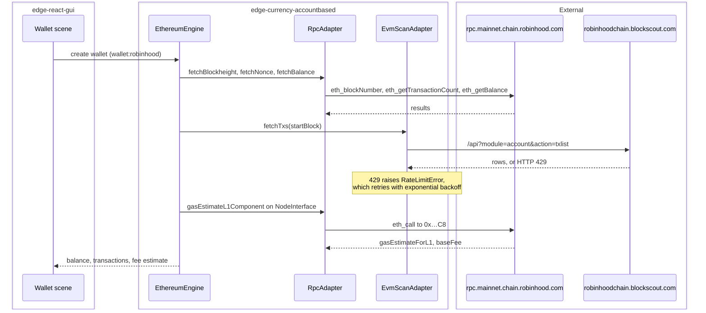

# Robinhood Chain: an Arbitrum Nitro L2 as an Edge EVM currency plugin

| | |
|---|---|
| Status | Implemented |
| Author | Jon Tzeng |
| Reviewer | - |
| Last updated | 2026-08-28 |
| Repos | [edge-currency-accountbased](https://github.com/EdgeApp/edge-currency-accountbased), [edge-react-gui](https://github.com/EdgeApp/edge-react-gui), [edge-exchange-plugins](https://github.com/EdgeApp/edge-exchange-plugins), [edge-rates-server](https://github.com/EdgeApp/edge-rates-server) |
| Implementation | see the repo table in [4. Design overview](#4-design-overview) |
| Supersedes | - |
| Related | [Asana 1217382370104887](https://app.asana.com/1/9976422036640/project/1213843652804305/task/1217382370104887) |

File and branch references point at the `jon/robinhood-chain` branch in all four repos. The task description carried a single link, `https://docs.robinhood.com/chain/`, so every chain parameter below was read from Robinhood's published documentation and then confirmed against the live network.

## Contents

1. [Problem](#1-problem)
2. [Prior art](#2-prior-art)
3. [Goals and non-goals](#3-goals-and-non-goals)
4. [Design overview](#4-design-overview)
5. [Detailed design: edge-currency-accountbased](#5-detailed-design-edge-currency-accountbased)
6. [Detailed design: edge-react-gui](#6-detailed-design-edge-react-gui)
7. [Detailed design: edge-exchange-plugins](#7-detailed-design-edge-exchange-plugins)
8. [Detailed design: edge-rates-server](#8-detailed-design-edge-rates-server)
9. [Testing](#9-testing)
10. [Phase history](#10-phase-history)
11. [Decisions](#11-decisions)
12. [Glossary](#12-glossary)
13. [References](#13-references)
14. [Post-implementation retrospective](#14-post-implementation-retrospective)

## 1. Problem

Edge has no wallet for Robinhood Chain, an [EVM](#evm) Layer 2 that Robinhood runs on the [Arbitrum Nitro](#arbitrum-nitro) stack with ETH as its gas token. A user holding ETH or bridged stablecoins there cannot hold, receive, or spend them from Edge.

The chain differs from Edge's existing EVM plugins in two ways that decide the design. Its chain ID, 4663, is not one of the 64 chains Etherscan's V2 API serves, so the usual transaction-history source is unavailable. And its blocks arrive roughly every 96ms, which is 10 to 100 times faster than the chains whose block-count constants Edge copies between plugins.

## 2. Prior art

Two existing plugins are close relatives, and each is wrong in one respect.

`arbitrumInfo.ts` is the same rollup family. Its fee path is the one this chain needs: an Arbitrum chain charges an L1 data component that a plain `eth_estimateGas` does not see, and the plugin recovers it by calling `gasEstimateL1Component` on the [NodeInterface](#nodeinterface) precompile. Its transaction history, though, comes from Etherscan and Arbiscan, neither of which covers chain 4663.

`opbnbInfo.ts` is the most recent chain added and is the better template for the file's shape, but it sets `optimismRollup: true`, which routes fees through the [OP Stack](#op-stack) `GasPriceOracle` contract. That contract does not exist on an Arbitrum chain.

`ethereumclassicInfo.ts` and `rskInfo.ts` both point their `evmscan` adapter at a [Blockscout](#blockscout) instance, which is the precedent this design follows for history.

## 3. Goals and non-goals

Goals:

- A `robinhood` currency plugin whose wallets derive addresses, report balances, list transactions, and estimate fees correctly on chain 4663.
- Registration in `edge-react-gui` so the wallet is creatable and importable from the app.
- Built-in tokens for the assets a user is most likely to hold, with contract addresses that cannot be confused with imitations.
- A swap route that can fund a Robinhood Chain wallet from another chain, so a user arriving with no ETH on 4663 can acquire gas without leaving the app, and so a send can be exercised at all.

Non-goals:

- Currency icons. They live in the `content.edge.app` asset repo, outside the three repos here.
- Testnet (chain 46630) support. Nothing asked for it.

## 4. Design overview

| Repo | Deliverable | Scope |
|---|---|---|
| edge-currency-accountbased | [#1087](https://github.com/EdgeApp/edge-currency-accountbased/pull/1087) | The plugin itself: [5. Detailed design](#5-detailed-design-edge-currency-accountbased) |
| edge-react-gui | [#6150](https://github.com/EdgeApp/edge-react-gui/pull/6150) | Plugin registration and wallet naming: [6. Detailed design](#6-detailed-design-edge-react-gui) |
| edge-exchange-plugins | [#483](https://github.com/EdgeApp/edge-exchange-plugins/pull/483) | Swap routing to and from the chain: [7. Detailed design](#7-detailed-design-edge-exchange-plugins) |
| edge-rates-server | [#123](https://github.com/EdgeApp/edge-rates-server/pull/123) | Exchange rates for the chain's assets: [8. Detailed design](#8-detailed-design-edge-rates-server) |

The plugin is a configuration file. Every behavior it needs already exists in the shared `EthereumEngine`, selected by the fields the config sets. The engine runs inside edge-core-js's plugin WebView, and the app reaches it through the plugin registration in [6. Detailed design: edge-react-gui](#6-detailed-design-edge-react-gui).

Two network adapters back the plugin, and the order they are declared in is load-bearing. `EthereumNetwork.check()` runs an `asyncWaterfall` over the adapters that implement the method it wants, in declaration order. The RPC adapter is declared first because [Blockscout](#blockscout)'s API answers `Unknown module` to the `proxy` module that `EvmScanAdapter.fetchNonce` uses, so an evmscan-first order would fail every nonce lookup before falling through.



## 5. Detailed design: edge-currency-accountbased

The plugin is one new file plus a two-line registration.

[`src/ethereum/info/robinhoodInfo.ts`](https://github.com/EdgeApp/edge-currency-accountbased/blob/master/src/ethereum/info/robinhoodInfo.ts)
```ts
const networkInfo: EthereumNetworkInfo = {
  // Blocks arrive about every 96ms, so this is the usual ~2 minute overlap
  addressQueryLookbackBlocks: 1250,
  networkAdapterConfigs: [
    {
      // Keyed history source. Alchemy does not serve the `internal` category
      // on this network, so ETH paid out to the wallet from inside a contract
      // call is only seen while the Blockscout fallback below is answering.
      type: 'alchemy',
      servers: ['https://robinhood-mainnet.g.alchemy.com/v2/{{alchemyApiKey}}']
    },
    {
      type: 'rpc',
      servers: [
        'https://rpc.mainnet.chain.robinhood.com',
        'https://robinhood-rpc.publicnode.com',
        'https://robinhood-mainnet.g.alchemy.com/v2/{{alchemyApiKey}}'
      ],
      ethBalCheckerContract: '0x8950F12786CAE64F94a02733A260ca6FecDaeD7f'
    },
    {
      // Etherscan V2 does not support chain 4663. The chain's public Blockscout
      // instance has no gastracker module and allows 300 requests per minute
      // per IP, so it is the fallback history source rather than the primary.
      type: 'evmscan',
      gastrackerSupport: false,
      servers: ['https://robinhoodchain.blockscout.com']
    }
  ],
  uriNetworks: ['robinhood'],
  ercTokenStandard: 'ERC20',
  chainParams: {
    chainId: 4663,
    name: 'Robinhood Chain'
  },
  arbitrumRollupParams: {
    nodeInterfaceAddress: '0x00000000000000000000000000000000000000C8'
  },
  supportsEIP1559: true,
  hdPathCoinType: 60,
  pluginMnemonicKeyName: 'robinhoodMnemonic',
  pluginRegularKeyName: 'robinhoodKey',
  evmGasStationUrl: null,
  networkFees,
  decoyAddressConfig: {
    count: 5,
    minTransactionCount: 10,
    maxTransactionCount: 100
  }
}
```

`arbitrumRollupParams` is what selects the L1-component fee path in `EthereumEngine`. `hdPathCoinType: 60` puts wallets on the standard Ethereum derivation path, so one seed produces the same address here as on mainnet, which is what a bridged user expects.

### History source

`EthereumNetwork.check` runs the adapters that implement a method as a waterfall: the first one to answer wins that call, and the next one is only asked when the first fails. With `alchemy` listed first, transaction history and token balances come from Alchemy's `alchemy_getAssetTransfers` and `alchemy_getTokenBalances`, keyed by the plugin's `alchemyApiKey` init option, and the public [Blockscout](#blockscout) instance only answers while Alchemy is failing. The key reaches the plugin through `ROBINHOOD_INIT.alchemyApiKey` in the app's `env.json`; the `AlchemyAdapter` constructor drops a server whose placeholder has no init option, so a build without the key simply falls back to Blockscout.

`AlchemyAdapter` lives in `src/ethereum/networkAdapters/AlchemyAdapter.ts` and is written for any network Alchemy serves. Asset transfers are value movements rather than transactions and carry no gas data, so the adapter completes the wallet's own spends with `eth_getTransactionByHash` and `eth_getTransactionReceipt` from the same endpoint, then folds the rows per transaction hash with the amount and fee conventions of `processEvmScanTransaction`. Two things it cannot see on this network: the `internal` category is not supported here (Alchemy answers `The 'internal' category is not supported for this network`), so ETH paid out to the wallet from inside a contract call is invisible to it, and a failed transaction moves no value, so a reverted send only shows up through Blockscout's `txlist`.

The public Blockscout API allows 300 requests per minute per client IP. One wallet sync is 1 `txlist` + 1 `txlistinternal` + 7 `tokentx` calls, so two wallets on one IP exhaust it, and Blockscout then answers `{"message":"Too many requests. Increase limits now at https://dev.blockscout.com","result":null,"status":"0"}`. `EvmScanAdapter.fetchGetEtherscan` used to look for the throttle text in `result` only, so this reply fell through as an ordinary error and the engine kept polling at full cadence with an empty history; `isEvmScanRateLimitResponse` now classifies it as a `RateLimitError`, which makes `serialServers` back off exponentially.

`ethBalCheckerContract` points at an [eth-balance-checker](#eth-balance-checker) deployed to `0x8950F12786CAE64F94a02733A260ca6FecDaeD7f` in block 52107662 on 2026-09-01, byte-for-byte the runtime that Edge's other EVM plugins use at `0x7263…`. `RpcAdapter.fetchTokenBalances` is therefore defined and sits behind Alchemy's `alchemy_getTokenBalances` in the waterfall, so token balances stay batched even when Alchemy is unavailable.

### Fees

Fees follow the EIP-1559 formula the engine implements, `baseMultiplier * baseFee + minPriorityFee`. The chain's base fee sits near 0.053 gwei and `eth_maxPriorityFeePerGas` returns zero, so Arbitrum One's 0.1 gwei floor would be double the base fee by itself.

[`src/ethereum/info/robinhoodInfo.ts`](https://github.com/EdgeApp/edge-currency-accountbased/blob/b821eb39fd62922dbf2c5412a5cbaaa70a702300/src/ethereum/info/robinhoodInfo.ts)
```ts
    minPriorityFee: '10000000' // 0.01 Gwei
```

### Built-in tokens

[Blockscout](#blockscout)'s token list for this chain is full of imitations. A search for `USDC` returns a 30,726-holder contract named "Universal Stable Digital Coin" with 18 decimals, which is not USDC. Rather than trust any name, the four bridged tokens were derived from the canonical bridge by calling `calculateL2TokenAddress(l1Token)` on the L2 Gateway Router that Robinhood's contract documentation publishes, passing each token's known Ethereum mainnet address.

| Token | L2 address | Decimals | Source |
|---|---|---|---|
| USDC | `0x80e0e24718dbFcad49ECAA6F1e6C89A190586cA8` | 6 | Gateway router |
| USDT | `0xE246BC49b0598d7Cd9f0eAD48B885034f1254380` | 6 | Gateway router |
| WBTC | `0x6bac06600D220Ac5Ac281AD1f504D2Cf0F90F6e6` | 8 | Gateway router |
| WETH | `0x0Bd7D308f8E1639FAb988df18A8011f41EAcAD73` | 18 | Gateway router, and named in the contract docs |
| USDG | `0x5fc5360D0400a0Fd4f2af552ADD042D716F1d168` | 6 | Natively issued, see below |
| CASHCAT | `0x020bfC650A365f8BB26819deAAbF3E21291018b4` | 18 | Chain-native, see below |
| PONS | `0x39dBED3a2bd333467115dE45665cC57F813C4571` | 18 | Chain-native, see below |

USDG has no bridged deployment; `calculateL2TokenAddress` returns an address with no code. The listed contract is issued on the chain directly, and it checks out as genuine: it is a verified [ERC-1967](#erc-1967-proxy) proxy whose implementation contract is named `USDG`, with 354,036,599 units outstanding across 60,946 holders.

CASHCAT and PONS are chain-native too, and neither the gateway router nor the contract docs can vouch for them, so they are corroborated a different way. Each address is the one the swap providers themselves settle to, and more than one provider names it: CASHCAT appears at `0x020bfC65…` in ChangeNow, Swapuz, LetsExchange and Rango, and PONS at `0x39dBED3a…` in Swapuz and Rango. Each contract then confirms its own identity on chain, which is what rules out the same-symbol imitations the explorer is full of:

| Token | `name()` | `symbol()` | `decimals()` | Deployed bytecode |
|---|---|---|---|---|
| CASHCAT | Cash Cat | CASHCAT | 18 | 4830 bytes |
| PONS | Pons | PONS | 18 | 5274 bytes |

A single provider catalogue is not enough on its own. A provider can list a wrong address as easily as an explorer can, so the rule that holds here is two independent catalogues agreeing plus the contract's own answer, never a name lookup.

## 6. Detailed design: edge-react-gui

Five files, matching the shape of the `opbnb` and `monad` registrations.

`src/util/corePlugins.ts` adds `robinhood: ENV.ROBINHOOD_INIT`, and `src/envConfig.ts` adds `ROBINHOOD_INIT: asCorePluginInit(asEvmApiKeys)`. `asCorePluginInit` returns `false` for a key that `env.json` does not carry, so the plugin stays off until an `ROBINHOOD_INIT` entry is provisioned, exactly like every other [EVM](#evm) chain.

`src/constants/WalletAndCurrencyConstants.ts` appends `'wallet:robinhood'` to `WALLET_TYPE_ORDER` and adds the special-currency entry:

[`src/constants/WalletAndCurrencyConstants.ts`](https://github.com/EdgeApp/edge-react-gui/blob/4ca5637c8aba0e936ef2c29348e38aa435844f46/src/constants/WalletAndCurrencyConstants.ts)
```ts
  robinhood: {
    initWalletName: lstrings.string_first_robinhood_wallet_name,
    dummyPublicAddress: '0x0d73358506663d484945ba85d0cd435ad610b0a0',
    allowZeroTx: true,
    isImportKeySupported: true,
    showChainIcon: true,
    walletConnectV2ChainId: {
      namespace: 'eip155',
      reference: '4663'
    }
  },
```

`showChainIcon` is set because the native asset is ETH. Without the chain badge a Robinhood Chain wallet is visually identical to an Ethereum mainnet wallet in the wallet list, which is the same reason `arbitrum` and `base` set it.

The wallet name string is `'My Robinhood Chain'` rather than `'My Robinhood'`, since the shorter form reads as a brokerage account.

One search behavior is worth knowing: `filterWalletCreateItemListBySearchText` splits the query on whitespace and requires every term to match a field by prefix, so typing the full name "Robinhood Chain" returns nothing. "Robinhood" matches on `displayName`.

## 7. Detailed design: edge-exchange-plugins

Every swap plugin resolves a wallet to its provider-side chain code through one shared map, `MAINNET_CODE_TRANSCRIPTION`, keyed by Edge pluginId. `lifi.ts` and `rango.ts` gate entirely on a non-null lookup for both the source and destination wallet, so a chain the map does not know is invisible to the provider regardless of what the provider's API supports. Adding a chain is therefore a mapping change, not a code change.

The maps are generated. `scripts/mappings/<provider>Mappings.ts` holds the authored direction, provider chain code to Edge pluginId; `npm run mapctl update-mappings` inverts each one into `src/mappings/<provider>.ts`, which is what the plugins import. Every pluginId must exist in `src/util/edgeCurrencyPluginIds.ts` first, so `robinhood` is added there by `mapctl add-plugin`.

A full audit probed every provider in the repo against its own live discovery endpoint. Six carry the chain and are mapped; the rest carry nothing on it:

| Provider | Chain code | Assets seen on the chain |
|---|---|---|
| SideShift | `robinhood` | Native ETH and bridged WETH, both directions |
| LI.FI | `out` | Cross-chain routes into 4663; the chain's LI.FI key is the literal string `out` |
| Rango | `ROBINHOOD` | Chain enabled, tokens indexed including CASHCAT, routes via Relay and GasZip |
| ChangeNow | `hood` | Native ETH, USDG, CASHCAT, and tokenized equities (NVDA, SPY, AAPL) |
| Swapuz | `ROBINHOOD` | Native ETH, USDG, CASHCAT, PONS, PIPEDOG |
| LetsExchange | `ROBINHOOD` | CASHCAT and ARROW only, no native ETH |
| ChangeHero, Exolix, Godex, n.exchange | none | Probed live; the chain is absent from each catalogue |
| SwapKit | `HOOD` | Chain code appeared in an earlier sweep, but it is absent from the keyed provider list. Left unmapped |
| Changelly, Xgram | unknown | Not probed: Changelly's API is request-signed and the available Xgram key returns 401 |

Two providers are mapped without a fillable native-ETH pair at the time of mapping, on the same reasoning: the map is chain-level while fill availability is per-pair and dynamic. `changenow.ts` rebuilds `chainCodeTickerMap` hourly from `exchange/currencies?active=true`, filtered to the chain codes the map knows, so an unmapped chain can never appear even after a pair activates. ChangeNow proved the point: its native-ETH pair was inactive when the chain was first mapped and fills today, with no further change. LetsExchange is the same bet on tokens rather than gas, and costs a declined quote in the meantime, since `checkWhitelistedMainnetCodes` raises a plain `SwapCurrencyError` for a pair the provider cannot serve.

LI.FI's key deserves a note. Every other chain in `lifiMappings.ts` uses a mnemonic three-letter key (`arb`, `bas`, `opt`); LI.FI assigned Robinhood Chain `out`, which reads like a placeholder and is easy to mistake for a bug. It is what `https://li.quest/v1/chains` returns for chain ID 4663.

One asymmetry is worth recording: `https://li.quest/v1/connections?toChain=4663` returns zero connections while `https://li.quest/v1/quote` into the same chain returns a route. The connections endpoint lags; quoting is the reliable probe.

## 8. Detailed design: edge-rates-server

A chain can hold a real balance, receive a swap and send a transaction and still be unusable, because every fiat figure attached to it renders `$0`: wallet list, wallet scene, send confirm and swap quote. On the exchange scene the zero destination value additionally trips a "High Price Impact" warning, so a correct quote reads to the user as broken or predatory.

The reason is that the rates server's v3 API keys on `{pluginId, tokenId}`, not on currency code. Robinhood Chain's native asset is ETH and its `currencyInfo.currencyCode` is `'ETH'`, but that string never reaches the rate lookup. `toCryptoKey` turns the asset into the bare pluginId `robinhood`, and no provider map contained it, so the response came back with the asset echoed and the `rate` field simply absent.

Registration spans four maps plus one bridge:

| Map | Value | Effect |
|---|---|---|
| `coingeckoMainnetCurrencyMapping` | `ethereum` | Native ETH prices off ETH |
| `coingeckoPlatformIdMapping` | `robinhood` | This chain's tokens map automatically |
| `coinmarketcapMainnetCurrencyMapping` | `1027` | ETH, the same id arbitrum, base, optimism and zksync use |
| `coinmarketcapPlatformIdMapping` | `null` | CoinMarketCap has no platform id for the chain yet |
| `defaultTokenTypes` | `evm` | Contract addresses become tokenIds |
| `defaultPlatformPriority` | `630` | Ranks last, so a bridged asset resolves to its canonical chain |
| `defaultCrossChainMapping` | 3 entries | USDC, USDT and WBTC price off their Ethereum counterparts |

CoinGecko already carries the chain as asset platform `robinhood`, with `chain_identifier: 4663` and `native_coin_id: ethereum`, and lists 534 coins on it, mostly the tokenized equities the chain exists to host. It does not, however, carry a Robinhood Chain address on the canonical `usd-coin`, `tether` or `wrapped-bitcoin` coins, so the automated sweep can never reach those three. They get explicit cross-chain entries pointing at the Ethereum contracts. WETH and USDG need no entry: CoinGecko does list both here, so the sweep maps WETH to `robinhood-wrapped-eth-robinhood-chain` and bridges USDG through `global-dollar` on its own.

### Why half of this deploys itself and half does not

The two halves behave differently, and the difference decides what an operator has to do.

`templates` in a `DatabaseSetup` are written only when the document does not already exist. On a running deployment every one of these documents exists, so editing a template is inert there.

The mainnet maps escape that, because the daily `tokenMapping` engine does not read them from CouchDB at all. It rebuilds `uidMapping` from the code constant on every run and writes `{...existingDoc, ...uidMapping}`, spreading the code constant last. Deploying the branch therefore fixes the native ETH rate on the next engine run with no manual step.

The platform, token-type, priority and cross-chain documents have no such engine. They are read only from CouchDB, so they need a one-time write to the production `rates_settings` database using exactly the values in the table above.

That asymmetry is itself worth fixing: a chain added to `coingeckoPlatformIdMapping` in code never reaches production on its own, which is a trap for the next chain as much as this one. Having the sweep merge the code defaults underneath the database documents, `{...codeDefault, ...dbDoc}`, would remove the manual step permanently and would preserve deliberate overrides, since disabling a platform is expressed as an explicit `null` rather than a deleted key. It was left out of this work because it changes shared merge semantics for every chain and every provider, which does not belong in a change that registers one chain.

## 9. Testing

1. **Unit, built-in token IDs.** `test/builtinTokens.test.ts` iterates every registered plugin and asserts each `builtinTokens` key equals what `tools.getTokenId` derives from the token. The five contracts above pass, which is what proves the lowercased-address keys are right. The full `npm test` suite passes.
2. **Type check.** `tsc --noEmit` reports no errors in `src/ethereum`. Nine pre-existing errors in `src/zcash` come from an unpublished `react-native-zcash` and are untouched by this work.
3. **Key derivation.** Instantiating the plugin against `makeFakeIo` and importing the BIP-39 test vector `abandon abandon … about` derives `0x9858EfFD232B4033E47d90003D41EC34EcaEda94`, the canonical `m/44'/60'/0'/0/0` address. `parseUri('robinhood:0x…?amount=1.5')` returns `nativeAmount` `1500000000000000000` and `currencyCode` `ETH`.
4. **Live network, RPC.** Both configured servers answer `eth_chainId` with `0x1237`, and agree on `eth_blockNumber`, `eth_getBalance` and `eth_getTransactionCount`. The [NodeInterface](#nodeinterface) call at `0x…C8` returns a `baseFee`, which is what confirms the chain runs Nitro and that the Arbitrum fee path applies. The second server was originally `rpc.arrowrpc.com`; it went dark between phases (HTTP 530, Cloudflare error 1033) and was replaced with `robinhood-rpc.publicnode.com`, re-verified on the same four methods plus `gasEstimateL1Component`, which returns the same `l1BaseFeeEstimate` as the primary.
5. **In-app, wallet creation.** On the iOS simulator, "Robinhood Chain" appears in Choose Wallets to Add, creates as "My Robinhood Chain", and opens on a wallet scene titled "Robinhood Chain Network" showing 0 ETH.
6. **In-app, live balance.** Importing the test-vector seed as a second wallet renders `0.000000019866 ETH`, matching the `0x4a01b1a80` wei that `eth_getBalance` returns for that address. This is the end-to-end proof: the app is running the modified plugin, deriving the address, and reading the live chain.
7. **Transaction history.** The address's two real transactions, read from [Blockscout](#blockscout)'s v2 API, run through the repo's own `asEvmScanTransaction` cleaner and `processEvmScanTransaction` to `nativeAmount` `-11497329332206467` / `networkFee` `1182846000000` (21000 gas at 56,326,000 wei) / `blockHeight` `10328717` for the outgoing transfer, and `nativeAmount` `0` / `blockHeight` `25585560` for the incoming one. Both then render in the app as "Sent Ethereum -Ξ 0.011497, Jul 15 2026" and "Received Ethereum +Ξ 0, Aug 1 2026", captured under a forced response because the live endpoint was rate-limited; see [14. Post-implementation retrospective](#14-post-implementation-retrospective).
8. **Provider survey, live.** Each provider's own discovery endpoint was queried for a chain code matching the chain, then each candidate was asked for a real quote into native ETH on 4663. SideShift, LI.FI and Rango returned routes; ChangeNow returned `pair_is_inactive` in both directions; LetsExchange listed only two tokens and no native asset. The mapped codes in [7. Detailed design](#7-detailed-design-edge-exchange-plugins) come from that survey, not from documentation.
9. **In-app, funded swap.** With the modified `edge-exchange-plugins` served into the app, an exchange of 529.16 S from My Sonic to My Robinhood Chain quoted at 0.006243 ETH "Powered by LI.FI" and executed to the Congratulations scene. `eth_getBalance` for the receiving address then returned `0x1632fcdd394831`, 6248511112300593 wei, and the wallet scene rendered `0.006248511112300593 ETH`. This is the first spendable balance any Edge account has held on the chain.
10. **In-app, send.** Sending 0.001 ETH from that wallet reached the "Transaction Success" modal. On chain, transaction `0x70e4950b5991c9419eff70ea2478c7ae55c5c58adcc3da237d5889394f8fdf62` is `success` in block 35308086, value 1000000000000000 wei, fee 1427144040000 wei, and the sender's balance fell by exactly the sum. Send and fee estimation on the chain are now exercised rather than deferred.
11. **Rates, production reproduction.** `POST /v3/rates` for `{pluginId: 'robinhood', tokenId: null}` against `rates1` through `rates4` returned the asset with no `rate` field, while `ethereum`, `arbitrum` and `base` all returned about 1875.9 in the same response. `rates3` and `rates4` are the hosts the app actually calls, per `RATES_SERVERS` in edge-react-gui `src/util/network.ts`.
12. **Rates, local instance of the branch.** Against local CouchDB and Redis, with the real provider code path and nothing stubbed: seeding the databases wrote `robinhood` into all eight documents, confirming the fresh-deploy path. Stripping `robinhood` back out of all eight, so the local database matched an existing deployment, left the patched server still returning no rate, which is what proves the stored document wins over the code default at runtime. Running the `tokenMapping` engine once then added `robinhood: {id: 'ethereum'}` to `coingecko:automated` while `coingecko:platforms`, `tokenTypes` and `platformPriority` stayed empty, exactly as the template semantics predict, and the native rate resolved at 1878.73 against `ethereum` at 1878.73.
13. **Rates, cross-chain remap in isolation.** Sentinel rates were seeded in `constantrates` on the Ethereum token keys only, USDC 111.111, USDT 222.222 and WBTC 333.333. Querying the Robinhood Chain token ids returned each sentinel, a value reachable only through the remap, and an unmapped Robinhood Chain address returned no rate, which rules out a blanket fallthrough.
14. **Rates, in-app.** With the app pointed at that local instance, the wallet list rendered ETH on Robinhood Chain at `$1,877` per unit and `-0.14%`, and My Robinhood Chain's `0.005247 ETH` as `$9.85`. The same rows had rendered `$0` throughout phases 1 and 2.
15. **Unit, history source.** `test/ethereum/network/alchemyTxProcessing.test.ts` folds captured `alchemy_getAssetTransfers` rows into EdgeTransactions for a receive, a spend, a self-send seen from both query directions, a zero-value contract call, a token receive, a token spend, and a token pull the wallet did not sign, and checks the amounts, fees and `parentNetworkFee` against the evmscan conventions. `test/ethereum/network/evmScanRateLimit.test.ts` feeds the captured Blockscout throttle reply and the Etherscan variants to `isEvmScanRateLimitResponse`.
16. **In-app, history from Alchemy.** With the plugin linked into the app on the iOS simulator and three Robinhood Chain wallets of one account syncing at once, the engine log reports `processEthereumNetworkUpdate tokenTxs robinhood-mainnet.g.alchemy.com won` and the same for `tokenBal` on every sync, with no Blockscout request and no throttle reply in the log. The wallet's transaction list rendered the earlier sends and receives, and a real send of 0.0005389 ETH to `0xeC892dfb84B3c0567Cc2A7118A0885aC6D109Cf3` reached the "Transaction Success" scene; transaction `0xe2be5265fa03f9704960c31d7aa8bbe5fb839a82d7d9c280690be49fc0d21419` is in block 52101999.
17. **Balance checker, on chain.** After deployment, `eth_getCode` at the new address returns the 2234-byte runtime that the Sonic and Celo checkers hold, and `balances([0x9488ee…], [USDC, 0x0])` answers `[0, <wallet balance in wei>]` through the same `ETH_BAL_CHECKER_ABI` call `RpcAdapter.fetchTokenBalances` makes.

## 10. Phase history

### Phase 1: initial integration

Shipped as designed, with three changes made during verification:

| Sketched | Shipped | Why |
|---|---|---|
| No `CURRENCY_SETTINGS_KEYS` entry | Added between `ravencoin` and `rsk` | Bugbot caught it on #6150. Without it `WalletSettingsModal` hides the Asset Settings row and `AssetSettingsScene` omits the chain |
| One RPC server | Two | `chainid.network` lists additional public endpoints for 4663. The fallback is `robinhood-rpc.publicnode.com`, which answers every method the plugin uses, including the Arbitrum `NodeInterface` precompile |
| `addressQueryLookbackBlocks: 480`, copied from `arbitrumInfo` | `1250` | 480 blocks is ~46 seconds here, not the ~2 minutes the constant means elsewhere. Measured 626 blocks in 60.2s |
| `minPriorityFee: '100000000'` (Arbitrum's 0.1 gwei) | `'10000000'` | The chain's base fee is ~0.053 gwei, so Arbitrum's floor would dominate the fee |

Deferred:

- A funded send. No swap provider quotes chain 4663 and no roster account holds a spendable balance there, so acquiring gas would need an L1 bridge deposit through the Delayed Inbox contract, which Edge cannot drive from the app.
- Currency icons at `content.edge.app/currencyIconsV3/robinhood/`. The app requests `robinhood.png` and `chain_robinhood.png` and gets neither, so the wallet renders a text placeholder.
- A `robinhood` entry in edge-change-server's plugin registry. `usesChangeServer: true` is set to match `opbnb` and `monad`, which are also absent from that registry; an unknown plugin ID returns `-1` from the hub and the engine polls instead.

### Phase 2: swap routing, and the send it unblocked

Phase 1 recorded "no swap provider quotes chain 4663" and deferred a funded send on that basis. Both halves were wrong. The claim rested on the chain being absent from Edge's provider maps, which is a statement about Edge's configuration, not about the providers: a direct sweep of each provider's own discovery endpoint found six advertising the chain within a day of the integration landing. Mapping three of them turned an undeliverable send into a routine one.

| Phase 1 believed | Phase 2 found |
|---|---|
| No provider quotes 4663 | Six advertise it; SideShift, LI.FI and Rango fill orders into it |
| Funding needs an L1 bridge deposit through the Delayed Inbox, undrivable from the app | A single in-app exchange funds the wallet in about four minutes |
| A funded send is deferred | Sent, mined, and confirmed against the chain |

Scope added in this phase: `edge-exchange-plugins` [#483](https://github.com/EdgeApp/edge-exchange-plugins/pull/483), 27 inserted lines across the generated maps and no engine or plugin code.

Deferred, still:

- Currency icons, unchanged from phase 1.
- An exchange rate for ETH on `robinhood`. Edge's rates server has no entry for the pluginId, so every fiat figure on the chain renders `$0`. On the exchange scene that also trips the "High Price Impact" banner, since the destination value compares as zero against a priced source. Cosmetic, but it looks like a routing fault to a user and should be fixed where rates are configured, not here.
- A Blockscout API key, unchanged from phase 1 and now the one remaining functional gap: transaction history still rate-limits, so the send above is confirmed against the chain rather than in the app's own list.

### Phase 3: exchange rates

Phase 2 ended with a chain that could be funded, spent from, and swapped into, yet displayed `$0` everywhere. This phase priced it.

| Phase 2 expectation | What phase 3 found |
|---|---|
| A rates entry for the pluginId is all that is missing | True, but it is seven map entries across four documents, not one |
| Cosmetic | The zero destination value also trips the exchange scene's "High Price Impact" warning, so a correct quote reads as predatory |
| Fixing it needs production credentials | Only for the token half. The native ETH rate, the reported bug, self-propagates on deploy |

The split between the two halves is the finding worth carrying forward, and is described in [8. Detailed design: edge-rates-server](#8-detailed-design-edge-rates-server). It was not predictable from reading the maps: it falls out of `templates` being create-only while the daily sweep rebuilds its own document from the code constant.

Scope added in this phase: `edge-rates-server` [#123](https://github.com/EdgeApp/edge-rates-server/pull/123), 32 inserted lines across three map files, no engine or route code.

Deferred, still:

- Currency icons, unchanged from phases 1 and 2.
- A Blockscout API key, unchanged. Transaction history still rate-limits.
- The one-time write of the platform, token-type, priority and cross-chain documents to the production `rates_settings` database, without which the five built-in tokens stay unpriced. The native ETH rate does not depend on it.
- Merging code defaults underneath the database documents in the sweep, which would retire that manual step for every future chain.

### Phase 4: review pass

A deep review of all four PRs, run before any of them landed. Two findings survived verification, and both were fixed rather than filed.

| Assumption carried since phase 1 | What the review found |
|---|---|
| Two RPC endpoints give the plugin redundancy | The fallback had gone dark. `rpc.arrowrpc.com` returns HTTP 530 (Cloudflare error 1033) and had been answering when phase 1 tested it, so the plugin was one outage away from being unable to fetch balance, nonce or block height |
| The mapping sweep updates every generated file | Two files were missing exactly the `robinhood` key. `changelly.ts` has a mapping source but no synchronizer, and `mapctl update-mappings` iterates synchronizers, so the generator can never write it; `nexchange.ts` is hand-maintained with no source file at all |

The RPC finding is the one worth generalizing. A third-party endpoint verified at integration time is not verified at merge time, and nothing in CI re-checks a hard-coded server list. The gap between the two phases was two weeks.

Scope added in this phase: no new PRs. `edge-currency-accountbased` [#1087](https://github.com/EdgeApp/edge-currency-accountbased/pull/1087) swaps the dead endpoint for `robinhood-rpc.publicnode.com`; `edge-exchange-plugins` [#483](https://github.com/EdgeApp/edge-exchange-plugins/pull/483) gets the two missing null entries.

Deferred, still: everything listed under phase 3, plus making `mapctl update-mappings` iterate the authored mapping files rather than the synchronizer list, so a provider without a synchronizer cannot drift silently.

### Phase 5: the full provider audit

Phase 2 mapped four providers and recorded two exclusions. Both records turned out to be narrower than the truth, because that sweep read the providers Edge already had synchronizers for rather than probing every provider in the repo.

| Phase 2 record | What a full live probe found |
|---|---|
| "Six providers advertise the chain, only three can fill" | Six providers carry it and are mapped. Swapuz was never checked and serves native ETH plus USDG, CASHCAT, PONS and PIPEDOG |
| ChangeNow's native-ETH pair is inactive | It fills today. The chain-level mapping bet paid off with no further change |
| LetsExchange "cannot deliver gas, left unmapped" | True and beside the point. Not serving gas is not the same as not serving the chain, and its CASHCAT and ARROW pairs are unreachable while it stays unmapped |

The exclusion reasoning is the part worth keeping. "This provider cannot deliver gas" was treated as "this provider does not support the chain", and those differ: a provider that lists only tokens is still a route for those tokens, and `checkWhitelistedMainnetCodes` declines the pairs it cannot serve on its own.

CASHCAT is the asset that motivated the audit. It verifies on chain at `0x020bfc650a365f8bb26819deaabf3e21291018b4` with `name()` "Cash Cat", `symbol()` CASHCAT and `decimals()` 18, and ChangeNow and LetsExchange independently report the same address. It is NOT shipped as a built-in token here: the chain's built-in set is deliberately blue-chip and bridged assets, so adding a memecoin is an asset-listing call rather than a mapping one.

Scope added in this phase: no new PRs. `edge-exchange-plugins` [#483](https://github.com/EdgeApp/edge-exchange-plugins/pull/483) gains Swapuz and LetsExchange.

Deferred, still: everything under phase 4, plus the decision on whether CASHCAT (and the other Robinhood-native tokens the providers list) should become built-in tokens. Without one, LetsExchange's mapping is inert, since Edge has no wallet-side asset for the only pairs it serves.

### Phase 6: chain-native tokens

Phase 5 ended by asking whether the chain-native assets the swap providers carry should ship as built-in tokens, and deliberately left the call to the operator. The answer was CASHCAT, PONS and USDG. USDG already shipped in phase 1, so the work is the other two, plus checking whether the exchanges need anything to reach them.

They did not. The exchange half was already satisfied by phase 5's chain mappings, for a reason worth writing down: `createEdgeIdToSwapIdMap` matches a wallet's tokens to a provider's live ticker set BY CONTRACT ADDRESS, building a throwaway token from the provider's address and asking `getTokenId` for the answer. Ticker strings never enter it, so a provider calling something `cashcat` and Edge calling it `CASHCAT` cannot desynchronise. LI.FI and Rango are contract-address native for the same reason. Swapuz is the one exception, since it uses `getCodesWithTranscription` and passes Edge's `currencyCode` through unchanged, and there Edge's codes already equal Swapuz's tickers exactly.

| Token | Listed by | Quotes today |
|---|---|---|
| CASHCAT | ChangeNow, Swapuz, LetsExchange, Rango | Yes: Swapuz 0.05 ETH into 577.27, LetsExchange 0.1 ETH into 1150.94 |
| PONS | Swapuz, Rango | No: Swapuz answers "coin direction not available for market" |
| USDG | ChangeNow, Swapuz, Rango | No: Swapuz answers "withdraw not available"; ChangeNow lists it buyable but its quote endpoint needs a key |

That table is the phase's real lesson. A built-in token earns its place by letting a user hold, receive, send and price the asset, and swap availability is a separate, per-pair, provider-side fact that moves on its own. ChangeNow's native-ETH pair already demonstrated the movement, going from inactive in phase 2 to filling in phase 5 with no change on our side. Shipping PONS while no provider currently fills it is the same bet, and it costs a declined quote in the meantime.

Scope added in this phase: no new PRs. `edge-currency-accountbased` [#1087](https://github.com/EdgeApp/edge-currency-accountbased/pull/1087) gains CASHCAT and PONS.

Deferred, still: everything under phase 5, minus the token question this phase answered. PIPEDOG, ARROW and the tokenized equities (NVDA, SPY, AAPL) were surfaced in the phase 5 audit and were not blessed, so they stay out.

### Phase 7: token parity check

A parity pass over the two sides, the app's built-in tokens and what the rates server prices. It shipped no code, because they were already aligned.

The rates PR carries explicit cross-chain entries for USDC, USDT and WBTC, the three CoinGecko does not list on this chain. Everything else it reaches through the platform mapping, and that turns out to include phase 6's additions: CoinGecko lists CASHCAT as `cash-cat` and PONS as `pons` on the `robinhood` platform, and for both it is their only platform, so the daily sweep gives each its own uid mapping rather than a cross-chain entry.

Confirmed on a local instance of the rates PR rather than reasoned: every built-in token prices, along with native ETH.

```
ETH 2423.84   USDC 1   USDT 1   USDG 1   WBTC 77312
WETH 2424.22  CASHCAT 0.184152   PONS 0.132356
```

So neither direction owed anything: every token the rates PR tracks is already a built-in, and every built-in already prices.

Scope added in this phase: none.

### Phase 8: keyed transaction history

The cheese re-test of phase 7 ran two simulators on one IP and lost wallet history: Blockscout's public API allows 300 requests per minute per client IP, and past that it answered every history call with `{"message":"Too many requests…","result":null,"status":"0"}`. The engine did not recognize that reply as throttling, so it never backed off, the transaction list stayed empty, one send sat at unconfirmed, and the send slider stayed blocked with "Pending Transaction" until a wallet resync. Balances were unaffected because they come from RPC.

No other Edge-held key covers chain 4663 (Etherscan V2's chain list lacks it; Blockchair, NowNodes, Amberdata and Routescan do not serve it; dRPC, QuickNode and Pocket serve RPC only), and a Blockscout Pro key is shared by every app install, so the chain was enabled on the Alchemy app the user base already runs on for every other EVM chain. This phase added the `alchemy` network adapter and put it first, kept Blockscout as the fallback, taught `EvmScanAdapter` to classify Blockscout's throttle reply as a rate limit, deployed the eth-balance-checker to the chain, and corrected the retrospective's claim that a Blockscout key would have removed the limit without a code change.

Scope added in this phase: `AlchemyAdapter`, reusable on any Alchemy-served chain; the `apiKeyTemplate` helper shared with `RpcAdapter`; the balance checker at `0x8950F12786CAE64F94a02733A260ca6FecDaeD7f`.

## 11. Decisions

### Decision 1: pluginId is `robinhood`

Chosen because Edge names chain plugins after the chain: `arbitrum`, `base`, `monad`, `sonic`, `abstract`. Nothing named `robinhood` exists in edge-react-gui, edge-exchange-plugins, edge-core-js or edge-info-server.

Rejected: `robinhoodchain`, on the theory that `bobevm`, `hyperevm` and `filecoinfevm` set a precedent for suffixing. They do not. Each of those disambiguates two chains from one project (Hyperliquid's HyperCore and HyperEVM, Filecoin's native chain and its FEVM), not a brand collision.

Rejected: `hood`, from the task title. HOOD is Robinhood's stock ticker and this chain's gas token is ETH, so the ticker names nothing in the plugin.

Reopens if: Edge adds a Robinhood brokerage ramp or swap plugin. `corePlugins.ts` merges `currencyPlugins` and `swapPlugins` into one ID space, so that plugin would have to pick a different name.

### Decision 2: history comes from Alchemy, with Blockscout as the fallback

Chosen because Alchemy is the one keyed provider that serves the chain on a plan the user base already runs on, and its per-key quota is not shared with every other client behind an IP. Verified on `robinhood-mainnet.g.alchemy.com`: `eth_chainId` `0x1237`, `alchemy_getAssetTransfers` for `external` and `erc20` with `pageKey` pagination and `withMetadata` timestamps, `alchemy_getTokenBalances` and `alchemy_getTokenMetadata`. Phase 1 chose Blockscout as the only Etherscan-compatible API that answers for this chain, and it stays second in the waterfall: its `account` module still serves `txlist`, `txlistinternal` and `tokentx`, and it is the only source of internal transactions here.

Rejected: Etherscan V2. `GET /v2/api?chainid=4663` returns `Missing or unsupported chainid parameter`, and 4663 is absent from the 64 chains its `/v2/chainlist` lists.

Rejected: Routescan. `api.routescan.io/v2/network/mainnet/evm/4663` returns `chain not supported`.

Rejected: HoodScan, the second explorer `chainid.network` lists. It is a web application with no Etherscan-compatible `/api`.

Rejected: a Blockscout API key. Per-instance keys are retired; a Blockscout Pro key is shared by every app install and its free tier is about 5,000 requests per day for the whole user base.

Rejected: Alchemy's Data API `transactions/history/by-address`, which does not support this network.

Reopens if: Alchemy adds the `internal` category for this network, which would make Blockscout's `txlistinternal` redundant; or Etherscan adds chain 4663, which would also bring gas-oracle support and let `gastrackerSupport` flip to true.

### Decision 3: `ethBalCheckerContract` is a fresh deployment

Chosen in phase 8, reopening phase 1's "nothing is deployed to check against": `eth_getCode` returned empty for all twelve balance-checker addresses in use across Edge's [EVM](#evm) plugins, so the checker was deployed. The runtime bytecode is the one the Sonic and Celo checkers hold at `0x7263…`, copied with `eth_getCode` and wrapped in a twelve-byte `CODECOPY`/`RETURN` init stub (the contract has no constructor and no immutables), and sent from a key generated for the purpose and funded by the phase's in-app test send. The address differs from `0x7263…` because that address came from a deployer key this work did not hold.

Rejected: Multicall3 at `0xcA11bde05977b3631167028862bE2a173976CA11`, which is deployed here (7,618 bytes). `RpcAdapter.fetchTokenBalances` calls `balances(address[],address[])` from the [eth-balance-checker](#eth-balance-checker) [ABI](#abi), which Multicall3 does not implement, so pointing at it would fail every call.

Rejected: leaving the checker out now that Alchemy batches token balances. Alchemy is first in the waterfall, but the checker keeps balances batched when it is unavailable, and the twelve-checker convention is what every other EVM plugin follows.

Reopens if: the deployer of `0x7263…` deploys to this chain, in which case the shared address is preferable to a one-off one.

### Decision 4: built-in token addresses come from the gateway router

Chosen because the chain's token namespace is adversarial. Deriving each address from `calculateL2TokenAddress(l1Token)` is deterministic and needs no trust in a name or holder count.

Rejected: Blockscout's token search ranked by holders. It returns a fake USDC ahead of the real one.

Rejected: shipping no built-in tokens at all. Auto-detection would eventually surface holdings, but a user bridging USDC would see an unnamed contract until then.

Reopens if: Robinhood publishes a canonical token list, which would also settle USDG without the proxy-implementation check.

### Decision 5: map only the providers that fill, and only ChangeNow on faith

Chosen because a mapped chain code is a promise the plugin will quote. LetsExchange and SwapKit advertise the chain but cannot deliver native ETH, so mapping them would produce failed quotes with no path to a filled one. ChangeNow is the exception: it lists three assets on the chain and its plugin re-reads fill availability hourly, so the inactive pair is a temporary state the mapping does not have to encode.

Rejected: mapping all six advertised codes. It reads as broader support but converts a provider's marketing into a user-visible error.

Rejected: mapping only LI.FI, the provider actually used for the test. Two independent routes is what keeps the funding path alive when one is degraded, and Rango quoted a comparable rate through a different swapper.

Reopens if: Tether or another issuer bridges native liquidity that changes which providers can fill.

### Decision 6: the funding swap ran through LI.FI rather than SideShift

Chosen because SideShift is geographically blocked from this host's egress: quotes and the confirm slider render, but shift creation is denied at any amount. LI.FI and Rango are on-chain aggregators with no such gate, so competitors were disabled locally to pin the route and LI.FI won it.

Rejected: routing the test through SideShift to exercise the map's first entry. Its mapping is verified by its live pair endpoint quoting both directions; executing through it needs non-US egress the environment does not have.

Reopens if: a non-US egress path becomes available, which would let the SideShift leg be exercised end to end.

### Decision 7: register the chain, leave the sweep's merge semantics alone

Chosen because the two changes have very different blast radii. Registering `robinhood` touches only rows keyed by that pluginId. Making the sweep merge code defaults underneath the database documents changes how every chain and every provider resolves its configuration, and it would ship inside a change whose stated purpose is to add one chain. The registration also fully fixes the reported bug on its own, since the native ETH rate self-propagates.

Rejected: making the merge change here to avoid the manual database write. It is the more complete fix and it is probably correct, but a reviewer evaluating a one-chain registration is not being asked to evaluate a config-resolution change, and the two would land or revert together.

Rejected: pricing the five built-in tokens through `constantrates` to sidestep the platform document. That hard-codes values that must then be maintained by hand, and it would leave the chain's 534 CoinGecko-listed assets, which are the tokenized equities the chain exists for, still unpriced.

Reopens if: a second chain hits the same wall, which would make the asymmetry a pattern rather than an instance and justify its own change.

## 12. Glossary

### Arbitrum Nitro

The rollup software Arbitrum One runs, and the base for the Orbit / Dedicated Blockchain product this chain is built on. It executes EVM bytecode natively and posts compressed transaction batches to Ethereum. In this design its presence is what makes `arbitrumRollupParams` the right fee configuration. See [Arbitrum Nitro documentation](https://docs.arbitrum.io/how-arbitrum-works/inside-arbitrum-nitro).

### ABI

Application Binary Interface: the JSON description of a contract's functions and their argument types, which a client uses to encode a call. Two contracts can occupy the same address role while implementing different ABIs, which is why Multicall3 cannot stand in for eth-balance-checker here. See [the Solidity ABI specification](https://docs.soliditylang.org/en/latest/abi-spec.html).

### Blockscout

An open-source blockchain explorer that exposes an Etherscan-compatible REST API at `/api`. Here it is the sole transaction-history source, configured as the plugin's `evmscan` adapter. Its `proxy` and `gastracker` modules are absent on this deployment. See [Blockscout API documentation](https://docs.blockscout.com/devs/apis/rpc).

### ERC-1967 proxy

A standard storage layout for upgradeable contracts: the proxy holds state and delegates execution to an implementation address kept at a fixed storage slot. USDG on this chain is one, which is how its implementation contract could be read and identified. See [EIP-1967](https://eips.ethereum.org/EIPS/eip-1967).

### EVM

Ethereum Virtual Machine: the execution environment Ethereum defines for smart contracts. A chain that runs it unmodified can reuse Ethereum's addresses, signatures and tooling, which is why this whole plugin is configuration rather than new engine code. See [the Ethereum documentation](https://ethereum.org/en/developers/docs/evm/).

### eth-balance-checker

A helper contract that returns many token balances for many addresses in a single call. Edge's `RpcAdapter` uses it when a chain has one deployed, to avoid one RPC round trip per token. None is deployed here. See [the contract](https://github.com/wbobeirne/eth-balance-checker).

### NodeInterface

A virtual Arbitrum precompile at `0x00000000000000000000000000000000000000C8`. It is not a deployed contract, so `eth_getCode` returns empty for it, but `eth_call` against it works and `gasEstimateL1Component` reports the L1 data-posting component of a transaction's cost. See [Arbitrum gas estimation](https://docs.arbitrum.io/build-decentralized-apps/how-to-estimate-gas).

### JSON-RPC

The request format Ethereum nodes answer on, carrying methods like `eth_getBalance` and `eth_call` over HTTP POST. Edge's `RpcAdapter` speaks it to the two servers this plugin configures, and it is the transport for everything except transaction history. See [the Ethereum JSON-RPC specification](https://ethereum.org/en/developers/docs/apis/json-rpc/).

### OP Stack

Optimism's rollup framework, used by Base, opBNB and others. Its fee model differs from Arbitrum's: the L1 component comes from a `GasPriceOracle` contract rather than a NodeInterface call, which is why `optimismRollup` is the wrong flag for this chain. See [OP Stack documentation](https://docs.optimism.io/stack/getting-started).

## 13. References

- [Robinhood Chain documentation](https://docs.robinhood.com/chain/)
- [Connecting to Robinhood Chain](https://docs.robinhood.com/chain/connecting), the source for chain ID, RPC and explorer URLs
- [Robinhood Chain protocol contracts](https://docs.robinhood.com/chain/protocol-contracts), the source for the gateway router and [NodeInterface](#nodeinterface) addresses
- [chainid.network chain registry](https://chainid.network/chains.json), the source for the second RPC endpoint

## 14. Post-implementation retrospective

### Estimate vs. actuals

| Item | Expected | Actual |
|---|---|---|
| Files changed | 3 in accountbased, 6 in gui | 3 and 6, plus 19 in exchange-plugins (17 of them generated) |
| New engine code | none | none, config and mappings only |
| Chain params from docs | all | all but the token addresses, which the docs do not list |
| Swap support | none expected | three providers, reached by mapping alone |
| Exchange rates | one rates-server entry | seven entries across four documents, in a fourth repo |
| Rate fix reaching production | one deploy | one deploy for native ETH, plus a manual database write for tokens |

### Where this document was wrong or silent

1. [5. Detailed design](#5-detailed-design-edge-currency-accountbased) originally carried Arbitrum One's `addressQueryLookbackBlocks: 480` with a "~2 minutes" comment copied from that plugin. On a 96ms block time that is 46 seconds. The constant is a re-scan overlap, so too small a value narrows the window that absorbs indexer lag. Corrected to 1250 before the first PR.
2. Nothing anticipated the token-imitation problem. The first pass would have read addresses off [Blockscout](#blockscout)'s token list, which ranks a fake USDC above the real one by holder count.
3. The largest error was the non-goal itself. "No Edge swap provider quotes chain 4663" was inferred from the chain being absent in Edge's own provider maps and never checked against a provider API, and a deferred send was justified with an L1-bridge argument that a four-minute in-app swap made moot. The absence of a chain in a mapping file says nothing about the provider; only the provider's endpoint does. Any future chain integration should query the provider discovery endpoints before writing down what swap support exists.
4. The document assumed a working balance implies a working fiat display. It does not: the rates server keys on pluginId, so a new chain reads `$0` everywhere until it is registered there, and the exchange scene turns that zero into a "High Price Impact" warning that looks like a routing fault.
5. Having identified the rates gap, phase 2 then described it as one entry to add and called it cosmetic. Both were wrong. It is seven entries across four documents, and only some of them reach a running server, because `templates` are create-only while the daily sweep rebuilds its own document from the code constant. Editing a default in a server repo is not the same as changing that server's behavior, and which of the two you get depends on whether an engine rewrites the document.
6. Nothing re-checks the hard-coded RPC server list after integration. Phase 1 verified both endpoints answering, and by phase 4 one of them was dead. A server list is external state that decays, not configuration that stays true, and only a review that actually called the endpoints would have caught it.
7. The provider survey was scoped to the providers with synchronizers, and the document then wrote its result down as a fact about all providers. Swapuz has served this chain, native ETH included, the whole time and was simply never asked. A survey's coverage is part of its finding, and "six providers advertise the chain" should have read "six of the thirteen we probed".

### What held

The plugin needed no engine changes in phases 1 through 7. `arbitrumRollupParams`, `supportsEIP1559` and the `evmscan` adapter's existing Blockscout branch covered the chain as configured. The claim that no rate-limit handling had to be written did not hold: the HTTP 429 path raises `RateLimitError`, but Blockscout's per-IP throttle answers HTTP 200 with the text in `message`, which nothing classified until phase 8.

### Verification highlights

- Block rate measured on the live chain: 626 blocks in 60.2 seconds, 96ms per block.
- The rates fix was verified by first reproducing the bug locally rather than only observing it fixed. Stripping `robinhood` out of a freshly seeded database and watching the patched server still return nothing is what established that the stored document beats the code default, and therefore that a deploy alone would not have been enough. Confirming a fix without first reproducing the failure in the same harness would have credited the deploy with a change the daily sweep actually makes.
- The cross-chain remap was proven with sentinels rather than market data, because market data cannot distinguish a working remap from a coincidence: Robinhood Chain USDC reading `$1.00` looks identical whether it resolved through Ethereum's USDC or through some unrelated stablecoin match. Seeding 111.111, 222.222 and 333.333 on the Ethereum keys only, then reading them back off the Robinhood Chain token ids, leaves no other path they could have come from. The unmapped-address control rules out a fallthrough.
- The in-app frame proves the fix but no same-session "before" frame is possible. The app caches rates, so pointing it back at production and relaunching still rendered the local server's `$1,877`. The before state is established by the production API returning no `rate` field, which is reproducible by anyone, not by a screenshot.
- In-app balance `0.000000019866 ETH` matches `eth_getBalance` returning `0x4a01b1a80` for the imported address.
- The funding swap delivered 6248511112300593 wei against a quoted 0.006243 ETH, slightly above quote, and the app rendered the figure to the wei once the engine's next balance poll landed. The poll is the lag to expect after any receive: the balance arrived on chain before the wallet scene showed it, and no resync was needed.
- The send's destination was the `abandon abandon … about` test vector, whose private key is public. It was credited by the transaction above and drained to zero shortly after, so a destination-balance delta is not a usable check there. The transaction receipt is.
- The public Blockscout instance returns HTTP 429 after a small number of requests from one egress address and recovers after about three minutes. During this run the simulator's own polling and the verification probes competed for that budget, so the transaction list was verified by forcing the response instead: `fetchGetEtherscan` was temporarily stubbed to return the address's two real rows, leaving the cleaner, `processEvmScanTransaction` and the list component untouched. The stub was reverted afterwards.
- Its v2 API (`/api/v2/addresses/<addr>/transactions`) has a SEPARATE quota from the Etherscan-compatible `/api` and answered while the latter was still returning 429. That is where the real row data above came from. No Edge-held provider key covered chain 4663 at the time: Etherscan V2 does not serve it, the dRPC key is deactivated account-wide, nowNodes and quiknode have no endpoint for it, and Alchemy supported the network but answered `ROBINHOOD_MAINNET is not enabled for this app`. This retrospective originally concluded that enabling the Alchemy app, or a Blockscout API key, would remove the limit without a code change. Neither was true: per-instance Blockscout keys are retired and a Pro key is shared across every install, and Alchemy's history API is `alchemy_getAssetTransfers`, not an Etherscan-compatible `txlist`, so using it needed the adapter phase 8 added.
