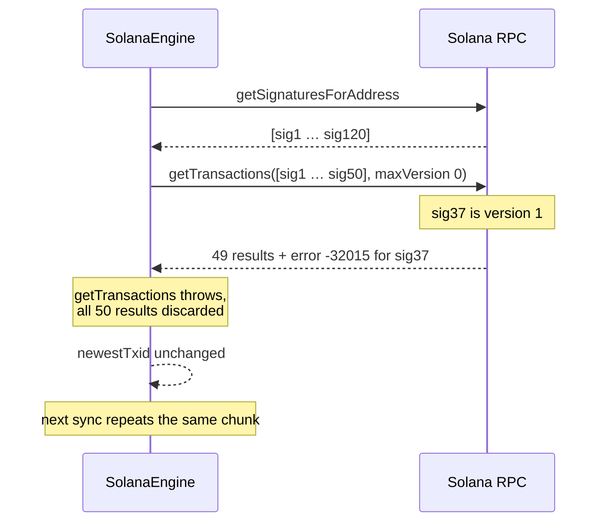
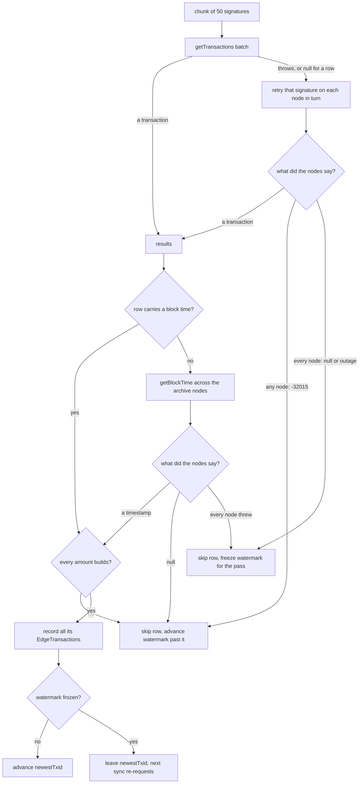

# Solana version 1 transactions: history keeps syncing past a v1 row

| | |
|---|---|
| Status | Implemented |
| Author | Jon Tzeng |
| Reviewer | - |
| Last updated | 2026-09-11 |
| Repos | [edge-currency-accountbased](https://github.com/EdgeApp/edge-currency-accountbased) |
| Implementation | branch `jon/solana-v1-transactions` |
| Supersedes | - |
| Related | [Asana 1218333177692561](https://app.asana.com/0/1215088146871429/1218333177692561) |

<!-- tdd-code-fingerprint: 5ce58982e18f8b86d8226f2e9b4de47a4eb4248c -->

Code references point at `jon/solana-v1-transactions` in edge-currency-accountbased. Direction came from the Asana task, which scoped the dependency bump, the version declaration, the resilience requirement and the unit test.

## Contents

1. [Problem](#1-problem)
2. [Prior art](#2-prior-art)
3. [Goals and non-goals](#3-goals-and-non-goals)
4. [Design overview](#4-design-overview)
5. [Testing](#5-testing)
6. [Phase history](#6-phase-history)
7. [Decisions](#7-decisions)
8. [Glossary](#8-glossary)
9. [References](#9-references)

## 1. Problem

Solana mainnet activates the [Agave](#agave) 4.2 feature gates at [epoch](#epoch) 1032 (2026-09-10 06:45 UTC). One of them introduces [version 1 transaction](#version-1-transaction) messages, which carry a larger size limit and a `transactionConfig` block the earlier versions do not have.

`SolanaEngine` reads a wallet's history in two passes. `getSignaturesForAddress` collects signatures newest first, then the loop reverses them and fetches bodies in chunks of 50 with `Connection.getTransactions`. That fetch declared `maxSupportedTransactionVersion: 0`. The [RPC](#rpc) answers JSON-RPC error -32015 for any transaction newer than the version the caller declares, and web3.js's `getTransactions` throws on the first error entry in the batch, discarding the other 49 results with it.

The loop walks oldest to newest and only advances `otherData.newestTxid` after a row is processed, so the failure is not a dropped row. It is a wall: every later sync re-requests the same chunk, hits the same v1 transaction, and the wallet's history stops there permanently.



Balances are unaffected: `queryBalance` reads account state rather than transaction bodies. Sends are unaffected: spends compile version 0 messages and bridge deposits compile legacy messages, both of which stay valid.

Exposure starts near zero at activation and grows as senders adopt v1.

## 2. Prior art

Two approaches were already in the codebase and neither covers this.

`asyncStaggeredRace` fans a request across the archival [RPC](#rpc) nodes and resolves on the first success. It cannot help here, because -32015 is a property of the request rather than the node: every node answers the same error for the same declared version, so the race exhausts its nodes and rejects.

The engine already tolerates individual bad rows in two narrower ways: `meta?.err != null` skips reverted transactions, and a missing `blockTime` falls back to `getBlockTime` and skips the row when that fails too. Both operate on a row the batch already returned. Neither runs when the batch itself never resolves.

## 3. Goals and non-goals

Goals:

- Solana history syncs across a v1 transaction with the correct amount, fee and direction.
- A transaction the client cannot fetch or parse costs one history row rather than the whole chunk, so the next protocol change degrades instead of freezing.
- The v1 path is covered by a test over a real captured [RPC](#rpc) response.

Non-goals:

- Sending v1 transactions. `@solana/web3.js` 1.99.0 is read-only for v1 (`MessageV1.serialize` throws), and the engine has no reason to build one.
- Rent changes from [SIMD-0437](#simd-0437). Both the address minimum and the token-account rent already come from `getMinimumBalanceForRentExemption`, so the reduction is picked up without a code change.
- Changing the engine's existing fee-accounting convention in `parseTxAmounts`, which this work leaves as it found it.

## 4. Design overview

Everything below lands in edge-currency-accountbased.

**Dependency.** `@solana/web3.js` moves from `^1.98.4` to `^1.99.0`, in `dependencies` and in the `@solana/web3.js@^1` override. 1.98.4's `versionedMessageFromResponse` branches on version 0 only and falls through to the legacy `Message` constructor for anything else. 1.99.0 adds the version 1 branch, which builds a `MessageV1` from the response's `accountKeys`, `header`, `recentBlockhash`, `instructions` and `transactionConfig`.

`MessageV1` keeps `staticAccountKeys`, so `parseTxAmounts`'s account-key lookup works on a v1 message with no adaptation. `meta` comes off the wire untouched, so `fee`, `preBalances`, `postBalances` and the token balance arrays keep the shapes the engine reads. The type surface widens rather than shifting: `TransactionVersion` becomes `'legacy' | 0 | 1` and `VersionedMessage` becomes `Message | MessageV0 | MessageV1`.

**Declared version.** The history fetch now declares support for version 1, written as a JSON integer rather than a string. This is the only call site in `src/solana` that declares a version; `getBlockTime` and `getBlockHeight` take no version config, and the plugin makes no `getParsedTransaction` or `getBlock` calls.

**Resilience.** The chunk fetch moves into `fetchTransactionChunk`, which keeps the batch as the fast path. Every row the batch did not serve, whether the batch threw or came back with a `null` in that slot, is retried one signature at a time across every archive node. A signature that still has no transaction becomes `null` in the returned array rather than an exception, and lands in the result's `unavailable` set unless a node reported -32015:

- An outage (a timeout, a rate limit, an unhealthy node) is unavailable, since another node or a later sync can serve the row.
- A `null` result is unavailable too. The node that listed the signature holds it, so a `null` from another node means that node has not caught up. Each node's retry throws on `null`, and `asyncStaggeredRace` moves on to the next node rather than letting the first `null` win ([7.8](#78-treat-a-null-transaction-as-unserved)).
- -32015, an unsupported transaction version, stays out. That is a property of our request rather than of the node, so it recurs until the client learns the next version. Each node's retry turns -32015 into an answer (`UNSUPPORTED_VERSION`) instead of a throw, so an outage on another node cannot become the error the race rejects with and hide it. `isUnsupportedTransactionVersion` reads the code off web3.js's `SolanaJSONRPCError` and compares it to `SolanaJSONRPCErrorCode.JSON_RPC_SERVER_ERROR_UNSUPPORTED_TRANSACTION_VERSION` ([7.5](#75-treat-only-an-unsupported-version-as-a-permanent-fetch-failure)).

[`src/solana/SolanaEngine.ts`](https://github.com/EdgeApp/edge-currency-accountbased/blob/a6b938d34b5bb8f92fe63095e13382bf599136a3/src/solana/SolanaEngine.ts)
```typescript
interface TransactionChunk {
  /** One entry per requested signature, in the order they were requested. */
  transactions: Array<VersionedTransactionResponse | null>
  /** Signatures no node served, for a reason another sync may not repeat. */
  unavailable: Set<string>
}

async fetchTransactionChunk(signatures: string[]): Promise<TransactionChunk>
```

The processing loop then guards `null` and builds each row in two steps. `parseTxAmounts` plus `makeSolanaTransaction` turn the transaction into its `EdgeTransaction`s (one for the native coin, one per token it moved) inside a `try`, and `addTransaction` records them only after every one has built. A transaction the engine cannot interpret is logged and skipped whole, never half-recorded ([7.6](#76-build-every-amount-before-recording-any)).

**Block time.** A row whose signature entry and transaction body both lack `blockTime` falls back to `getBlockTime`, raced across the archive connections. That call resolves to a bare `number | null` rather than a [JSON-RPC](#rpc) envelope, so its three answers are read separately: a number is the timestamp, a `null` is the nodes saying the slot carries no block time, and every node throwing is the only answer that nobody gave ([7.7](#77-read-getblocktime-as-a-bare-number)).

Which skips move `newestTxid` is the whole design:

- A failure asking again cannot fix (a parse failure, -32015, a reverted transaction, a slot with no block time) advances the watermark past the row and the row is lost. That holds when the row is the newest one too: the skip itself writes the row's signature into `newestTxid`, so the next poll does not ask for it again. Retrying it forever is the wall this change removes. That is the missing-row-not-frozen-wallet trade.
- A failure asking again can fix (a signature in `unavailable`, or a `getBlockTime` lookup no node answered) freezes the watermark for the rest of the pass, so a later chunk's success cannot write its own signature into `newestTxid` and carry the next sync's `until` past the rows we never got. Rows after the gap are still processed and shown; the next sync re-requests them and `addTransaction` deduplicates by txid.



## 5. Testing

`test/solana/solanaV1Transaction.test.ts` runs against a real v1 `getTransaction` response captured from devnet slot 495733175, where v1 is live ahead of mainnet. The fixture is the raw [RPC](#rpc) result, and the test drives it through a real `Connection` whose `fetch` is stubbed, so web3.js's own deserialization runs rather than a hand-built `MessageV1`.

The stub enforces `maxSupportedTransactionVersion` the way the [RPC](#rpc) does, answering -32015 when the caller declares less than version 1, and it also answers `getSignaturesForAddress`, so `queryTransactionsInner` itself runs against it. Reverting the engine to version 0 fails every case that reads the fixture.

| # | Case | Asserts |
|---|---|---|
| 1 | A v1 response deserializes | `version` is 1, `staticAccountKeys` present and matching the response's `accountKeys` |
| 2 | Send side | `isSend` true, `nativeAmount` `-1449120`, `networkFee` `5740`, `blockHeight`, `txid` |
| 3 | Receive side | `isSend` false, `nativeAmount` `1437640`, `ourReceiveAddresses` holds the recipient |
| 4 | One signature poisons the batch | the good row survives and the bad one is `null` |
| 5 | A node outage | the signature lands in `unavailable` |
| 6 | An unsupported transaction version | `null`, and `unavailable` stays empty |
| 7 | A signature no node holds | `null` and in `unavailable`, the rest unaffected |
| 8 | The first node answers `null`, the second holds the transaction | the transaction comes back, `unavailable` empty |
| 9 | One node answers -32015, the node after it is down | `null`, and `unavailable` stays empty |
| 10 | History: a clean chunk | `newestTxid` advances to the newest row, the row is recorded |
| 11 | History: an outage before a good row | `newestTxid` stays empty, the good row is still recorded |
| 12 | History: -32015 before a good row | `newestTxid` advances past both |
| 13 | History: -32015 as the newest row | `newestTxid` is the unreadable row's signature |
| 14 | History: a row no node holds before a good row | `newestTxid` stays empty, the good row is still recorded |
| 15 | History: a row whose second amount fails to build | nothing is recorded, `newestTxid` still advances |
| 16 | History: a block time the nodes answer in the fallback | the row carries that timestamp, `newestTxid` advances |
| 17 | History: a slot the nodes say has no block time | nothing is recorded, no placeholder timestamp, `newestTxid` advances |
| 18 | History: no node answers the block time lookup | nothing is recorded, `newestTxid` stays empty |

Each fix has a case that fails without it: re-adding -32015 to `unavailable` fails 6 and 12, dropping the freeze fails 11, recording each amount as it builds fails 15, and restoring the envelope cleaner on `getBlockTime` fails 16 and 18. Letting the first `null` win fails 7, 8 and 14, reading -32015 only off the race's rejection fails 9, and advancing only on a recorded row fails 13 and 17.

Cases 2 and 3 assert the engine's existing fee convention rather than a new one: the send's `nativeAmount` is the balance delta (`75889606355 - 75891049735`) less the fee the engine subtracts for a send.

Verified separately against devnet before the change was written: devnet runs `solana-core` 4.3.0-rc.0 and produced six v1 transactions in one slot, and requesting one of them with a declared version of 0 returns the -32015 message quoted in the fixture stub. Mainnet was at [epoch](#epoch) 1031 on `solana-core` 4.2.2 at that time.

## 6. Phase history

### Phase 1 (2026-09-09)

Sketched in the plan as four steps: dependency bump, version declaration, resilience, unit test. All four shipped as sketched.

The account-key lookup diverged. The plan expected to check whether a v1 message exposes `staticAccountKeys` and to adapt the lookup if it did not. `MessageV1` keeps the field, so `parseTxAmounts` needed no change.

The watermark rule diverged too. The first implementation advanced `newestTxid` past every skipped row, fetch failures included. Bugbot caught that a whole-chunk outage followed by a later successful chunk drops the failed chunk's transactions for good, since the next sync's `until` starts after them. Phase 1 shipped with every fetch failure freezing the watermark.

The branch also carries an unrelated commit fixing two tests that failed outside `npm run test`: `builtinTokens` ran under mocha's 2s default while each case dynamically imports a plugin's tools module, and the Fantom fee test read `currencyInfo`/`networkInfo` from `fantomInfo` through a `module.exports` assignment guarded on `npm_lifecycle_event`. Neither touches the Solana work.

### Phase 2 (2026-09-10): review of the watermark freeze

Code review found three problems with the phase 1 freeze, all accepted:

| Found | Shipped as |
|---|---|
| Every fetch failure froze the watermark, -32015 included. A future version 2 transaction would freeze it forever, since nothing counts attempts or clears the latch: the [section 1](#1-problem) wall one version up. | -32015 stays out of `unavailable` and advances like a parse failure ([7.5](#75-treat-only-an-unsupported-version-as-a-permanent-fetch-failure)). |
| The `try` spanned recording. A throw on the second of several amounts left the first recorded and still advanced the watermark, a half row nothing downstream can detect. | `processSolanaTransaction` became the pure `makeSolanaTransaction`; every amount builds before any is recorded ([7.6](#76-build-every-amount-before-recording-any)). |
| The freeze itself was untested; `newestTxid` appeared nowhere under `test/`. | Cases 8 to 11 drive `queryTransactionsInner` through a fake engine. |

Deferred: the QA cases on the task that need a post-activation mainnet build (a v1 transaction paid to a QA wallet, and the rent-reduction fee comparison) run against the staging 4.51.0 build, since mainnet had not reached [epoch](#epoch) 1032 when this shipped.

### Phase 3 (2026-09-11): the block time fallback

Review of the phase 2 freeze found one path left that could still freeze the watermark permanently, accepted:

| Found | Shipped as |
|---|---|
| `getBlockTime`'s answer was cleaned with `asRpcResponse(asNumber)`, but the web3.js `Connection` hands back a bare `number \| null`. `asMaybe` therefore returned `null` for every answer, a valid timestamp included, and latched the freeze on every fallback. Nothing counts attempts or clears the latch, so a row lacking `blockTime` on both the signature list and the transaction body stalled history there on every sync. | The three answers are read apart, and only "every node threw" freezes ([7.7](#77-read-getblocktime-as-a-bare-number)). The now-unused `asBlocktime` cleaner is deleted. |

The same round repointed [section 4](#4-design-overview)'s file citation, which still pinned the commit before the phase 2 fixes.

The `try` also closes a path that predates this branch: with the envelope cleaner in place, a `getBlockTime` lookup where every node threw rejected out of `queryTransactionsInner` and ended the whole sync pass rather than skipping one row.

### Phase 4 (2026-09-16): skips on the newest row, and whose answer counts

Rebasing onto 4.93.0 re-ran Bugbot, which found three problems in the fetch and watermark rules, all accepted:

| Found | Shipped as |
|---|---|
| A permanent skip `continue`d without writing `newestTxid`; only a recorded or parse-failed row advanced it. When the unreadable row was the newest, `until` never moved and every poll asked for it again. | Every permanent skip (-32015, a reverted transaction, a slot with no block time) advances the watermark itself, unless a retryable gap already froze it. |
| `asyncStaggeredRace` resolves on the first success, `null` included, so the first node to answer `null` for a row it had not caught up on won, and a later row carried the watermark past it for good. | A `null` is retried on every node, and a row no node serves lands in `unavailable` ([7.8](#78-treat-a-null-transaction-as-unserved)). |
| -32015 was read off the race's rejection, which is the last node's error, so one node timing out after another reported -32015 froze the watermark for a row no node will ever serve. | Each node's retry returns -32015 as an answer instead of throwing it. |

## 7. Decisions

### 7.1 Retry per signature instead of always fetching one at a time

Chosen: keep `getTransactions` as the fast path and fall back to per-signature `getTransaction` calls only when the batch throws.

Evidence: web3.js builds the batch as a single JSON-[RPC](#rpc) array request, so the happy path is one round trip per 50 signatures. A wallet with a long history pays that cost on every full resync.

Rejected: always fetching one signature at a time. It is simpler and uniformly resilient, but it turns one request into 50 for every chunk of every sync, on a chain where wallets routinely carry hundreds of transactions.

Reopens if: batch failures become common enough that the fallback is the normal path anyway, which would show up as a steady stream of the `getTransactions batch failed` log line.

### 7.2 Freeze the watermark only for a failure that asking again can fix

Chosen: a failure that recurs identically on every sync (a parse failure, -32015, a slot with no block time) is logged and skipped and `newestTxid` advances past it; a row no node served (an outage, or `null` from every node) freezes the watermark for the rest of the pass.

Evidence: the two kinds have opposite retry value. Retrying a permanent failure is the frozen wallet this change removes. Dropping an outage's rows is silent data loss: without the freeze, a later chunk's success writes its own signature into `newestTxid` and the next sync's `until` skips straight past everything the failed chunk held.

Rejected: advancing on everything, which loses a whole failed chunk the moment a later one succeeds. Also rejected: freezing on everything, which reinstates the wall for any transaction the client can never read. Also rejected: stopping the sync at the bad row, which is the behavior being removed.

Cost, accepted: a skipped permanent row never comes back without a full wallet resync. A frozen watermark re-fetches rows already recorded, which `addTransaction` deduplicates by txid.

Reopens if: a failure classified as permanent turns out to succeed on retry, which the `Could not process transaction` and `getTransaction failed for` log lines would show.

### 7.3 A real devnet capture rather than a synthesized fixture

Chosen: capture a v1 `getTransaction` response from devnet and commit it verbatim.

Evidence: devnet runs 4.3.0-rc.0 and already produces v1 transactions, so a real capture cost one scan of recent blocks. It also pinned facts a hand-built object would have assumed, notably that the response carries `transactionConfig` (1.99.0 throws for a v1 message without it) and that `meta` is shaped exactly as before.

Rejected: building the response by hand. It would encode the same assumptions the test is supposed to check.

Reopens if: a later protocol version needs a fixture and no public network carries one yet, in which case Solana CLI 4.2+ or surfpool can produce one locally.

### 7.4 Drive the fixture through a real `Connection`

Chosen: construct a `Connection` with a stubbed `fetch` and call the engine's real fetch path.

Evidence: `versionedMessageFromResponse` is not exported, so a test that built a `MessageV1` directly would skip the deserialization it means to cover and would keep passing on 1.98.4. The stub also lets the test enforce `maxSupportedTransactionVersion`, which makes the declared version a tested contract rather than a comment.

Rejected: stubbing the `Connection` object itself. Cheaper to write, but it proves nothing about whether web3.js can read a v1 response.

Reopens if: web3.js drops the `fetch` config option.

### 7.5 Treat only an unsupported version as a permanent fetch failure

Chosen: exactly one JSON-[RPC](#rpc) code, -32015 (unsupported transaction version), is treated as permanent. Every other error a `getTransaction` retry ends on is treated as an outage.

Evidence: -32015 depends only on the version the request declares, so every node on the cluster returns it for the same signature until the client changes. The other codes a history fetch can meet depend on the node: -32011 (transaction history not available) reflects one node's configuration, and -32009 and -32001 (a slot skipped in long-term storage, a block cleaned up) reflect one node's retention. Another archival node in `asyncStaggeredRace` can still hold the transaction, so treating those as permanent would bring back the silent loss the freeze exists to prevent.

Rejected: a broader list of permanent codes, for the node-dependence above. Also rejected: counting attempts per signature in `otherData` and giving up after N, which catches unknown permanent codes but adds persisted state and a threshold nobody can tune well, for a case with no known member.

Reopens if: a node-independent error code appears on `getTransaction` (the `getTransaction failed for` line would show one signature failing on every sync), or a version 2 transaction ships and the declared version needs raising anyway.

### 7.6 Build every amount before recording any

Chosen: `makeSolanaTransaction` returns each `EdgeTransaction` without recording it, the `try` covers building every amount, and `addTransaction` runs only once all of them have built.

Evidence: one Solana transaction can produce several rows (the native coin plus each token it moved). When recording happened amount by amount inside the `try`, a throw on the second left the first recorded while the watermark moved past the transaction, so the row stayed incomplete until a full resync and nothing downstream could tell.

Rejected: narrowing the `try` to `parseTxAmounts` alone. A throw while building would then escape the loop and end the whole pass, which is a wall again.

Reopens if: recording itself (`addTransaction`) can throw part way, which would need the engine's own record to become transactional.

### 7.7 Read `getBlockTime` as a bare number

Chosen: clean the raced `getBlockTime` result with `asNumber`, wrap the race in a `try`, and map its three answers separately. A number is the timestamp. A `null` drops the row and leaves the watermark free to move. A rejection, which is every node throwing, freezes the watermark.

Evidence: `Connection.getBlockTime(slot): Promise<number | null>` in web3.js 1.99.0 resolves the [RPC](#rpc) envelope's `result` itself, so the envelope cleaner never matched. `asyncStaggeredRace` resolves on the first success, `null` included, and rejects only once every function has thrown, so the resolve/reject split is exactly the answered/unanswered split the freeze rule needs. A `null` is a property of the slot rather than of the node, which puts it with the permanent failures of [7.5](#75-treat-only-an-unsupported-version-as-a-permanent-fetch-failure).

Rejected: fixing `asBlocktime` to `asNumber` and keeping one `null` branch for both answers. That reads a slot with no block time as an outage and freezes on it forever, which is the [section 1](#1-problem) wall again. Also rejected: coercing a `null` to `0` or to the chunk's neighboring block time, which records a row against a timestamp no node gave and puts it in the wrong place in history.

Reopens if: `getBlockTime` starts distinguishing "pruned, ask an archive node" from "this slot has no block time", which would move the `null` answer into the retryable set.

### 7.8 Treat a null transaction as unserved

Chosen: a `null` from `getTransaction` is not an answer. Each node's retry throws on it, so the race asks the next node, and a row every node answers `null` for lands in `unavailable` and freezes the watermark.

Evidence: every signature the loop fetches came from `getSignaturesForAddress` on an archive node moments earlier, so some node holds it. A `null` from another node is that node lagging, most often for the newest row, which is also the row whose loss nobody would notice until a full resync.

Rejected: taking the first `null` as final, the phase 3 rule, which loses a just-confirmed row whenever a lagging node answers first. Also rejected: advancing the watermark on `null` like -32015, which loses the same row even when every other node holds it.

Cost, accepted: a signature no archive node will ever serve freezes the watermark on every sync, so each poll re-fetches from that row forward, and `addTransaction` deduplicates what it has already recorded. No such signature is known, since the list and the bodies come from the same archive nodes.

Reopens if: the `getTransaction failed for` log line shows one signature returning `null` from every node on every sync.

## 8. Glossary

### Agave

The validator client Anza maintains for Solana, the successor to the original `solana-validator`. Its 4.2 release carries the feature gates that activate v1 transactions and the first rent reduction at epoch 1032. See [Anza's Agave repository](https://github.com/anza-xyz/agave).

### Epoch

A fixed span of Solana slots (432,000, roughly two days) that bounds leader schedules and feature-gate activation. Feature gates take effect at an epoch boundary, which is why this change has a dated deadline. See [Solana's terminology reference](https://solana.com/docs/references/terminology#epoch).

### RPC

Remote procedure call, here the JSON-RPC HTTP interface a Solana node exposes. The engine reaches it through `@solana/web3.js`'s `Connection`, and every fact in this design about -32015 and `maxSupportedTransactionVersion` is a property of that interface. See [Solana's JSON RPC API](https://solana.com/docs/rpc).

### SIMD-0437

The Solana improvement document that cuts the lamports-per-byte rent rate in five steps, from 6960 toward 696. It activates alongside v1 at epoch 1032 and needs no code change here, since rent is read from `getMinimumBalanceForRentExemption`. See [Solana's rent documentation](https://solana.com/docs/core/rent).

### Version 1 transaction

A Solana transaction message format introduced with Agave 4.2, raising the maximum transaction size to 4096 bytes and adding a `transactionConfig` block that carries the compute limit, heap size, loaded-accounts limit and priority fee. A node refuses to serve one to a client that has not declared support with `maxSupportedTransactionVersion`. See [Solana's larger transaction sizes page](https://solana.com/upgrades/larger-transaction-sizes).

## 9. References

- [Solana: larger transaction sizes](https://solana.com/upgrades/larger-transaction-sizes)
- [Solana: rent](https://solana.com/docs/core/rent)
- [QuickNode: Solana v1 transactions explained](https://www.quicknode.com/blog/solana-v1-transactions-explained)
- [Solana JSON RPC API](https://solana.com/docs/rpc)
