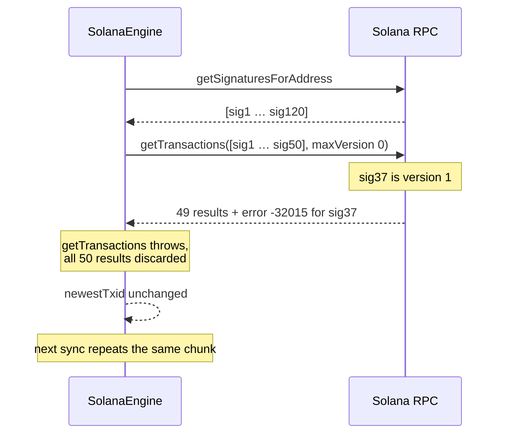
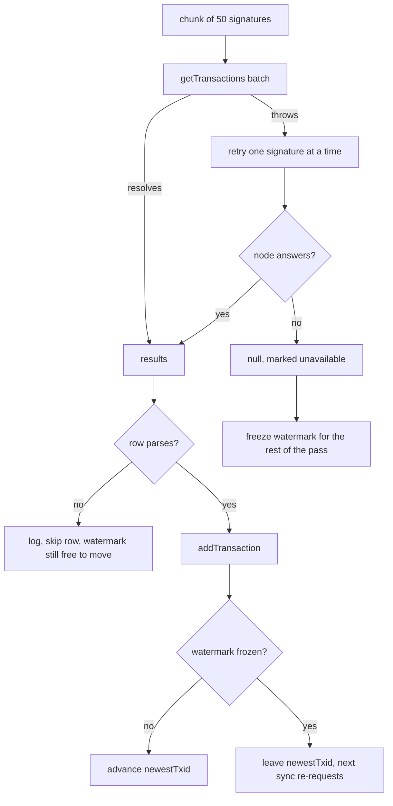

# Solana version 1 transactions: history keeps syncing past a v1 row

| | |
|---|---|
| Status | Implemented |
| Author | Jon Tzeng |
| Reviewer | - |
| Last updated | 2026-09-09 |
| Repos | [edge-currency-accountbased](https://github.com/EdgeApp/edge-currency-accountbased) |
| Implementation | branch `jon/solana-v1-transactions` |
| Supersedes | - |
| Related | [Asana 1218333177692561](https://app.asana.com/0/1215088146871429/1218333177692561) |

<!-- tdd-code-fingerprint: 59306a9e68e9f865710cd54e8b316b44a8063ce8 -->

Code references point at `jon/solana-v1-transactions` in edge-currency-accountbased. Direction came from the Asana task, which scoped the dependency bump, the version declaration, the resilience requirement and the unit test.

## Contents

1. [Problem](#1-problem)
2. [Prior art](#2-prior-art)
3. [Goals and non-goals](#3-goals-and-non-goals)
4. [Design overview](#4-design-overview)
5. [Testing](#5-testing)
6. [Phase history](#6-phase-history)
7. [Decisions](#7-decisions)
8. [Glossary](#8-glossary)
9. [References](#9-references)

## 1. Problem

Solana mainnet activates the [Agave](#agave) 4.2 feature gates at [epoch](#epoch) 1032 (2026-09-10 06:45 UTC). One of them introduces [version 1 transaction](#version-1-transaction) messages, which carry a larger size limit and a `transactionConfig` block the earlier versions do not have.

`SolanaEngine` reads a wallet's history in two passes. `getSignaturesForAddress` collects signatures newest first, then the loop reverses them and fetches bodies in chunks of 50 with `Connection.getTransactions`. That fetch declared `maxSupportedTransactionVersion: 0`. The [RPC](#rpc) answers JSON-RPC error -32015 for any transaction newer than the version the caller declares, and web3.js's `getTransactions` throws on the first error entry in the batch, discarding the other 49 results with it.

The loop walks oldest to newest and only advances `otherData.newestTxid` after a row is processed, so the failure is not a dropped row. It is a wall: every later sync re-requests the same chunk, hits the same v1 transaction, and the wallet's history stops there permanently.



Balances are unaffected: `queryBalance` reads account state rather than transaction bodies. Sends are unaffected: spends compile version 0 messages and bridge deposits compile legacy messages, both of which stay valid.

Exposure starts near zero at activation and grows as senders adopt v1.

## 2. Prior art

Two approaches were already in the codebase and neither covers this.

`asyncStaggeredRace` fans a request across the archival [RPC](#rpc) nodes and resolves on the first success. It cannot help here, because -32015 is a property of the request rather than the node: every node answers the same error for the same declared version, so the race exhausts its nodes and rejects.

The engine already tolerates individual bad rows in two narrower ways: `meta?.err != null` skips reverted transactions, and a missing `blockTime` falls back to `getBlockTime` and skips the row when that fails too. Both operate on a row the batch already returned. Neither runs when the batch itself never resolves.

## 3. Goals and non-goals

Goals:

- Solana history syncs across a v1 transaction with the correct amount, fee and direction.
- A transaction the client cannot fetch or parse costs one history row rather than the whole chunk, so the next protocol change degrades instead of freezing.
- The v1 path is covered by a test over a real captured [RPC](#rpc) response.

Non-goals:

- Sending v1 transactions. `@solana/web3.js` 1.99.0 is read-only for v1 (`MessageV1.serialize` throws), and the engine has no reason to build one.
- Rent changes from [SIMD-0437](#simd-0437). Both the address minimum and the token-account rent already come from `getMinimumBalanceForRentExemption`, so the reduction is picked up without a code change.
- Changing the engine's existing fee-accounting convention in `parseTxAmounts`, which this work leaves as it found it.

## 4. Design overview

Everything below lands in edge-currency-accountbased.

**Dependency.** `@solana/web3.js` moves from `^1.98.4` to `^1.99.0`, in `dependencies` and in the `@solana/web3.js@^1` override. 1.98.4's `versionedMessageFromResponse` branches on version 0 only and falls through to the legacy `Message` constructor for anything else. 1.99.0 adds the version 1 branch, which builds a `MessageV1` from the response's `accountKeys`, `header`, `recentBlockhash`, `instructions` and `transactionConfig`.

`MessageV1` keeps `staticAccountKeys`, so `parseTxAmounts`'s account-key lookup works on a v1 message with no adaptation. `meta` comes off the wire untouched, so `fee`, `preBalances`, `postBalances` and the token balance arrays keep the shapes the engine reads. The type surface widens rather than shifting: `TransactionVersion` becomes `'legacy' | 0 | 1` and `VersionedMessage` becomes `Message | MessageV0 | MessageV1`.

**Declared version.** The history fetch now declares support for version 1, written as a JSON integer rather than a string. This is the only call site in `src/solana` that declares a version; `getBlockTime` and `getBlockHeight` take no version config, and the plugin makes no `getParsedTransaction` or `getBlock` calls.

**Resilience.** The chunk fetch moves into `fetchTransactionChunk`, which keeps the batch as the fast path and retries the chunk one signature at a time when the batch throws. A signature that still fails becomes `null` in the returned array rather than an exception, and lands in the result's `unavailable` set. A node that answers with a `null` result is kept out of that set: it is telling us the transaction is not there, which is an answer rather than an outage.

[`src/solana/SolanaEngine.ts`](https://github.com/EdgeApp/edge-currency-accountbased/blob/1b932d9cbe473994a0681cb910a4e5c961096c26/src/solana/SolanaEngine.ts)
```typescript
interface TransactionChunk {
  /** One entry per requested signature, in the order they were requested. */
  transactions: Array<VersionedTransactionResponse | null>
  /** Signatures no node would answer for, which are worth asking again. */
  unavailable: Set<string>
}

async fetchTransactionChunk(signatures: string[]): Promise<TransactionChunk>
```

The processing loop then guards `null`, and wraps `parseTxAmounts` plus `processSolanaTransaction` so a transaction the engine cannot interpret is logged and skipped. Which skips move `newestTxid` is the whole design:

- A transaction that fails to parse is structural. Retrying it forever is the wall this change removes, so the watermark advances past it and the row is lost. That is the missing-row-not-frozen-wallet trade.
- A transaction that fails to fetch (`unavailable`, or a `getBlockTime` lookup that no node answered) is retryable. The first one freezes the watermark for the REST of the pass, so a later chunk's success cannot write its own signature into `newestTxid` and carry the next sync's `until` past the rows we never got. Rows after the gap are still processed and shown; the next sync re-requests them and `addTransaction` deduplicates by txid.



## 5. Testing

`test/solana/solanaV1Transaction.test.ts` runs against a real v1 `getTransaction` response captured from devnet slot 495733175, where v1 is live ahead of mainnet. The fixture is the raw [RPC](#rpc) result, and the test drives it through a real `Connection` whose `fetch` is stubbed, so web3.js's own deserialization runs rather than a hand-built `MessageV1`.

The stub enforces `maxSupportedTransactionVersion` the way the [RPC](#rpc) does, answering -32015 when the caller declares less than version 1. That makes the whole file a regression test for the declared version: reverting the engine to version 0 fails all five cases.

| # | Case | Asserts |
|---|---|---|
| 1 | A v1 response deserializes | `version` is 1, `staticAccountKeys` present and matching the response's `accountKeys` |
| 2 | Send side | `isSend` true, `nativeAmount` `-1449120`, `networkFee` `5740`, `blockHeight`, `txid` |
| 3 | Receive side | `isSend` false, `nativeAmount` `1437640`, `ourReceiveAddresses` holds the recipient |
| 4 | One signature poisons the batch | the good row survives and the bad one is `null` |
| 5 | A signature no node would answer | it lands in `unavailable`, so the watermark freezes rather than skipping it |
| 6 | A signature no node holds | `null` for that row, `unavailable` empty, the rest unaffected |

Cases 2 and 3 assert the engine's existing fee convention rather than a new one: the send's `nativeAmount` is the balance delta (`75889606355 - 75891049735`) less the fee the engine subtracts for a send.

Verified separately against devnet before the change was written: devnet runs `solana-core` 4.3.0-rc.0 and produced six v1 transactions in one slot, and requesting one of them with a declared version of 0 returns the -32015 message quoted in the fixture stub. Mainnet was at [epoch](#epoch) 1031 on `solana-core` 4.2.2 at that time.

## 6. Phase history

### Phase 1 (2026-09-09)

Sketched in the plan as four steps: dependency bump, version declaration, resilience, unit test. All four shipped as sketched.

The account-key lookup diverged. The plan expected to check whether a v1 message exposes `staticAccountKeys` and to adapt the lookup if it did not. `MessageV1` keeps the field, so `parseTxAmounts` and `processSolanaTransaction` are unchanged.

The watermark rule diverged too. The first implementation advanced `newestTxid` past every skipped row, fetch failures included. Review caught that a whole-chunk outage followed by a later successful chunk drops the failed chunk's transactions for good, since the next sync's `until` starts after them. The fetch/parse split in [7.2](#72-advance-the-watermark-past-a-parse-failure-freeze-it-on-a-fetch-failure) is the correction, and `fetchTransactionChunk` grew its `unavailable` set to carry the distinction.

The branch also carries an unrelated commit fixing two tests that failed outside `npm run test`: `builtinTokens` ran under mocha's 2s default while each case dynamically imports a plugin's tools module, and the Fantom fee test read `currencyInfo`/`networkInfo` from `fantomInfo` through a `module.exports` assignment guarded on `npm_lifecycle_event`. Neither touches the Solana work.

Deferred: the QA cases on the task that need a post-activation mainnet build (a v1 transaction paid to a QA wallet, and the rent-reduction fee comparison) run against the staging 4.51.0 build, since mainnet had not reached [epoch](#epoch) 1032 when this shipped.

## 7. Decisions

### 7.1 Retry per signature instead of always fetching one at a time

Chosen: keep `getTransactions` as the fast path and fall back to per-signature `getTransaction` calls only when the batch throws.

Evidence: web3.js builds the batch as a single JSON-[RPC](#rpc) array request, so the happy path is one round trip per 50 signatures. A wallet with a long history pays that cost on every full resync.

Rejected: always fetching one signature at a time. It is simpler and uniformly resilient, but it turns one request into 50 for every chunk of every sync, on a chain where wallets routinely carry hundreds of transactions.

Reopens if: batch failures become common enough that the fallback is the normal path anyway, which would show up as a steady stream of the `getTransactions batch failed` log line.

### 7.2 Advance the watermark past a parse failure, freeze it on a fetch failure

Chosen: a transaction that throws during parsing is logged and skipped and `newestTxid` advances past it, but a signature no node would answer freezes the watermark for the rest of the pass.

Evidence: the two failures have opposite retry value. A message the client cannot deserialize will fail identically on every later sync, so retrying it is the frozen wallet this change removes. An RPC that would not answer is transient, and dropping its rows is silent data loss: without the freeze, a later chunk's success writes its own signature into `newestTxid` and the next sync's `until` skips straight past everything the failed chunk held.

Rejected: advancing on both. That was the first implementation, and it loses a whole failed chunk the moment any later chunk succeeds. Also rejected: freezing on both, which reinstates the wall for a permanently unreadable transaction. Also rejected: stopping the sync at the bad row, which is the behavior being removed.

Cost, accepted: a parse-skipped row never comes back without a full wallet resync. A frozen watermark re-fetches rows already recorded, which `addTransaction` deduplicates by txid.

Reopens if: parse failures turn out to be retryable in practice, which the `Could not process transaction` log line would show.

### 7.3 A real devnet capture rather than a synthesized fixture

Chosen: capture a v1 `getTransaction` response from devnet and commit it verbatim.

Evidence: devnet runs 4.3.0-rc.0 and already produces v1 transactions, so a real capture cost one scan of recent blocks. It also pinned facts a hand-built object would have assumed, notably that the response carries `transactionConfig` (1.99.0 throws for a v1 message without it) and that `meta` is shaped exactly as before.

Rejected: building the response by hand. It would encode the same assumptions the test is supposed to check.

Reopens if: a later protocol version needs a fixture and no public network carries one yet, in which case Solana CLI 4.2+ or surfpool can produce one locally.

### 7.4 Drive the fixture through a real `Connection`

Chosen: construct a `Connection` with a stubbed `fetch` and call the engine's real fetch path.

Evidence: `versionedMessageFromResponse` is not exported, so a test that built a `MessageV1` directly would skip the deserialization it means to cover and would keep passing on 1.98.4. The stub also lets the test enforce `maxSupportedTransactionVersion`, which makes the declared version a tested contract rather than a comment.

Rejected: stubbing the `Connection` object itself. Cheaper to write, but it proves nothing about whether web3.js can read a v1 response.

Reopens if: web3.js drops the `fetch` config option.

## 8. Glossary

### Agave

The validator client Anza maintains for Solana, the successor to the original `solana-validator`. Its 4.2 release carries the feature gates that activate v1 transactions and the first rent reduction at epoch 1032. See [Anza's Agave repository](https://github.com/anza-xyz/agave).

### Epoch

A fixed span of Solana slots (432,000, roughly two days) that bounds leader schedules and feature-gate activation. Feature gates take effect at an epoch boundary, which is why this change has a dated deadline. See [Solana's terminology reference](https://solana.com/docs/references/terminology#epoch).

### RPC

Remote procedure call, here the JSON-RPC HTTP interface a Solana node exposes. The engine reaches it through `@solana/web3.js`'s `Connection`, and every fact in this design about -32015 and `maxSupportedTransactionVersion` is a property of that interface. See [Solana's JSON RPC API](https://solana.com/docs/rpc).

### SIMD-0437

The Solana improvement document that cuts the lamports-per-byte rent rate in five steps, from 6960 toward 696. It activates alongside v1 at epoch 1032 and needs no code change here, since rent is read from `getMinimumBalanceForRentExemption`. See [Solana's rent documentation](https://solana.com/docs/core/rent).

### Version 1 transaction

A Solana transaction message format introduced with Agave 4.2, raising the maximum transaction size to 4096 bytes and adding a `transactionConfig` block that carries the compute limit, heap size, loaded-accounts limit and priority fee. A node refuses to serve one to a client that has not declared support with `maxSupportedTransactionVersion`. See [Solana's larger transaction sizes page](https://solana.com/upgrades/larger-transaction-sizes).

## 9. References

- [Solana: larger transaction sizes](https://solana.com/upgrades/larger-transaction-sizes)
- [Solana: rent](https://solana.com/docs/core/rent)
- [QuickNode: Solana v1 transactions explained](https://www.quicknode.com/blog/solana-v1-transactions-explained)
- [Solana JSON RPC API](https://solana.com/docs/rpc)
